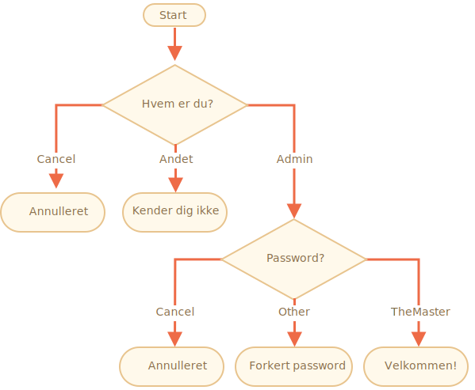

importance: 3

---

# Check login

Skriv koden, som spørger efter et login med `prompt`.

Hvis brugeren indtaster `"Admin"`, så spørg efter en adgangskode med `prompt`, hvis input er en tom linje eller `key:Esc` -- vis "Canceled", hvis det er en anden streng -- vis "I don't know you".

Adgangskoden kontrolleres som følger:

- Hvis den er lig med "TheMaster", så vis "Welcome!",
- En anden streng -- vis "Wrong password",
- For en tom streng eller annulleret input, vis "Canceled"

Skemaet:

Brug gerne indlejrede `if`-blokke. Vær opmærksom på den overordnede læsbarhed af koden.

Hint:  at afgive en tom indtastning til en prompt returnerer en tom streng `''`. At trykke på `key:ESC` under en prompt returnerer `null`.

[demo]
