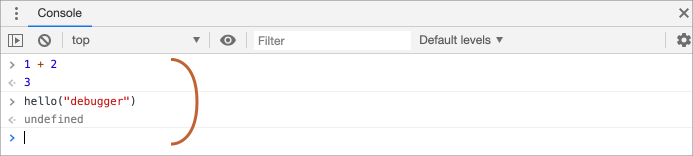

# Debugging i browseren

Før vi skriver mere kompleks kode, lad os tale om debugging.

[Debugging](https://en.wikipedia.org/wiki/Debugging) (aflusning) er processen med at finde og rette fejl i et script. Alle moderne browsere og de fleste andre miljøer understøtter debugging-værktøjer -- en særlig brugerflade i udviklerværktøjer, der gør debugging meget nemmere. Det tillader også at spore koden trin for trin for at se, hvad der præcist foregår.

Vi vil bruge Chrome her, fordi det har nok funktioner, de fleste andre browsere har en lignende proces.

## "Sources" panelet

Din version af Chrome kan se en smule anderledes ud, men det burde stadig være indlysende, hvad der er der.

- Åbn [eksempelsiden](debugging/index.html) i Chrome.
- Tænd udviklerværktøjer med `key:F12` (Mac: `key:Cmd+Opt+I`).
- Vælg `Sources` panelet.

Her er, hvad du bør se, hvis det er første gang, du gør det:


Toggle-knappen <span class="devtools" style="background-position:-172px -98px"></span> åbner fanen med filer.

Klik på den og vælg `hello.js` i trævisningen. Her er, hvad der bør vises:


"Sources" panelet har 3 dele:

1. **File Navigator** panelet  viser HTML, JavaScript, CSS og andre filer, inklusive billeder, der er knyttet til siden. Chrome-udvidelser kan også vises her.
2. **Code Editor** panelet viser kildekoden.
3. **JavaScript Debugging** panelet er til debugging, det vil vi udforske snart.

Du kan klikke på den samme toggle-knap <span class="devtools" style="background-position:-172px -122px"></span> igen for at skjule ressourcelisten og give koden mere plads.

## Console

Hvis vi trykker på `key:Esc`, åbnes en konsol nedenfor. Vi kan skrive kommandoer der og trykke på `key:Enter` for at udføre dem.

Efter en kommandolinje er udført, vises resultatet nedenfor.

For eksempel her resulterer `1+2` i `3`, mens funktionskaldet `hello("debugger")` ikke returnerer noget, så resultatet er `undefined`:



## Breakpoints

Lad os undersøge, hvad der foregår i koden på [eksempelsiden](debugging/index.html). I `hello.js` skal du klikke på linjenummer `4`. Ja, lige på tallet `4`, ikke på koden.

Tillykke! Du har sat et breakpoint. Klik også på nummeret for linje `8`.

Det skulle se sådan ud (blåt er hvor du skal klikke):


Et *breakpoint* er et punkt i koden, hvor debuggeren automatisk vil pause JavaScript-udførelsen.

Mens koden er pauset, kan vi undersøge aktuelle variabler, udføre kommandoer i konsollen osv. Med andre ord kan vi debugge den.

Vi kan altid finde en liste over breakpoints i højre panel. Det er nyttigt, når vi har mange breakpoints i forskellige filer. Det giver os mulighed for at:
- Hurtigt hoppe til breakpointet i koden (ved at klikke på det i højre panel).
- Midlertidigt deaktivere breakpointet ved at fjerne markeringen.
- Fjerne breakpointet ved at højreklikke og vælge Fjern.
- ...Og så videre.

```smart header="Betingede breakpoints"
*Højreklik* på linjenummeret giver mulighed for at oprette et *betinget* breakpoint. Det udløses kun, når det givne udtryk, som du skal angive, når du opretter det, er sandt.

Det er praktisk, når vi kun skal stoppe for en bestemt variabelværdi eller for visse funktionsparametre.
```

## Kommandoen "debugger"

Vi kan også pause koden ved at bruge `debugger`-kommandoen i den, sådan her:

```js
function hello(name) {
  let phrase = `Hello, ${name}!`;

*!*
  debugger;  // <-- debuggeren stopper her
*/!*

  say(phrase);
}
```

Denne kommando virker kun, når udviklingsværktøjerne er åbne, ellers ignorerer browseren den.

## Tag en pause og kig dig omkring

I vores eksempel bliver `hello()` kaldt under sideindlæsningen, så den nemmeste måde at aktivere debuggeren på (efter at vi har sat breakpoints) er at genindlæse siden. Så lad os trykke på `key:F5` (Windows, Linux) eller `key:Cmd+R` (Mac).

Da breakpointet er sat, pauser udførelsen ved linje 4:


Åben de forskellige informationsdropdowns til højre (markeret med pile). De giver dig mulighed for at undersøge den aktuelle tilstand af koden:

1. **`Watch` -- viser aktuelle værdier for enhver udtryk.**

    Du kan klikke på plus `+` og indtaste et udtryk. Debuggeren vil vise dets værdi og automatisk genberegne det under udførelsen.

2. **`Call Stack` -- viser den indlejrede stak af kald til funktioner.**

    På nuværende tidspunkt er debuggeren inde i kaldet til `hello()`, som blev kaldt af et script i `index.html` (ingen funktion der, så det kaldes "anonymous").

    Hvis du klikker på et stak-element (f.eks. "anonymous"), hopper debuggeren til den tilsvarende kode, og alle dens variabler kan også undersøges.
3. **`Scope` -- aktuelle variable.**

    `Local` viser lokale variable. Du kan også se deres værdier fremhævet lige over kilden.

    `Global` viser globale variable (uden for funktioner).

    Der er også `this`-nøgleordet der, som vi endnu ikke har studeret, men det vil vi gøre snart.

## Spor udførelsen

Nu er det tid til at *spore* (trace) scriptet.

Der er knapper til det øverst i højre panel. Lad os aktivere dem.
<!-- https://github.com/ChromeDevTools/devtools-frontend/blob/master/front_end/Images/src/largeIcons.svg -->
<span class="devtools" style="background-position:-146px -168px"></span> -- "Resume": fortsæt udførelsen, genvejstast `key:F8`.
: Fortsætter udførelsen. Hvis der ikke er flere breakpoints, fortsætter udførelsen bare, og debuggeren mister kontrollen.

    Her er hvad vi ser efter et klik på den:

    

    Udførelsen er fortsat, nåede et andet breakpoint inde i `say()` og er sat på pause der. Tag et kig på "Call Stack" til højre. Den er øget med et kald mere. Vi er inde i `say()` nu.

<span class="devtools" style="background-position:-200px -190px"></span> -- "Step": kør den næste kommando, genvejstast `key:F9`.
: Kør den næste sætning. Hvis vi klikker på den nu, vises `alert`.

    Hvis vi klikker på denne igen og igen, vil den gennemgå alle scriptsætninger én efter én.

<span class="devtools" style="background-position:-62px -192px"></span> -- "Step over": kør den næste kommando, men *gå ikke ind i en funktion*, genvejstast `key:F10`.
: Ligner den tidligere "Step" kommando, men opfører sig anderledes, hvis den næste sætning er et funktionskald (ikke en indbygget, som `alert`, men en funktion vi selv har skrevet).

    Hvis vi sammenligner dem, går "Step" kommandoen ind i et indlejret funktionskald og sætter udførelsen på pause ved dets første linje, mens "Step over" udfører det indlejrede funktionskald usynligt for os og springer funktionens indre over.

    Udførelsen sættes derefter på pause umiddelbart efter det funktionskald.

    Dette er godt, hvis vi ikke er interesserede i at se, hvad der sker inde i funktionskaldet.

<span class="devtools" style="background-position:-4px -194px"></span> -- "Step into", hotkey `key:F11`.
: Den minder om "Step", men opfører sig anderledes i tilfælde af asynkrone funktionskald. Hvis du kun er begyndt at lære JavaScript, kan du ignorere forskellen, da vi endnu ikke har asynkrone kald.

    For nuværende så husk at "Step" komandoen ignorerer asynkrone handlinger, såsom `setTimeout` (planlagt funktionskald), der udføres senere. "Step into" går ind i deres kode og venter på dem, hvis nødvendigt. Se [DevTools manual](https://developers.google.com/web/updates/2018/01/devtools#async) for flere detaljer.

<span class="devtools" style="background-position:-32px -194px"></span> -- "Step out": fortsætter afvikling af koden til slutningen af den nuværende funktion, genvejstast `key:Shift+F11`.
: Fortsæt udførelsen og stop ved den aller sidste linje i den nuværende funktion. Det er praktisk, når vi ved et uheld er trådt ind i et indlejret kald ved hjælp af <span class="devtools" style="background-position:-200px -190px"></span>, men det interesserer os ikke, og vi vil fortsætte til slutningen så hurtigt som muligt.

<span class="devtools" style="background-position:-61px -74px"></span> -- aktiver/deaktiver alle breakpoints.
: Denne knap flytter ikke udførelsen. Den tænder eller slukker bare for alle breakpoints på én gang.

<span class="devtools" style="background-position:-90px -146px"></span> -- aktiver/deaktiver automatisk pause ved en fejl.
: Når den er aktiveret, hvis udviklerværktøjerne er åbne, pauser en fejl under scriptudførelsen automatisk det. Så kan vi analysere variabler i debuggeren for at se, hvad der gik galt. Så hvis vores script dør med en fejl, kan vi åbne debuggeren, aktivere denne mulighed og genindlæse siden for at se, hvor det dør, og hvad konteksten er på det tidspunkt.

```smart header="Fortsæt hertil"
Højreklik på en kodelinje åbner kontekstmenuen med en fantastisk mulighed kaldet "Fortsæt hertil".

Det er praktisk, når vi vil flytte flere trin frem til linjen, men vi er for dovne til at sætte et breakpoint.
```

## Logging

For at skrive noget til konsollen fra vores kode, findes der funktionen `console.log`.

For eksempel udskriver dette værdierne fra `0` til `4` til konsollen:

```js run
// åbn konsollen for at se output
for (let i = 0; i < 5; i++) {
  console.log("værdi,", i);
}
```

Brugere af sitet ser ikke dette output, det er i konsollen. For at se det, skal du enten åbne Konsol-panelet i udviklerværktøjerne eller trykke på `key:Esc`, mens du er i et andet panel: det åbner konsollen nederst.

Hvis vi har nok logning i vores kode, kan vi se, hvad der sker ud fra registreringerne, uden debuggeren. Det er en god måde at debugge på, når vi ikke har brug for at se alle variabler og spore koden trin for trin.

## Opsummering

Som vi kan se, er der tre hovedmåder at sætte et script på pause:
1. Et breakpoint.
2. `debugger`-udsagn.
3. En fejl (hvis udviklerværktøjerne er åbne, og knappen <span class="devtools" style="background-position:-90px -146px"></span> er "tændt").

Når scriptet er sat på pause, kan vi debugge: undersøge variabler og spore koden for at se, hvor udførelsen går galt.

Der er mange flere muligheder i udviklerværktøjerne end dem, der er dækket her. Den fulde manual findes på <https://developers.google.com/web/tools/chrome-devtools>.

Oplysningerne fra dette kapitel er nok til at begynde at debugge, men senere, især hvis du arbejder meget med browserrelaterede ting, bør du gå derhen og kigge på mere avancerede funktioner i udviklerværktøjerne.

Åh, og du kan også klikke forskellige steder i udviklerværktøjerne og bare se, hvad der vises. Det er sandsynligvis den hurtigste måde at lære udviklerværktøjerne på. Glem ikke højreklik og kontekstmenuer!