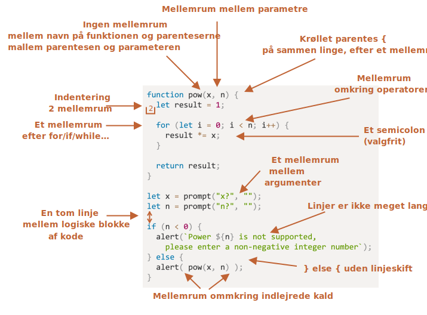

# Kodestil

Vores kode skal være så ren og let at læse som muligt.

Det er faktisk programmeringens kunst -- at tage en kompleks opgave og kode den på en måde, der både er korrekt og menneskelæselig. En god kodestil hjælper meget med det.  

## Syntaks

Her er et snydeark med nogle foreslåede regler (se nedenfor for flere detaljer):


<!--
```js
function pow(x, n) {
  let result = 1;

  for (let i = 0; i < n; i++) {
    result *= x;
  }

  return result;
}

let x = prompt("x?", "");
let n = prompt("n?", "");

if (n < 0) {
  alert(`Power ${n} is not supported,
    please enter a non-negative integer number`);
} else {
  alert( pow(x, n) );
}
```

-->

Lad os nu diskutere reglerne og årsagerne til dem i detaljer.

```warn header="Der findes ingen \"du skal\" regler"
Intet er hugget i sten her. Dette er stilpræferencer, ikke religiøse dogmer.
```

### Krøllede parenteser

I de fleste JavaScript-projekter skrives krøllede parenteser i "Egyptian" stil med den åbne parentes på samme linje som det tilsvarende nøgleord -- ikke på en ny linje. Der skal også være et mellemrum før den åbne parentes, sådan her:

```js
if (betingelse) {
  // gør dette
  // ...og dette
  // ...og dette
}
```

En enkeltlinjekonstruktion, såsom `if (betingelse) doSomething()`, er et vigtig "edge case". Skal vi overhovedet bruge parenteser her?

Her er de annoterede varianter, så du kan bedømme deres læsbarhed for dig selv:

1. 😠 Begyndere gør nogle gange dette. De krøllede parenteser er ikke nødvendige:
    ```js
    if (n < 0) *!*{*/!*alert(`At opløfte i potens ${n} er ikke understøttet`);*!*}*/!*
    ```
2. 😠 Split op til en ny linje uden parenteser. Man kan risikere at lave en fejl, når man tilføjer nye linjer:
    ```js
    if (n < 0)
      alert(`At opløfte i potens ${n} er ikke understøttet`);
    ```
3. 😏 En linje uden parenteser - acceptabelt, hvis det er kort:
    ```js
    if (n < 0) alert(`At opløfte i potens ${n} er ikke understøttet`);
    ```
4. 😃 Den mest læsbare variant:
    ```js
    if (n < 0) {
      alert(`At opløfte i potens ${n} er ikke understøttet`);
    }
    ```

For kort kode er en enkelt linje tilladt, f.eks. `if (cond) return null`. Men en kodeblok (den sidste variant) er normalt mere læsbar.

### Linjelængde

Ingen bryder sig om at læse en lang horisontal linje kode. Det er bedste praksis at opdele dem.

For eksempel:
```js
// backtick quotes ` tillader at opdele strengen i flere linjer
let str = `
  ECMA International's TC39 er en gruppe af JavaScript-udviklere,
  implementører, akademikere og flere, der samarbejder med fællesskabet
  for at vedligeholde og udvikle definitionen af JavaScript.
`;
```

Og for `if` udsagn:

```js
if (
  id === 123 &&
  moonPhase === 'Waning Gibbous' &&
  zodiacSign === 'Libra'
) {
  letTheSorceryBegin();
}
```

Den maksimale linjelængde bør aftales på teamniveau. Det er normalt 80 eller 120 tegn.

### Indrykninger

Der findes to typer indrykninger:

- **Horisontale indrykninger: 2 eller 4 mellemrum.**

    En horisontal indrykning laves ved hjælp af enten 2 eller 4 mellemrum eller det horisontale tab-symbol (tasten `Tab`). Hvilken man vælger er en gammel hellig krig. Mellemrum er mere almindelige nu om dage.

    En fordel ved mellemrum frem for tabulatorer er, at mellemrum tillader mere fleksible konfigurationer af indrykninger end tabulator-symbolet.

    For eksempel kan vi justere parametrene med den åbne parentes, sådan her:

    ```js no-beautify
    show(parametre,
         justeret, // 5 mellemrum indrykning til venstre  
         en,
         efter,
         en,
         anden
      ) {
      // ...
    }
    ```

- **Vertikale indrykninger: tomme linjer til opdeling af kode i logiske blokke.**

    Selv en enkelt funktion kan ofte opdeles i logiske blokke. I eksemplet nedenfor er initialiseringen af variabler, hovedløkken og returneringen af resultatet opdelt vertikalt:

    ```js
    function pow(x, n) {
      let result = 1;
      //              <--
      for (let i = 0; i < n; i++) {
        result *= x;
      }
      //              <--
      return result;
    }
    ```

    Indsæt en ekstra tom linje, hvor det hjælper med at gøre koden mere læsbar. Der bør ikke være mere end ni linjer kode uden en vertikal indrykning.

### Semikoloner

En semikolon bør være til stede efter hver erklæring, selvom det muligvis kan springes over.

Der findes sprog, hvor en semikolon er helt valgfri, og den sjældent bruges. I JavaScript er der dog tilfælde, hvor et linjeskift ikke fortolkes som en semikolon, hvilket efterlader koden sårbar over for fejl. Se mere om det i kapitlet <info:structure#semicolon>.

Hvis du er en erfaren JavaScript-programmør, kan du vælge en kode stil uden semikolon som [StandardJS](https://standardjs.com/). Ellers er det bedst at bruge semikoloner for at undgå mulige faldgruber. Flertallet af udviklere bruger stadig semikoloner, men nyere tendenser går i retning af at droppe dem.

### Indrykningsniveauer

Prøv at undgå at indrykke koden for mange niveauer dybt.

For eksempel, i løkken, er det nogle gange en god idé at bruge [`continue`](info:while-for#continue) direktivet for at undgå ekstra indrykning.

For eksempel, i stedet for at tilføje en indlejret `if` betingelse som denne:

```js
for (let i = 0; i < 10; i++) {
  if (cond) {
    ... // <- et niveau dybere
  }
}
```

kan vi skrive:

```js
for (let i = 0; i < 10; i++) {
  if (!cond) *!*continue*/!*;
  ...  // <- intet ekstra indrykningsniveau
}
```

En lignende ting kan gøres med `if/else` og `return`.

For eksempel er de to konstruktioner nedenfor identiske.

Mulighed 1:

```js
function pow(x, n) {
  if (n < 0) {
    alert("Negativ potensværdi er ikke understøttet");
  } else {
    let result = 1;

    for (let i = 0; i < n; i++) {
      result *= x;
    }

    return result;
  }  
}
```

Mulighed 2:

```js
function pow(x, n) {
  if (n < 0) {
    alert("Negativ potensværdi er ikke understøttet");
    return;
  }

  let result = 1;

  for (let i = 0; i < n; i++) {
    result *= x;
  }

  return result;
}
```

Den anden er mere læsbar, fordi "specialtilfældet" `n < 0` håndteres tidligt. Når kontrollen er udført, kan vi gå videre til "hoved"-kodeflowet uden behov for yderligere indrykning.

## Placering af funktioner

Hvis du skriver flere "hjælpe"-funktioner og den kode, der bruger dem, er der tre måder at organisere funktionerne på.

1. Deklarer funktionerne *over* den kode, der bruger dem:

    ```js
    // *!*funktionserklæringer*/!*
    function createElement() {
      ...
    }

    function setHandler(elem) {
      ...
    }

    function walkAround() {
      ...
    }

    // *!*den kode, der bruger dem*/!*
    let elem = createElement();
    setHandler(elem);
    walkAround();
    ```
2. Kode først, så funktioner

    ```js
    // *!*den kode, der bruger funktionerne*/!*
    let elem = createElement();
    setHandler(elem);
    walkAround();

    // --- *!*hjælpefunktioner*/!* ---
    function createElement() {
      ...
    }

    function setHandler(elem) {
      ...
    }

    function walkAround() {
      ...
    }
    ```
3. Mix: en funktion erklæres, hvor den først bruges.

Mest af tiden foretrækkes den anden variant.

Det er fordi, når man læser kode, vil man først vide *hvad den gør*. Hvis koden kommer først, bliver det klart fra starten. Så måske behøver vi slet ikke læse funktionerne, især hvis deres navne beskriver, hvad de faktisk gør.

## Style Guides

En style guide indeholder generelle regler om "hvordan man skriver" kode, f.eks. hvilke anførselstegn der skal bruges, hvor mange mellemrum der skal bruges til indrykning, den maksimale linjelængde osv. Mange små ting.

Når alle medlemmer af et team bruger den samme style guide, ser koden ensartet ud, uanset hvilket teammedlem der har skrevet den.

Selvfølgelig kan et team altid skrive deres egen style guide, men som regel er der ikke behov for det. Der findes mange eksisterende guides at vælge imellem.

Nogle populære valg:

- [Google JavaScript Style Guide](https://google.github.io/styleguide/jsguide.html)
- [Airbnb JavaScript Style Guide](https://github.com/airbnb/javascript)
- [Idiomatic.JS](https://github.com/rwaldron/idiomatic.js)
- [StandardJS](https://standardjs.com/)
- (plus mange flere)

Hvis du er en nyudvikler, så start med snydearket i begyndelsen af dette kapitel. Derefter kan du gennemse andre style guides for at få flere idéer og beslutte, hvilken du bedst kan lide.

## Automatiserede "Linters"

Linters er værktøjer, der automatisk kan tjekke stilen i din kode og komme med forbedringsforslag.

Det gode ved dem er, at stilkontrol også kan finde nogle fejl, som stavefejl i variabel- eller funktionsnavne. På grund af denne funktion anbefales det at bruge en linter, selv hvis du ikke ønsker at følge en bestemt "kode stil".

Her er nogle velkendte linting-værktøjer:

- [JSLint](https://www.jslint.com/) -- en af de første linters.
- [JSHint](https://jshint.com/) -- flere indstillinger end JSLint.
- [ESLint](https://eslint.org/) -- sandsynligvis den nyeste.

Alle kan udføre opgaven. Forfatteren bruger [ESLint](https://eslint.org/).

De fleste linters er integreret med mange populære editorer: bare aktiver plugin'et i editoren og konfigurer stilen.

For eksempel, for ESLint skal du gøre følgende:

1. Installer [Node.js](https://nodejs.org/).
2. Installer ESLint med kommandoen `npm install -g eslint` (npm er en JavaScript-pakkeinstallatør).
3. Opret en konfigurationsfil med navnet `.eslintrc` i roden af dit JavaScript-projekt (i mappen, der indeholder alle dine filer).
4. Installer/aktiver plugin'et til din editor, der integrerer med ESLint. De fleste editorer har en sådan.

Her er et eksempel på en `.eslintrc`-fil:

```js
{
  "extends": "eslint:recommended",
  "env": {
    "browser": true,
    "node": true,
    "es6": true
  },
  "rules": {
    "no-console": 0,
    "indent": 2
  }
}
```

Her angiver direktivet `"extends"`, at konfigurationen er baseret på "eslint:recommended"-sættet af indstillinger. Derefter specificerer vi vores egne.

Det er også muligt at downloade stilregel-sæt fra nettet og udvide dem i stedet. Se <https://eslint.org/docs/user-guide/getting-started> for flere detaljer om installation.

Mange IDE'er har også indbygget linting, hvilket er praktisk, men ikke altid med så store muligheder for tilpasning som f.eks. ESLint.

## Opsummering

Alle syntaksregler beskrevet i dette kapitel (og i de refererede style guides) har til formål at øge læsbarheden af din kode. Alle er til diskussion.

Når vi tænker på at skrive "bedre" kode, er de spørgsmål, vi bør stille os selv: "Hvad gør koden mere læsbar og lettere at forstå?" og "Hvad kan hjælpe os med at undgå fejl?" Dette er de vigtigste ting at huske på, når man vælger og diskuterer kodestile.

At læse populære style guides vil give dig mulighed for at holde dig opdateret med de nyeste idéer om kodestilstrends og bedste praksis.
