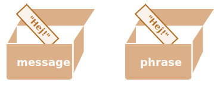

# Objekt referencer og kopiering af objekter

En af de grundlæggende forskelle mellem objekter og primitive værdier er, at objekter gemmes og kopieres "ved reference", mens primitive værdier: strenge, tal, booleske værdier osv. altid kopieres "som en hel værdi".

Det er nok nemmere at forstå, hvis vi kigger lidt under motorhjelmen på, hvad der sker, når vi kopierer en værdi.

Lad os starte med en primitiv, såsom en streng.

Her lægger vi en kopi af `message` i `phrase`:

```js
let message = "Hej!";
let phrase = message;
```

Resultatet er, at vi har to uafhængige variabler, hver med strengen `"Hej!"`.



Ret indlysende resultat, ikke? 

Objekter er ikke sådan.

**En variabel, der tildeles et objekt, gemmer ikke selve objektet, men dets "adresse i hukommelsen" -- med andre ord "en reference" til det.**

Lad os se på et eksempel på en sådan variabel:

```js
let user = {
  name: "John"
};
```

Og sådan gemmes det faktisk i hukommelsen:


Objektet er gemt et sted i hukommelsen (til højre i billedet), mens variablen `user` (til venstre) har en "reference" til det.

Vi kan tænke på en objektvariabel, såsom `user`, som et stykke papir med adressen til objektet på.

Når vi udfører handlinger med objektet, f.eks. tager en egenskab `user.name`, kigger JavaScript-motoren på, hvad der er på den adresse, og udfører operationen på det faktiske objekt.

Nu kommer grunden til, at det er vigtigt.

**Når en objektvariabel kopieres, kopieres referencen, men selve objektet duplikeres ikke.**

For eksempel:

```js no-beautify
let user = { name: "John" };

let admin = user; // kopier referencen
```

Nu har vi to variabler, der hver gemmer en reference til det samme objekt:


Som du kan se, er der stadig kun ét objekt, men nu med to variabler, der refererer til det.

Vi kan bruge enten variablen til at få adgang til objektet og ændre dets indhold:

```js run
let user = { name: 'John' };

let admin = user;

*!*
admin.name = 'Pete'; // ændret af "admin" referencen
*/!*

alert(*!*user.name*/!*); // 'Pete', ændringer kan ses fra "user" referencen
```

Det er som om, vi havde et skab med to nøgler og brugte en af dem (`admin`) til at åbne det og foretage ændringer. Hvis vi senere bruger den anden nøgle (`user`), åbner vi stadig det samme skab og kan få adgang til de ændrede indhold.

## Sammenligning efter reference

To objekter er kun lige, hvis de er det samme objekt.

For eksempel refererer `a` og `b` her til det samme objekt, derfor er de lige:

```js run
let a = {};
let b = a; // kopier referencen

alert( a == b ); // true, begge variabler refererer til det samme objekt
alert( a === b ); // true
```

Og her er to uafhængige objekter ikke lige, selvom de ligner hinanden (begge er tomme):

```js run
let a = {};
let b = {}; // to uafhængige objekter

alert( a == b ); // false
```

For sammenligninger som `obj1 > obj2` eller for en sammenligning mod en primitiv `obj == 5`, konverteres objekter til primitivværdier. Vi vil snart studere, hvordan objektkonverteringer fungerer, men sandheden er, at sådanne sammenligninger sjældent er nødvendige -- de opstår normalt som følge af en programmeringsfejl.

````smart header="Const objekter kan ændres"
En vigtig bivirkning ved at gemme objekter som referencer er, at et objekt erklæret som `const` *kan* ændres.

For eksempel:

```js run
const user = {
  name: "John"
};

*!*
user.name = "Pete"; // (*)
*/!*

alert(user.name); // Pete
```

Du vil måske tro, at linjen `(*)` ville forårsage en fejl, men det gør den ikke. Værdien af `user` er konstant, den skal altid referere til det samme objekt, men egenskaberne for det objekt kan ændres frit.

Med andre ord, `const user` giver kun en fejl, hvis vi prøver at sætte `user=...` som helhed.

Hvis vi virkelig har brug for at gøre objektets egenskaber konstante, er det også muligt, men ved hjælp af helt andre metoder. Vi vil nævne det i kapitlet <info:property-descriptors>.
````

## Kloning Kloning og sammenfletning, Object.assign [#cloning-and-merging-object-assign]

Så, kopiering af en objektvariabel skaber en reference mere til det samme objekt.

Men hvad hvis vi har brug for at duplikere et objekt?

Vi kan oprette et nyt objekt og replikere strukturen af det eksisterende ved at iterere over dets egenskaber og kopiere dem på det primitive niveau.

Som dette:

```js run
let user = {
  name: "John",
  age: 30
};

*!*
let clone = {}; // det nye tomme objekt

// lad os kopiere alle brugerens egenskaber ind i det
for (let key in user) {
  clone[key] = user[key];
}
*/!*

// nu er clone et fuldstændigt uafhængigt objekt med det samme indhold
clone.name = "Pete"; // ændrede dataene i det

alert( user.name ); // stadig John i det oprindelige objekt
```

Vi kan også bruge metoden [Object.assign](https://developer.mozilla.org/en-US/docs/Web/JavaScript/Reference/Global_Objects/Object/assign).

Syntaksen er:

```js
Object.assign(dest, ...sources)
```

- Det første argument `dest` er et målobjekt.
- Yderligere argumenter er en liste over kildeobjekter.

Det kopierer egenskaberne fra alle kildeobjekterne ind i målobjektet `dest`, og returnerer det derefter som resultat.
I dette eksempel har vi et `user` objekt. Lad os tilføje et par tilladelser til det:

```js run
let user = { name: "John" };

let permissions1 = { canView: true };
let permissions2 = { canEdit: true };

*!*
// kopierer alle egenskaber fra permissions1 og permissions2 ind i user
Object.assign(user, permissions1, permissions2);
*/!*

// nu er user = { name: "John", canView: true, canEdit: true }
alert(user.name); // John
alert(user.canView); // true
alert(user.canEdit); // true
```

Hvis den kopierede egenskabs navn allerede findes, overskrives det:

```js run
let user = { name: "John" };

Object.assign(user, { name: "Pete" });

alert(user.name); // nu er user = { name: "Pete" }
```

Vi kan også bruge `Object.assign` til at udføre en simpel kloning af et objekt:

```js run
let user = {
  name: "John",
  age: 30
};

*!*
let clone = Object.assign({}, user);
*/!*

alert(clone.name); // John
alert(clone.age); // 30
```

Her kopieres alle egenskaberne fra `user` ind i det tomme objekt og returneres.

Der findes også andre metoder til at klone et objekt, f.eks. ved at bruge [spread-syntaksen](info:rest-parameters-spread) `clone = {...user}`, som vil blive dækket senere i vejledningen.

## Nested cloning

Indtil nu har vi antaget, at alle egenskaber af `user` er primitive. Men egenskaber kan være referencer til andre objekter.

Som dette:
```js run
let user = {
  name: "John",
  sizes: {
    height: 182,
    width: 50
  }
};

alert( user.sizes.height ); // 182
```

Nu er det ikke nok at kopiere `clone.sizes = user.sizes`, fordi `user.sizes` er et objekt, og vil blive kopieret ved reference, så `clone` og `user` vil dele den samme sizes:

```js run
let user = {
  name: "John",
  sizes: {
    height: 182,
    width: 50
  }
};

let clone = Object.assign({}, user);

alert( user.sizes === clone.sizes ); // true, samme objekt

// user og clone deler sizes
user.sizes.width = 60;    // ændrer en egenskab ét sted
alert(clone.sizes.width); // 60, får resultatet fra det andet sted
```

For at løse det og gøre `user` og `clone` til virkelig separate objekter, bør vi bruge en kloningsløkke, der undersøger hver værdi af `user[key]` og, hvis det er et objekt, så replikere dets struktur også. Det kaldes en "dyb kloning" eller "struktureret kloning". Der findes en [structuredClone](https://developer.mozilla.org/en-US/docs/Web/API/structuredClone) metode, der implementerer dyb kloning.


### structuredClone

Kaldet til `structuredClone(object)` kloner `object` med alle indlejrede egenskaber.

Her er hvordan vi kan bruge det i vores eksempel:

```js run
let user = {
  name: "John",
  sizes: {
    height: 182,
    width: 50
  }
};

*!*
let clone = structuredClone(user);
*/!*

alert( user.sizes === clone.sizes ); // false, forskellige objekter

// user og clone er nu helt uafhængige
user.sizes.width = 60;    // ændrer en egenskab ét sted
alert(clone.sizes.width); // 50, ikke relateret
```

Metoden `structuredClone` kan klone de fleste datatyper, såsom objekter, arrays, primitive værdier.

Den understøtter også cirkulære referencer, når en objekt-egenskab refererer til objektet selv (direkte eller via en kæde af referencer).

For eksempel:

```js run
let user = {};
// lad os lave en cirkulær reference:
// user.me refererer til user selv
user.me = user;

let clone = structuredClone(user);
alert(clone.me === clone); // true
```

Som du kan se, refererer `clone.me` til `clone`, ikke `user`! Så den cirkulære reference blev klonet korrekt også.

Men der er tilfælde, hvor `structuredClone` fejler.

For eksempel, når et objekt har en funktions-egenskab:

```js run
// fejl
structuredClone({
  f: function() {}
});
```

Function-egenskaber understøttes ikke.

For at håndtere sådanne komplekse tilfælde kan vi have brug for at bruge en kombination af kloningsmetoder, skrive brugerdefineret kode eller, for ikke at opfinde den dybe tallerken igen, tage en eksisterende implementering, for eksempel [_.cloneDeep(obj)](https://lodash.com/docs#cloneDeep) fra JavaScript-biblioteket [lodash](https://lodash.com).

## Opsummering

Objekter tildeles og kopieres ved reference. Med andre ord gemmer en variabel ikke "objektværdien", men en "reference" (adresse i hukommelsen) til værdien. Så kopiering af en sådan variabel eller videregivelse som et funktionsargument kopierer den reference, ikke selve objektet.

Alle operationer via kopierede referencer (som at tilføje/fjerne egenskaber) udføres på det samme enkelt objekt.

For at lave en "ægte kopi" (en klon) kan vi bruge `Object.assign` til den såkaldte "shallow copy" (indlejrede objekter kopieres ved reference) eller en "deep cloning"-funktion `structuredClone` eller bruge en brugerdefineret kloningsimplementering, såsom [_.cloneDeep(obj)](https://lodash.com/docs#cloneDeep).