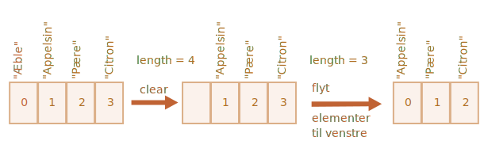
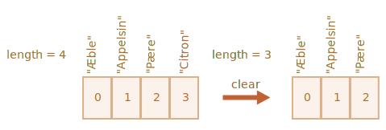

# Arrays (rækker)

Objekter tillader dig at gemme samlinger af værdier med nøgler. Det er fint.

Men meget ofte finder vi ud af, at vi har brug for en *ordnet samling*, hvor vi har et 1., et 2., et 3. element osv. For eksempel har vi brug for det til at gemme en liste over noget: brugere, varer, HTML-elementer osv.

Det er ikke praktisk at bruge et objekt her, fordi det ikke giver metoder til at håndtere rækkefølgen af elementer. Vi kan ikke indsætte en ny egenskab "mellem" de eksisterende. Objekter er bare ikke beregnet til sådan brug.

Der findes en speciel datastruktur kaldet `Array`, til at gemme ordnede samlinger.

## Deklaration

Der er to syntakser til at oprette et tomt array:

```js
let arr = new Array();
let arr = [];
```

Næsten altid bruges den anden syntaks. Vi kan angive startværdier i parenteserne:

```js
let fruits = ["Apple", "Orange", "Plum"];
```

Array elementer er nummererede, startende fra nul.

Vi kan få et element ved dets nummer i firkantede parenteser:

```js run
let fruits = ["Æble", "Appelsin", "Blomme"];

alert( fruits[0] ); // Æble
alert( fruits[1] ); // Appelsin
alert( fruits[2] ); // Blomme
```

Vi kan erstatte et element:

```js
fruits[2] = 'Pære'; // now ["Æble", "Appelsin", "Pære"]
```

...Eller tilføj en ny til arrayet:

```js
fruits[3] = 'Citron'; // now ["Æble", "Appelsin", "Pære", "Citron"]
```

Det samlede antal elementer i arrayet er dets `length`:

```js run
let fruits = ["Æble", "Appelsin", "Blomme"];

alert( fruits.length ); // 3
```

Vi kan også bruge `alert` til at vise hele arrayet.

```js run
let fruits = ["Æble", "Appelsin", "Blomme"];

alert( fruits ); // Æble,Appelsin,Blomme
```

Et array kan gemme elementer af enhver type.

For eksempel, det kan være en blanding af værdier:

```js run no-beautify
// blanding af værdier
let arr = [ 'Æble', { name: 'Karsten' }, true, function() { alert('hej'); } ];

// henter objektet ved indeks 1 og viser dets navn
alert( arr[1].name ); // Karsten

// henter funktionen ved indeks 3 og kører den
arr[3](); // hej
```


````smart header="Hængende komma"
Et array, ligesom et objekt, kan ende med et komma:
```js
let fruits = [
  "Æble",
  "Appelsin",
  "Blomme"*!*,*/!*
];
```

Det "hængende komma" gør det lettere at indsætte/fjerne elementer, fordi alle linjer bliver ens.
````

## Hente sidste elementer med "at"

[recent browser="new"]

Lad os sige, at vi vil have det sidste element i arrayet.

Nogle programmeringssprog tillader brugen af negative indekser til det samme formål, som `fruits[-1]`.

Men i JavaScript virker det ikke. Resultatet vil være `undefined`, fordi indekset i firkantede parenteser behandles bogstaveligt. 

Vi kan eksplicit beregne indekset for det sidste element og derefter få adgang til det: `fruits[fruits.length - 1]`.

```js run
let fruits = ["Æble", "Appelsin", "Blomme"];

alert( fruits[fruits.length-1] ); // Blomme
```

En smule besværligt, ikke? Vi skal skrive variabelnavnet to gange.

Heldigvis findes der en kortere syntaks: `fruits.at(-1)`:

```js run
let fruits = ["Æble", "Appelsin", "Blomme"];

// Samme som fruits[fruits.length-1]
alert( fruits.at(-1) ); // Blomme
```

Med andre ord, `arr.at(i)`:
- er præcis det samme som `arr[i]`, hvis `i >= 0`.
- for negative værdier af `i`, går det baglæns fra slutningen af arrayet.

## Metoderne pop/push, shift/unshift

En [kø](https://en.wikipedia.org/wiki/Queue_(abstract_data_type)) er en af de mest almindelige anvendelser af et array. I datalogi betyder det en ordnet samling af elementer, som understøtter to operationer:

- `push` tilføjer et element til slutningen.
- `shift` henter et element fra begyndelsen, hvilket flytter køen frem, så det 2. element bliver det 1.


Arrays understøtter begge operationer.

I praksis har vi ofte brug for det. For eksempel en kø af beskeder, der skal vises på skærmen.

Der er en anden anvendelse af arrays -- datastrukturen kaldet [stak](https://en.wikipedia.org/wiki/Stack_(abstract_data_type)).

Den understøtter to operationer:

- `push` tilføjer et element til slutningen.
- `pop` henter et element fra slutningen.

Så nye elementer tilføjes eller tages altid fra "enden".

En stak illustreres normalt som en bunke kort: nye kort tilføjes øverst eller tages fra øverst:


For stakke modtages det senest tilføjede element først, det kaldes også LIFO-princippet (Last-In-First-Out). For køer har vi FIFO (First-In-First-Out).

Arrays i JavaScript kan fungere både som en kø og som en stak. De tillader dig at tilføje/fjerne elementer både i starten og i slutningen.
I datalogi kaldes datastrukturen, der tillader dette, for en [deque](https://en.wikipedia.org/wiki/Double-ended_queue).

**Metoder, der arbejder med slutningen af arrayet:**

`pop`
: Trækker det sidste element ud af arrayet og returnerer det:

    ```js run
    let fruits = ["Æble", "Appelsin", "Blomme"];

    alert( fruits.pop() ); // fjern "Blomme" og vis det

    alert( fruits ); // Æble, Appelsin
    ```

    Både `fruits.pop()` og `fruits.at(-1)` returnerer det sidste element i arrayet, men `fruits.pop()` ændrer også arrayet ved at fjerne det.

`push`
: Tilføjer elementet til slutningen af arrayet:

    ```js run
    let fruits = ["Æble", "Appelsin"];

    fruits.push("Blomme");

    alert( fruits ); // Æble, Appelsin, Blomme
    ```

    Kaldet `fruits.push(...)` svarer til `fruits[fruits.length] = ...`.

**Metoder, der arbejder med begyndelsen af arrayet:**

`shift`
: Trækker det første element ud af arrayet og returnerer det:

    ```js run
    let fruits = ["Æble", "Appelsin", "Blomme"];

    alert( fruits.shift() ); // fjern "Æble" og vis det

    alert( fruits ); // Appelsin, Blomme
    ```

`unshift`
: Tilføjer elementet til begyndelsen af arrayet:

    ```js run
    let fruits = ["Appelsin", "Blomme"];

    fruits.unshift('Æble');

    alert( fruits ); // Æble, Appelsin, Blomme
    ```

Metoderne `push` og `unshift` kan tilføje flere elementer på én gang:

```js run
let fruits = ["Æble"];

fruits.push("Appelsin", "Blomme");
fruits.unshift("Ananas", "Citron");

// ["Ananas", "Citron", "Æble", "Appelsin", "Blomme"]
alert( fruits );
```

## Intern opbygning

Et array er en særlig slags objekt. De firkantede parenteser, der bruges til at få adgang til en egenskab `arr[0]`, stammer faktisk fra objektsyntaksen. Det er i bund og grund det samme som `obj[key]`, hvor `arr` er objektet, mens tal bruges som nøgler.

De udvider objekter ved at tilbyde specielle metoder til at arbejde med ordnede samlinger af data og også `length`-egenskaben. Men i kernen er det stadig et objekt.

Husk, der kun er otte grundlæggende datatyper i JavaScript (se kapitlet [Datatyper](info:types) for mere info). Array er et objekt og opfører sig derfor som et objekt.

For eksempel kopieres det ved reference:

```js run
let fruits = ["Banan"]

let arr = fruits; // kopier ved reference (to variabler refererer til samme array)

alert( arr === fruits ); // true

arr.push("Pære"); // ændrer arrayet ved reference

alert( fruits ); // Banan, Pære - 2 elementer nu
```

...Men det, der virkelig gør arrays specielle, er deres interne repræsentation. Motoren forsøger at gemme elementerne i et sammenhængende hukommelsesområde, ét efter ét, som vist på illustrationerne i dette kapitel, og der er også andre optimeringer for at få arrays til at køre virkelig hurtigt.

Men de bryder alle sammen, hvis vi holder op med at arbejde med et array som en "ordnet samling" og begynder at arbejde med det, som om det var et almindeligt objekt.

For eksempel kan vi teknisk set gøre dette:

```js
let fruits = []; // lav et array

fruits[99999] = 5; // tildel en egenskab med et indeks langt større end længden

fruits.age = 25; // opret en egenskab med et vilkårligt navn
```

Det er muligt, fordi arrays i bund og grund er objekter. Vi kan tilføje vilkårlige egenskaber til dem.

Men motoren vil se, at vi arbejder med arrayet som med et almindeligt objekt. Array-specifikke optimeringer er ikke egnede til sådanne tilfælde og vil blive slået fra, deres fordele forsvinder.

Måder at misbruge et array på:

- Tilføj en ikke-numerisk egenskab som `arr.test = 5`.
- Lav huller, som: tilføj `arr[0]` og derefter `arr[1000]` (og intet imellem).
- Fyld arrayet i omvendt rækkefølge, som `arr[1000]`, `arr[999]` og så videre.

Tænk venligst på arrays som specielle strukturer til at arbejde med *ordnede data*. De tilbyder specielle metoder til det. Arrays er omhyggeligt optimeret i JavaScript-motorer til at arbejde med sammenhængende ordnede data, brug dem venligst på denne måde. Og hvis du har brug for vilkårlige nøgler, er chancerne store for, at du faktisk har brug for et almindeligt objekt `{}`.

## Performance

Metoderne `push/pop` kører hurtigt, mens `shift/unshift` er langsomme.


Hvorfor er det hurtigere at arbejde med enden af et array end med begyndelsen? Lad os se, hvad der sker under udførelsen:

```js
fruits.shift(); // fjern 1 element fra starten
```

Det er ikke nok at tage og fjerne elementet med indekset `0`. De andre elementer skal også omnummereres.

`shift`-operationen skal gøre 3 ting:

1. Fjern elementet med indekset `0`.
2. Flyt alle elementer til venstre, omnummerer dem fra indekset `1` til `0`, fra `2` til `1` og så videre.
3. Opdater `length`-egenskaben.



**Jo flere elementer i arrayet, jo længere tid tager det at flytte dem, flere operationer i hukommelsen.**

Det samme sker med `unshift`: for at tilføje et element i begyndelsen af arrayet, skal vi først flytte eksisterende elementer til højre, hvilket øger deres indekser.

Og hvad med `push/pop`? De behøver ikke at flytte noget. For at fjerne et element fra enden, rydder `pop`-metoden indekset og forkorter `length`.

Handlingerne for `pop`-operationen:

```js
fruits.pop(); // fjern 1 element fra enden
```



**`pop`-metoden behøver ikke at flytte noget, fordi de andre elementer beholder deres indekser. Derfor er den lynhurtig.**

Det samme gælder for `push`-metoden.

## Løkker

En af de traditionelle måder at gennemløbe array-elementer på er ved at bruge `for`-loopet over indekser:

```js run
let arr = ["Æble", "Appelsin", "Pære"];

*!*
for (let i = 0; i < arr.length; i++) {
*/!*
  alert( arr[i] );
}
```

Men for arrays er der en anden form for løkke, `for..of`:

```js run
let fruits = ["Æble", "Appelsin", "Blomme"];

// itererer over array-elementer
for (let fruit of fruits) {
  alert( fruit );
}
```

`for..of` giver ikke adgang til nummeret på det aktuelle element, kun dets værdi, men i de fleste tilfælde er det nok. Og det er kortere.

Teknisk set, fordi arrays er objekter, er det også muligt at bruge `for..in`:

```js run
let arr = ["Æble", "Appelsin", "Pære"];

*!*
for (let key in arr) {
*/!*
  alert( arr[key] ); // Æble, Appelsin, Pære
}
```

Men det er faktisk en dårlig idé. Der er potentielle problemer med det:

1. Løkken `for..in` itererer over *alle egenskaber*, ikke kun de numeriske.

    Der findes såkaldte "array-lignende" objekter i browseren og i andre miljøer, som *ligner arrays*. Det vil sige, de har `length` og indeks-egenskaber, men de kan også have andre ikke-numeriske egenskaber og metoder, som vi normalt ikke har brug for. `for..in`-løkken vil dog liste dem. Så hvis vi skal arbejde med array-lignende objekter, kan disse "ekstra" egenskaber blive et problem.

2. `for..in`-løkken er optimeret til generiske objekter, ikke arrays, og derfor er den 10-100 gange langsommere. Selvfølgelig er den stadig meget hurtig. Hastighedsfordelen kan kun være relevant i flaskehalse. Men vi bør stadig være opmærksomme på forskellen.

Generelt bør vi ikke bruge `for..in` til arrays.


## Lidt detaljer om "length"

`length`-egenskaben opdateres automatisk, når vi ændrer arrayet. For at være præcis, er det faktisk ikke antallet af værdier i arrayet, men den største numeriske indeks plus én.

For eksempel, et enkelt element med en stor indeks giver en stor længde:

```js run
let fruits = [];
fruits[123] = "Æble";

alert( fruits.length ); // 124
```

Bemærk, at vi normalt ikke bruger arrays på den måde.

En anden interessant ting ved `length`-egenskaben er, at den kan skrives til.

Hvis vi øger den manuelt, sker der ikke noget interessant. Men hvis vi mindsker den, bliver arrayet forkortet. Processen er irreversibel, her er et eksempel:

```js run
let arr = [1, 2, 3, 4, 5];

arr.length = 2; // forkort til 2 elementer
alert( arr ); // [1, 2]

arr.length = 5; // returner længden tilbage
alert( arr[3] ); // undefined: værdierne kommer ikke tilbage
```

Så den enkleste måde at rydde arrayet på er: `arr.length = 0;`.


## new Array() [#new-array]

Der er endnu en syntaks til at oprette et array:

```js
let arr = *!*new Array*/!*("Æble", "Pære", "osv");
```

Det bruges sjældent, fordi firkantede parenteser `[]` er kortere. Derudover er der en tricky funktion med det.

Hvis `new Array` kaldes med et enkelt argument, som er et tal, så opretter det et array *uden elementer, men med den givne længde*.

Lad os se hvordan man kan skyde sig selv i foden ved at bruge `new Array`:

```js run
let arr = new Array(2); // vil det oprette et array med [2] ?

alert( arr[0] ); // undefined! intet element.

alert( arr.length ); // length 2
```

For at undgå sådanne overraskelser bruger vi normalt firkantede parenteser, medmindre vi virkelig ved, hvad vi gør.

## Flerdimensionale arrays

Arrays kan have elementer, som også er arrays. Vi kan bruge det til flerdimensionale arrays, for eksempel til at gemme matricer eller tabeller.:

```js run
let matrix = [
  [1, 2, 3],
  [4, 5, 6],
  [7, 8, 9]
];

alert( matrix[0][1] ); // 2, den anden værdi i det første indre array
```

## toString

Arrays har deres egen implementering af `toString`-metoden, som returnerer en kommasepareret liste over elementer.

For eksempel, her er et array med tre elementer:


```js run
let arr = [1, 2, 3];

alert( arr ); // 1,2,3
alert( String(arr) === '1,2,3' ); // true
```

Lad os også prøve dette:

```js run
alert( [] + 1 ); // "1"
alert( [1] + 1 ); // "11"
alert( [1,2] + 1 ); // "1,21"
```

Arrays har ikke `Symbol.toPrimitive`, heller ikke en brugbar `valueOf`, de implementerer kun `toString`-konvertering, så her bliver `[]` til en tom streng, `[1]` bliver `"1"` og `[1,2]` bliver `"1,2"`.

Når den binære plus `"+"` operator lægger noget til en streng, konverterer den det også til en streng, så næste trin ser sådan ud:

```js run
alert( "" + 1 ); // "1"
alert( "1" + 1 ); // "11"
alert( "1,2" + 1 ); // "1,21"
```

## Sammenlign ikke arrays med ==

Arrays i JavaScript, i modsætning til nogle andre programmeringssprog, bør ikke sammenlignes med operatoren `==`.

Denne operator har ingen særlig behandling for arrays, den fungerer med dem som med enhver anden objekt.

Lad os genopfriske reglerne:

- To objekter er lige `==` kun hvis de refererer til det samme objekt.
- Hvis et af argumenterne til `==` er et objekt, og det andet er en primitiv, så bliver objektet konverteret til en primitiv, som forklaret i kapitlet <info:object-toprimitive>.
- ...Med undtagelse af `null` og `undefined`, som er lige `==` hinanden og intet andet.

Streng sammenligning `===` er endnu enklere, da den ikke konverterer typer.

Så hvis vi sammenligner arrays med `==`, er de aldrig ens, medmindre vi sammenligner to variabler, der refererer til præcis det samme array.

For eksempel:
```js run
alert( [] == [] ); // false
alert( [0] == [0] ); // false
```

Disse arrays er teknisk set forskellige objekter. Så de er ikke ens. Operatoren `==` laver ikke element-for-element sammenligning.

Sammenligning med primitivtyper kan også give tilsyneladende mærkelige resultater:

```js run
alert( 0 == [] ); // true

alert('0' == [] ); // false
```

I begge tilfælde sammenligner vi en primitiv med et array-objekt. Så arrayet `[]` bliver konverteret til en primitiv med henblik på sammenligning og bliver til en tom streng `''`.

Sammenligningsprocessen fortsætter derefter med primitivtyperne, som beskrevet i kapitlet <info:type-conversions>:

```js run
// efter [] blev konverteret til ''
alert( 0 == '' ); // true, da '' bliver konverteret til tallet 0

alert('0' == '' ); // false, ingen typekonvertering, forskellige strenge
```

Så, hvordan sammenligner man arrays?

Det er egentlig simpelt: brug ikke `==` operatoren. Sammenlign dem i stedet element-for-element i en løkke eller ved hjælp af iterationsmetoder, der forklares i det næste kapitel.

## Opsummering

Array er en speciel slags objekt, velegnet til at gemme og håndtere ordnede dataelementer.

Deklarationen:

```js
// firkantede parenteser (almindeligt)

let arr = [item1, item2...];

// new Array (meget sjældent)
let arr = new Array(item1, item2...);
```

Kaldet til `new Array(number)` opretter et array med den givne længde, men uden elementer.

- `length`-egenskaben er arrayets længde eller, mere præcist, dets sidste numeriske indeks plus en. Den justeres automatisk af array-metoder.
- Hvis vi forkorter `length` manuelt, bliver arrayet forkortet.

Hentning af elementer:

- vi kan få elementet ved dets indeks, som `arr[0]`
- vi kan også bruge metoden `at(i)`, som tillader negative indekser. For negative værdier af `i` tæller den baglæns fra slutningen af arrayet. Hvis `i >= 0`, fungerer den som `arr[i]`.

Vi kan bruge et array som en deque med følgende operationer:

- `push(...items)` tilføjer `items` til slutningen.
- `pop()` fjerner elementet fra slutningen og returnerer det.
- `shift()` fjerner elementet fra begyndelsen og returnerer det.
- `unshift(...items)` tilføjer `items` til begyndelsen.

For at gennemløbe elementerne i arrayet, kan vi bruge en af følgende løkker:
  - `for (let i=0; i<arr.length; i++)` -- virker hurtigst, kompatibel med gamle browsere.
  - `for (let item of arr)` -- den moderne syntaks for kun elementer,
  - `for (let i in arr)` -- brug aldrig.

For at sammenligne arrays, brug ikke `==` operatoren (eller `>`, `<` og andre), da de ikke har nogen særlig behandling for arrays. De håndterer dem som almindelige objekter, og det er ikke, hvad vi normalt ønsker.

I stedet kan du bruge en `for..of` løkke til at sammenligne arrays element-for-element.

Vi fortsætter med arrays og studerer flere metoder til at tilføje, fjerne, udtrække elementer og sortere arrays i det næste kapitel <info:array-methods>.
