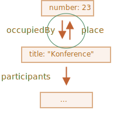

# JSON metoder, toJSON

Lad os sige vi har en kompleks objekt, som vi gerne vil konvertere til en streng. Det kan vi gøre for at sende det over en netværk, eller bare for at udskrive det for logføring.

Selvfølgelig skal en sådan streng indeholde alle vigtige egenskaber.

Vi kunne implementere konverteringen sådan her:

```js run
let user = {
  name: "John",
  age: 30,

*!*
  toString() {
    return `{name: "${this.name}", age: ${this.age}}`;
  }
*/!*
};

alert(user); // {name: "John", age: 30}
```

...Men her, bliver nye egenskaber tilføjet, gamle egenskaber omdøbt og fjernet. Samtidig kan en opdatering af `toString` hver gang blive en omstændig proces. Vi kunne prøve at loop over egenskaberne, men hvad hvis objektet er komplekst og har objekter i egenskaber? Vi ville have brug for at implementere deres konvertering også.

Heldigvis er der en metode til at håndtere alt dette. Denne opgave er løst for os.

## JSON.stringify

[JSON](https://en.wikipedia.org/wiki/JSON) (JavaScript Object Notation) er et generisk format til at repræsentere værdier og objekter. Den er beskrevet i [RFC 4627](https://tools.ietf.org/html/rfc4627) standarden. Den blev oprindeligt lavet for JavaScript, men mange andre sprog har biblioteker til at håndtere den.  Så det er nemt at bruge JSON for data exchange når klienten bruger JavaScript og serveren er skrevet på Ruby/PHP/Java/Whatever.

JavaScript har metoder:

- `JSON.stringify` for at konvertere objekter til JSON.
- `JSON.parse` for at konvertere JSON tilbage til et objekt.

For eksempel, her bruges `JSON.stringify` på et objekt med en student:
```js run
let student = {
  name: 'John',
  age: 30,
  isAdmin: false,
  courses: ['html', 'css', 'js'],
  spouse: null
};

*!*
let json = JSON.stringify(student);
*/!*

alert(typeof json); // vi har en streng!

alert(json);
*!*
/* JSON-encoded objekt:
{
  "name": "John",
  "age": 30,
  "isAdmin": false,
  "courses": ["html", "css", "js"],
  "spouse": null
}
*/
*/!*
```

Metoden `JSON.stringify(student)` tager objektet og konverterer det til en streng.

Den resulterende `json` streng kaldes et *JSON-encoded* eller *serialized* eller *stringified* eller *marshalled* objekt. Vi er klar til at sende det over netværket eller gemme det i en database.


Bemærk at en JSON objekt har flere vigtige forskel på objekter:

- Strenge bruger dobbelte anførselstegn. Ingen enkelte anførselstegn eller backticks i JSON. Så `'John'` bliver `"John"`.
- Objekts property navne er også dobbelte anførselstegn. Det er obligatorisk. Så `age:30` bliver `"age":30`.

`JSON.stringify` kan også bruges på primitiver.

JSON understøtter følgende datatyper:

- Objekter `{ ... }`
- Arrays `[ ... ]`
- Primitiver:
    - strenge,
    - tal,
    - booleske værdier `true/false`,
    - `null`.

For eksempel:

```js run
// et tal i JSON er bare et tal
alert( JSON.stringify(1) ) // 1

// en streng i JSON er stadig en streng, men dobbelte anførselstegn
alert( JSON.stringify('test') ) // "test"

alert( JSON.stringify(true) ); // true

alert( JSON.stringify([1, 2, 3]) ); // [1,2,3]
```

JSON er en specifiktation der alene fokuserer på data. Så nogle JavaScript-specifikke objekters egenskaber er ikke inkluderet i `JSON.stringify`.

Namely:

- Funktioner (metoder).
- Symbolske nøgler og værdier.
- Egenskaber der gemmer `undefined`.

```js run
let user = {
  sayHi() { // ignoreret
    alert("Hello");
  },
  [Symbol("id")]: 123, // ignoreret
  something: undefined // ignoreret
};

alert( JSON.stringify(user) ); // {} (tomt objekt)
```

Normalt er det fint. Hvis det ikke er hvad vi ønsker, så vil vi snart se hvordan vi kan tilpasse processen.

Det store træk er at nøstede objekter understøttes og konverteres automatisk.

For eksempel:

```js run
let meetup = {
  title: "Konference",
*!*
  room: {
    number: 23,
    participants: ["john", "ann"]
  }
*/!*
};

alert( JSON.stringify(meetup) );
/* Hele strukturen bliver stringified:
{
  "title":"Konference",
  "room":{"number":23,"participants":["john","ann"]},
}
*/
```

Den vigtige begrænsning er at der ikke må være en cirkulær referencer.

For eksempel:

```js run
let room = {
  number: 23
};

let meetup = {
  title: "Konference",
  participants: ["john", "ann"]
};

meetup.place = room;       // meetup refererer til room
room.occupiedBy = meetup; // room refererer til meetup

*!*
JSON.stringify(meetup); // Error: Converting circular structure to JSON
*/!*
```

Her fejler konverteringen, fordi der er en cirkulær referencer: `room.occupiedBy` refererer til `meetup`, og `meetup.place` refererer til `room`:




## Udeluk og transformer: replacer

Den fulde syntaks for `JSON.stringify` er:

```js
let json = JSON.stringify(value[, replacer, space])
```

value
: Den værdi der skal konverteres.

replacer
: En array af egenskaber der skal konverteres eller en mapping funktion `function(key, value)`.

space
: Antallet af mellemrum der skal bruges for formatering.

De fleste gange bruges `JSON.stringify` kun med det første argument. Men hvis vi har brug for at fine-tune konverteringsprocessen, så kan vi bruge den anden argument til `JSON.stringify`.

Hvis vi sender en array af egenskaber til den, så bliver kun disse egenskaber kodet.

For eksempel:

```js run
let room = {
  number: 23
};

let meetup = {
  title: "Konference",
  participants: [{name: "John"}, {name: "Alice"}],
  place: room // meetup refererer til room
};

room.occupiedBy = meetup; // room refererer til meetup

alert( JSON.stringify(meetup, *!*['title', 'participants']*/!*) );
// {"title":"Konference","participants":[{},{}]}
```

Her er vi sandsynligvis lidt for strikse. Listen med egenskaber bliver anvendt på hele objekstrukturen. Så objekterne inde i `participants` er tomme, fordi `name` ikke er med på listen.

Lad os inkludere hver egenskab i listen, undtagen `room.occupiedBy` der ville forårsage en cirkulær referance:

```js run
let room = {
  number: 23
};

let meetup = {
  title: "Konference",
  participants: [{name: "John"}, {name: "Alice"}],
  place: room // meetup refererer til room
};

room.occupiedBy = meetup; // room refererer til meetup

alert( JSON.stringify(meetup, *!*['title', 'participants', 'place', 'name', 'number']*/!*) );
/*
{
  "title":"Konference",
  "participants":[{"name":"John"},{"name":"Alice"}],
  "place":{"number":23}
}
*/
```

Nu bliver alt, undtagen `occupiedBy`, kodet. Men listen med egenskaber er meget lang.

Fortjusligtvis kan vi bruge en funktion i stedet for en array som `replacer`.

Denne funktion bliver kaldt for hver `(key, value)` par og skal returnere den "omplacerede" værdi, der vil blive brugt i stedet for den originale værdi. Eller `undefined` hvis værdien skal blive ignoreret.

I vores tilfælde kan vi returnere `value` "som det er" for alt, undtagen `occupiedBy`. For at ignorere `occupiedBy`, returnerer koden under `undefined`:

```js run
let room = {
  number: 23
};

let meetup = {
  title: "Konference",
  participants: [{name: "John"}, {name: "Alice"}],
  place: room // meetup refererer til room
};

room.occupiedBy = meetup; // room refererer til meetup

alert( JSON.stringify(meetup, function replacer(key, value) {
  alert(`${key}: ${value}`);
  return (key == 'occupiedBy') ? undefined : value;
}));

/* key:value par der kommer til replacer:
:             [object Object]
title:        Konference
participants: [object Object],[object Object]
0:            [object Object]
name:         John
1:            [object Object]
name:         Alice
place:        [object Object]
number:       23
occupiedBy: [object Object]
*/
```

Bemærk at `replacer` funktionen får hvert `(key, value)` par, inklusive nøstede objekter og array elementer. Den bliver anvendt rekursivt. Værdien af `this` inden i `replacer` er objektet der indeholder den aktuelle egenskab.

Det første kald er særligt. Det bliver skabt ved brug af et særligt "wrapper object": `{"": meetup}`. Med andre ord, det første `(key, value)` par har en tom nøgle, og værdien er hele mål-objektet. Derfor er den første linje `":[object Object]"` i eksemplet ovenfor.

Ideen er at tildele så meget kraft til `replacer` som muligt: det har dermed en chance for at analysere eller udskifte/ignorere hele eller dele af objektet hvis nødvendigt.


## Formattering: space

Det tredje argument af `JSON.stringify(value, replacer, space)` er antallet af mellemrum der skal bruges for en pæn formattering.

Tidligere havde alle stringified objekter ingen indentering og ekstra mellemrum. Det er fint hvis vi ønsker at sende et objekt over et netværk. `space` argumentet bruges udelukkende til et pænere output.

Her vil `space = 2` fortælle JavaScript at den skal vise indlejrede objekter på flere linjer, med en indrykning på 2 mellemrum inde i et objekt:

```js run
let user = {
  name: "John",
  age: 25,
  roles: {
    isAdmin: false,
    isEditor: true
  }
};

alert(JSON.stringify(user, null, 2));
/* indentering med 2 mellemrum:
{
  "name": "John",
  "age": 25,
  "roles": {
    "isAdmin": false,
    "isEditor": true
  }
}
*/

/* for JSON.stringify(user, null, 4) vil resultatet være mere indenteret:
{
    "name": "John",
    "age": 25,
    "roles": {
        "isAdmin": false,
        "isEditor": true
    }
}
*/
```

Det tredje argument kan også være en streng. I dette tilfælde bruges strengen til indrykning i stedet for et antal mellemrum.

`space` parameteren bruges udelukkende til logging og pæne output.

## Brugerdefineret "toJSON"

På samme måde som `toString` kan styre konverering til tekststrenge kan objekter have metoden `toJSON` for konvertering til JSON. `JSON.stringify` kalder den automatisk, hvis den er defineret.

For eksempel:

```js run
let room = {
  number: 23
};

let meetup = {
  title: "Konference",
  date: new Date(Date.UTC(2017, 0, 1)),
  room
};

alert( JSON.stringify(meetup) );
/*
  {
    "title":"Konference",
*!*
    "date":"2017-01-01T00:00:00.000Z",  // (1)
*/!*
    "room": {"number":23}               // (2)
  }
*/
```

Her kan vi se at `date` `(1)` bliver til en streng. Det er fordi, at alle dato-objekter har en indbygget `toJSON` metode der returnerer sådan en streng.

Nu kan vi prøve at oprette en brugerdefineret `toJSON` for vores objekt `room` `(2)`:

```js run
let room = {
  number: 23,
*!*
  toJSON() {
    return this.number;
  }
*/!*
};

let meetup = {
  title: "Konference",
  room
};

*!*
alert( JSON.stringify(room) ); // 23
*/!*

alert( JSON.stringify(meetup) );
/*
  {
    "title":"Konference",
*!*
    "room": 23
*/!*
  }
*/
```

Som vi kan se bliver `toJSON` brugt både ved det direkte kald `JSON.stringify(room)` og når `room` er indlejret i et andet objekt.


## JSON.parse

For at afkode en JSON-streng, skal vi bruge en anden metode kaldet [JSON.parse](mdn:js/JSON/parse).

Syntaksen er:
```js
let value = JSON.parse(str[, reviver]);
```

str
: JSON-strengen der skal parses.

reviver
: Frivillig funktion(key,value) der vil blive kaldt for hvert `(key, value)` par og kan transformere værdien.

For eksempel:

```js run
// stringified array
let numbers = "[0, 1, 2, 3]";

numbers = JSON.parse(numbers);

alert( numbers[1] ); // 1
```

Eller for indlejrede objekter:

```js run
let userData = '{ "name": "John", "age": 35, "isAdmin": false, "friends": [0,1,2,3] }';

let user = JSON.parse(userData);

alert( user.friends[1] ); // 1
```

JSOM kan være simpel eller kompleks. Objekter og arrays kan inkludere andre objekter og arrays. Men de skal overholde samme JSON-format.

Her er et par typiske fejl i håndskrevet JSON (Nogle gange skal vi selv skrive det for debugging eller lignende):

```js
let json = `{
  *!*name*/!*: "John",                     // fejl: egenskabens navn er uden dobbelte anførselstegn
  "surname": *!*'Smith'*/!*,               // fejl: enkelte anførselstegn i værdi (skal være dobbelte)
  *!*'isAdmin'*/!*: false                  // fejl: enkelte anførselstegn i nøgle (skal være dobbelte)
  "birthday": *!*new Date(2000, 2, 3)*/!*, // fejl: "new" er ikke tilladt - kun rene værdier
  "friends": [0,1,2,3]              // her er alt fint
}`;
```

Ud over det understøtter JSON ikke kommentarer. Hvis du tilføjer en kommentar til JSON, bliver det ugyldigt.

Der findes et andet format kaldet [JSON5](https://json5.org/), der tillader nøgler uden anførselstegn, kommentarer osv. Men dette er en selvstændig bibliotek, ikke i sprogets specifikation.

Den normale JSON er striks. Det er ikke fordi udviklerne er dovne med for at sikre en nem, pålidelig og meget hurtig implementering mellem forskellige systemer.

## Brug reviver

Forestil dig, at vi modtager et stringified `meetup` objekt fra serveren.

Det ser således ud:

```js
// title: (meetup title), date: (meetup date)
let str = '{"title":"Konference","date":"2017-11-30T12:00:00.000Z"}';
```

...Nu har vi brug for at *deserialize* det og ændre det tilbage til et JavaScript objekt.

Det kan vi gøre ved at kalde `JSON.parse`:

```js run
let str = '{"title":"Konference","date":"2017-11-30T12:00:00.000Z"}';

let meetup = JSON.parse(str);

*!*
alert( meetup.date.getDate() ); // Fejl!
*/!*
```

Ups! En fejl!

Værdien af `meetup.date` er en streng, ikke et `Date` objekt. Hvordan kunne `JSON.parse` vide, at den skulle transformere den streng til et `Date` objekt?

Lad os give `JSON.parse` en reviving funktion som anden argument, som returnerer alle værdier "som de er", men `date` vil blive til et `Date` objekt:

```js run
let str = '{"title":"Konference","date":"2017-11-30T12:00:00.000Z"}';

*!*
let meetup = JSON.parse(str, function(key, value) {
  if (key == 'date') return new Date(value);
  return value;
});
*/!*

alert( meetup.date.getDate() ); // nu virker det!
```

Det virker også for indlejrede objekter:

```js run
let schedule = `{
  "meetups": [
    {"title":"Konference","date":"2017-11-30T12:00:00.000Z"},
    {"title":"Fødselsdag","date":"2017-04-18T12:00:00.000Z"}
  ]
}`;

schedule = JSON.parse(schedule, function(key, value) {
  if (key == 'date') return new Date(value);
  return value;
});

*!*
alert( schedule.meetups[1].date.getDate() ); // det virker!
*/!*
```


## Opsummering

- JSON er et selvstændigt data format. Det er et uafhængigt format der er standard for de fleste programmeringssprog.
- JSON understøtter almindelige objekter, arrays, strenge, tal, booleans og `null`.
- JavaScript leverer metoderne [JSON.stringify](mdn:js/JSON/stringify) til serialisering til JSON og [JSON.parse](mdn:js/JSON/parse) til læsning fra JSON.
- Begge metoder understøtter transformerfunktioner for smart læsning/skrivning.
- Hvis et objekt har `toJSON`, så kaldes det af `JSON.stringify`.

