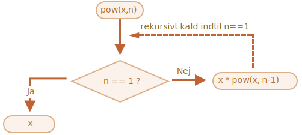
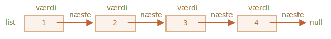
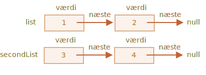
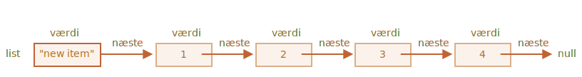
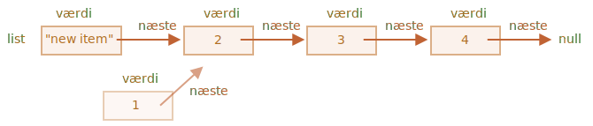

# Rekursion og stak

Lad os vende tilbage til funktioner og studere dem mere grundigt.

Vores første emne vil være *rekursion*.

Hvis du ikke er ny i programmering, så er det sandsynligvis kendt og du kan springe dette kapitel over.

Rekursion er et programmeringsmønster, som er nyttigt i situationer hvor en opgave kan opdeles i flere opgaver af samme type, men mere simple. Eller når en opgave kan formindskes til en enkel handling plus en mere simpel variant af samme opgave. Eller, som vi vil se snart, for at håndtere bestemte datastrukturer.

Når en funktion løser en opgave, kan den i processen kalde mange andre funktioner. En delmængde heraf er når en funktion kalder *sig selv*. Det kaldes *rekursion*.

## To måder at tænke på

For noget simpelt at starte med -- lad os skrive en funktion `pow(x, n)` som hæver `x` til en naturlig potens af `n`. Med andre ord, multiplicerer `x` med sig selv `n` gange.

```js
pow(2, 2) = 4
pow(2, 3) = 8
pow(2, 4) = 16
```

Der er to måder at implementere det.

1. Iterativ tankegang: `for`-loopet:

    ```js run
    function pow(x, n) {
      let result = 1;

      // Gang resultatet med x n gange i loopet
      for (let i = 0; i < n; i++) {
        result *= x;
      }

      return result;
    }

    alert( pow(2, 3) ); // 8
    ```

2. Rekursiv tænkning: Simplificer opgaven og kald dig selv:

    ```js run
    function pow(x, n) {
      if (n == 1) {
        return x;
      } else {
        return x * pow(x, n - 1);
      }
    }

    alert( pow(2, 3) ); // 8
    ```

Bemærk hvordan den rekursive variant er grundiglæggende anderledes.

Når `pow(x, n)` kaldes splittes udførelsen til to forgreninger:

```js
              if n==1  = x
             /
pow(x, n) =
             \
              else     = x * pow(x, n - 1)
```

1. Hvis `n == 1`, så er alt trivielt. Dette kaldes *basen* for rekursion, fordi den fordi den umiddelbart producerer det obviouse resultat: `pow(x, 1)` er lig med `x`.
2. Ellers kan vi repræsentere `pow(x, n)` som `x * pow(x, n - 1)`. I matematik ville man skrive <code>x<sup>n</sup> = x * x<sup>n-1</sup></code>. Dette kaldes *et rekursivt trin*: vi transformerer opgaven til en enkel handling (multiplication med `x`) og et mere simpelt kald af samme opgave (`pow` med lavere `n`). Næste trin forenkler det yderligere og yderligere indtil `n` når `1`.

Vi kan også sige at `pow` *kalder sig selv rekursivt* indtil `n == 1`.




For eksempel, for at udregne `pow(2, 4)` vil den rekursive variant gøre disse trin:

1. `pow(2, 4) = 2 * pow(2, 3)`
2. `pow(2, 3) = 2 * pow(2, 2)`
3. `pow(2, 2) = 2 * pow(2, 1)`
4. `pow(2, 1) = 2`

så rekursionen reducerer et funktionskald til et mere simpelt, og så videre, indtil resultatet bliver åbenlyst.

````smart header="Rekursion er normalt kortere"
En rekursiv løsning er normalt kortere end en iterativ.

Her kan vi omskrive det samme med betingelsesoperatoren `?` i stedet for `if` for at gøre `pow(x, n)` mere kompakt og stadig meget læselig:

```js run
function pow(x, n) {
  return (n == 1) ? x : (x * pow(x, n - 1));
}
```
````

Det maksimalt antal indlejrede kald (inklusive det første) kaldes *rekursionsdybde*. I vores tilfælde vil det være præcis `n`.

Den maksimale rekursionsdybde er begrænset af JavaScript-motoren. Vi kan stole på, at den er 10.000, nogle motorer tillader mere, men 100.000 er sandsynligvis uden for grænsen for de fleste af dem. Der er automatiske optimeringer, der hjælper med at optimere antallet af kald ("tail calls optimizations"), men de er ikke endnu understøttet overalt og virker kun i simple tilfælde.

Det begrænser anvendelsen af rekursion, men den forbliver stadig meget bred. Der er mange opgaver hvor den rekursive måde at tænke giver enklere kode der er nemmere at vedligeholde.

## Eksekveringens kontekst og stak

Lad os undersøge hvordan rekursive kald fungerer. For det vil vi kigge under huden på funktioner.

Informationen om processen for eksekvering af en kørende funktion er gemt i dens *eksekveringskontekst*.

[Eksekveringskonteksten](https://tc39.github.io/ecma262/#sec-execution-contexts) er en intern datastruktur, der indeholder detaljer om eksekveringen af en funktion: hvor kontrolløbet er nu, de aktuelle variabler, værdien af `this` (vi bruger det ikke her) og andre interne detaljer.

Et funktionskald har præcis én eksekveringskontekst forbundet med det.

Når en funktion udfører et indlejret kald, sker følgende:

- Den nuværende funktion pauses.
- Den eksekveringskontekst, der er forbundet med den, huskes i en speciel datastruktur kaldet *execution context stack*.
- Det indlejrede kald udføres.
- Når det er færdigt, hentes den gamle eksekveringskontekst fra stakken og den ydre funktion genoptages fra hvor den stoppede.

Lad os se hvad der sker under kaldet `pow(2, 3)`.

### pow(2, 3)

I begyndelsen af kaldet `pow(2, 3)` vil eksekveringskonteksten gemme variablerne: `x = 2, n = 3`, og kontrolløbet er på linje `1` i funktionen.

Vi kan skitsere det som:

<ul class="function-execution-context-list">
  <li>
    <span class="function-execution-context">Context: { x: 2, n: 3, at line 1 }</span>
    <span class="function-execution-context-call">pow(2, 3)</span>
  </li>
</ul>

Det er her funktionen begynder at eksekvere. Betingelsen `n == 1` er falsk, så flowet fortsætter til den anden gren af `if`:

```js run
function pow(x, n) {
  if (n == 1) {
    return x;
  } else {
*!*
    return x * pow(x, n - 1);
*/!*
  }
}

alert( pow(2, 3) );
```


Variablene er de samme, men linjen ændres, så konteksten er nu:

<ul class="function-execution-context-list">
  <li>
    <span class="function-execution-context">Context: { x: 2, n: 3, at line 5 }</span>
    <span class="function-execution-context-call">pow(2, 3)</span>
  </li>
</ul>

For at udregne `x * pow(x, n - 1)`, vi skal lave et indlejret kald af `pow` med nye argumenter `pow(2, 2)`.

### pow(2, 2)

For at udføre et indlejret kald, husker JavaScript den nuværende eksekveringskontekst i *execution context stack*.

Her kalder vi den samme funktion `pow`, men det spiller ingen rolle. Processen er den samme for alle funktioner:

1. Den nuværende kontekst huskes øverst på stakken.
2. En ny kontekst oprettes for underkaldet.
3. Når underkaldet er færdigt -- bliver den gamle kontekst fjernet fra stakken, og dens eksekvering genoptages.

Her er kontekststakken efter vi er gået ind i underkaldet `pow(2, 2)`:

<ul class="function-execution-context-list">
  <li>
    <span class="function-execution-context">Kontekst: { x: 2, n: 2, at line 1 }</span>
    <span class="function-execution-context-call">pow(2, 2)</span>
  </li>
  <li>
    <span class="function-execution-context">Kontekst: { x: 2, n: 3, at line 5 }</span>
    <span class="function-execution-context-call">pow(2, 3)</span>
  </li>
</ul>

Den nye nuværende eksekveringskontekst er øverst (og fed), og de tidligere huskede kontekster er nedenfor.

Når underkaldet er færdigt -- er det nemt at genoptage den gamle kontekst, fordi den beholder både variablerne og den præcise sted i koden hvor den stoppede.

```smart
Her i billedet bruger vi ordet "line", som i vores eksempel er der kun ét underkald i en linje, men generelt kan en enkelt linje af kode indeholde flere underkald, f.eks. `pow(…) + pow(…) + somethingElse(…)`.

Så det ville være mere præcist at sige, at eksekveringen genoptages "øjeblikkeligt efter underkaldet".
```

### pow(2, 1)

Processen gentages: et nyt underkald oprettes på linje `5`, nu med argumenterne `x=2`, `n=1`.

En ny eksekveringskontekst oprettes, den gamle kontekst bliver pushed øverst på stakken:

<ul class="function-execution-context-list">
  <li>
    <span class="function-execution-context">Kontekst: { x: 2, n: 1, at line 1 }</span>
    <span class="function-execution-context-call">pow(2, 1)</span>
  </li>
  <li>
    <span class="function-execution-context">Kontekst: { x: 2, n: 2, at line 5 }</span>
    <span class="function-execution-context-call">pow(2, 2)</span>
  </li>
  <li>
    <span class="function-execution-context">Kontekst: { x: 2, n: 3, at line 5 }</span>
    <span class="function-execution-context-call">pow(2, 3)</span>
  </li>
</ul>

Der er 2 gamle kontekster og 1 nuværende kontekst for `pow(2, 1)`.

### Udgangen

Med udførelsen af `pow(2, 1)` vil betingelsen `n == 1`, i modsætning til før, være sand. Derfor udføres den første gren af `if`:

```js
function pow(x, n) {
  if (n == 1) {
*!*
    return x;
*/!*
  } else {
    return x * pow(x, n - 1);
  }
}
```

Der er ikke flere indlejrede kald, så funktionen afslutter og returnerer `2`.

Når funktionen afslutter, er dens eksekveringskontekst ikke længere nødvendig, så den fjernes fra hukommelsen. Den tidligere kontekst genoprettes fra toppen af stakken:


<ul class="function-execution-context-list">
  <li>
    <span class="function-execution-context">Context: { x: 2, n: 2, at line 5 }</span>
    <span class="function-execution-context-call">pow(2, 2)</span>
  </li>
  <li>
    <span class="function-execution-context">Context: { x: 2, n: 3, at line 5 }</span>
    <span class="function-execution-context-call">pow(2, 3)</span>
  </li>
</ul>

Udførelsen af `pow(2, 2)` genoptages. Den har resultatet af underkaldet `pow(2, 1)`, så den også kan færdiggøre evalueringen af `x * pow(x, n - 1)`, og returnere `4`.

Så den tidligere kontekst genoprettes:

<ul class="function-execution-context-list">
  <li>
    <span class="function-execution-context">Kontekst: { x: 2, n: 3, at line 5 }</span>
    <span class="function-execution-context-call">pow(2, 3)</span>
  </li>
</ul>

Når den afslutter, har vi et resultat på `pow(2, 3) = 8`.

Dybden af rekursionen i dette tilfælde var: **3**.

Som vi kan se fra illustrationerne ovenfor, er rekursionsdybden lig med det maksimale antal kontekster i stakken.

Bemærk hukommelseskravene. Kontekster tager plads. I vores tilfælde kræver en udregning til potens af `n` faktisk hukommelse for `n` kontekster, for alle lavere værdier af `n`.

En algoritme baseret på løkker er mere hukommelsesvenlig:

```js
function pow(x, n) {
  let result = 1;

  for (let i = 0; i < n; i++) {
    result *= x;
  }

  return result;
}
```

Denne udgave af `pow` bruger kun en enkelt kontekst der ændrer `i` og `result` i processen. Dens hukommelseskrav er små, faste og afhænger ikke af `n`.

**Enhver rekursion kan omskrives som en løkke. Versionen baseret på løkker er ofte mere effektiv.**

...men nogle gange er omskrivningen ikke-triviel, især når en funktion bruger forskellige rekursive underkald afhængigt af betingelser og fletter deres resultater eller når forgreningen er mere kompleks. Endelig kan optimeringen være unødvendig til en grad hvor det ikke er værd værd at investere i.

Rekursion kan give en kortere kode der nemmere at forstå og understøtte. Optimeringer er ikke nødvendige overalt. Det vigtigste vi har brug for er god kode, og her kan rekursion være at foretrække (når man har "knækket koden" il at forstå den).

## Rekursive 'traversals'

Et anden god brug af rekursion er rekursive 'traversal'. Jeg tror ikke der er et godt direkte dansk ord, men det betyder noget i stil med *gennemløb af alle elementer i en struktur*.

Forestil dig et firma. I det kan medarbejdernes struktureres i et objekt i stil med dette:

```js
let company = {
  sales: [{
    name: 'John',
    salary: 1000
  }, {
    name: 'Alice',
    salary: 1600
  }],

  development: {
    sites: [{
      name: 'Peter',
      salary: 2000
    }, {
      name: 'Alex',
      salary: 1800
    }],

    internals: [{
      name: 'Jack',
      salary: 1300
    }]
  }
};
```

Med andre ord - et firma har afdelinger.

- En afdeling kan have et array af medarbejdere. For eksempel har salgsafdelingen (`sales`) 2 medarbejdere: John og Alice.
- Eller en afdeling kan opdeles i underafdelinger, som `development` har to grene: `sites` og `internals`. Hver af dem har deres egen medarbejderliste.
- Det er også muligt at en underafdeling vokser og opdeles i underunderafdelinger (eller hold).

    For eksempel kan `sites`-afdelingen i fremtiden opdeles i hold for `siteA` og `siteB`. Og de, potentielt, kan opdeles end mere. Det er ikke på billedet, bare noget at have i tankerne.

Lad os nu forestille os at vi vil have en funktion der lægger alle lønninger (salaries) sammen. Hvordan gør vi det?

En iterativ tilgang er ikke nem da strukturen ikke er simpel. En første idé kunne være at gennemløbe `company` med en nested subloop over 1. niveau afdelinger. Men så skal vi have flere nested subloops for at gennemløbe medarbejderne i 2. niveau afdelinger som `sites`... Og så en subloop inden i dem for 3. niveau afdelinger som måske vil opstå i fremtiden? Hvis vi sætter 3-4 nested subloops i koden for at gennemløbe et enkelt objekt, bliver det ret hurtigt svært at håndtere.

Lad os prøve rekursion.

Som vi kan se, når vores funktion får en afdeling den skal sammentælle, er der to mulige tilfælde:

1. Enten er den en "simpel" afdeling med et *array* af medarbejdere -- da kan vi summe lønningerne i en simpel loop.
2. Eller den er *et objekt* med `N` underafdelinger -- da kan vi lave `N` rekursive kald for at få summen for hver af de underafdelinger og kombinere resultaterne.

Det første tilfælde er basen for rekursionen, det trivielle tilfælde, når vi får et array.

Det andet tilfælde når vi får et objekt er det rekursive trin. En kompleks opgave opdeles i underopgaver for mindre afdelinger. De kan i sin tur opdeles igen, men snarest eller senest vil opdeltningen slutte ved (1).

Algoritmen er sandsynligvis endnu lettere at læse fra koden:


```js run
let company = { // det samme objekt, komprimeret 
  sales: [{name: 'John', salary: 1000}, {name: 'Alice', salary: 1600 }],
  development: {
    sites: [{name: 'Peter', salary: 2000}, {name: 'Alex', salary: 1800 }],
    internals: [{name: 'Jack', salary: 1300}]
  }
};

// Funktionen der udfører jobbet
*!*
function sumSalaries(department) {
  if (Array.isArray(department)) { // Tilfælde (1)
    return department.reduce((prev, current) => prev + current.salary, 0); // sum the array
  } else { // Tilfælde (2)
    let sum = 0;
    for (let subdep of Object.values(department)) {
      sum += sumSalaries(subdep); // rekursivt kald til underafdelinger. Sammentæl alle deres returnerede resultater
    }
    return sum;
  }
}
*/!*

alert(sumSalaries(company)); // 7700
```

Koden er kort og (forhåbentlig) nem at forstå. Det er kraften i rekursionen. Den virker også for ethvert niveau af underafdelingsindlejring.

Her er et diagram over kaldene:


Her kan vi måske nemmere se principperne: for et objekt `{...}` udføres subkald, mens arrays `[...]` er "blade" i rekursions-træet og giver umiddelbare resultater.

Bemærk at koden bruger et par af de smarte muligheder som vi har gennemgået tidligere:

- Metoden `arr.reduce` forklaret i kapitlet <info:array-methods> returnerer summen af et array.
- Løkken `for(val of Object.values(obj))` itererer over et objekt og `Object.values` returnerer et array af dens værdier.


## Rekursive strukturer

En rekursiv (recursivt defineret) datastruktur er en struktur der replikerer sig selv i dele.

Vi har lige set det i eksemplet med en virksomhedsstruktur ovenfor.

En virksomheds *afdeling* er:
- Enten et array af medarbejdere.
- Eller et objekt med *underafdelinger*.

For webudviklere er der et meget mere velkendt eksempel: HTML og XML dokumenter.

I et HTML dokument kan et *HTML-tag* indeholde en liste af:
- Tekststykker.
- HTML-kommentarer.
- Andre *HTML-tags* (der i sig selv kan indeholde tekststykker/kommentarer eller andre tags etc).

Det er igen en rekursiv definition.

For bedre at forstå dette vil vi gennemgå en mere kompleks rekursiv struktur kaldet "Linked list" som kan være en bedre alternativ til arrays i nogle tilfælde.

### Linked list

Forestil dig, vi vil gemme en ordnet liste af objekter.

Den naturlige valg er et array:

```js
let arr = [obj1, obj2, obj3];
```

...Men der er et problem med arrays. Operationerne "slet element" og "indsæt element" er dyre. For eksempel vil `arr.unshift(obj)` være nødt til at renummerere alle elementer for at skabe plads for det nye element `obj`. Hvis det er et stort array, så tager det tid; det samme vil ske med `arr.shift()`.

Den eneste modifikation der ikke kræver masser af renummerering er de operationer der arbejder med slutningen af arrayet: `arr.push/pop`. Så et array kan være ret langsomt for store køer, når vi skal arbejde med starten.

Alternativt, hvis vi virkelig har brug for hurtig indsættelse/sletning, kan vi vælge en anden datastruktur kaldet en [linked list](https://en.wikipedia.org/wiki/Linked_list).

Et *linked list element* er rekursivt defineret som et objekt med:
- `value` - værdien af elementet.
- `next` - en reference til det næste *linked list element* eller `null` hvis det er slutningen.

For eksempel er her en linked list med 4 elementer:

```js
let list = {
  value: 1,
  next: {
    value: 2,
    next: {
      value: 3,
      next: {
        value: 4,
        next: null
      }
    }
  }
};
```

Her er en grafisk repræsentation af listen:



En alternativ kode for oprettelse af den samme linked list kunne være:

```js no-beautify
let list = { value: 1 };
list.next = { value: 2 };
list.next.next = { value: 3 };
list.next.next.next = { value: 4 };
list.next.next.next.next = null;
```

Her kan vi tydeligere se at der er flere objekter, hvor hvert objekt har `value` og `next` som peger på naboen. Variablen `list` er det første objekt i kæden, så ved at følge `next`-pegerne fra det kan vi nå ethvert element.

Listen kan nemt opdeles i flere dele og senere genoprettes:

```js
let secondList = list.next.next;
list.next.next = null;
```



For at genoprette den oprindelige liste, skal vi bare forbinde den første del med den anden:

```js
list.next.next = secondList;
```

Og vi kan indsætte eller fjerne elementer hvor som helst.

For eksempel, for at indsætte et nyt element i starten af listen, skal vi opdatere hovedet af listen:

```js
let list = { value: 1 };
list.next = { value: 2 };
list.next.next = { value: 3 };
list.next.next.next = { value: 4 };

*!*
// indsæt et nyt element i starten af listen
list = { value: "new item", next: list };
*/!*
```



For at fjerne et element fra midten, ændre `next` af det forrige element:

```js
list.next = list.next.next;
```



Her får vi `list.next` til at hoppe over `1` til værdien `2`. Værdien `1` er nu fjernet fra kæden. Hvis den ikke er gemt et andet sted, vil den automatisk blive fjernet fra hukommelsen.

I modsætning til arrays sker der ingen massiv omnummerering, vi kan nemt rearrangere elementer.

Naturligvis er denne slags lister ikke altid bedre end arrays. Ellers ville alle bruge kun lister.

Den store ulempe er at vi ikke nemt kan tilgå et element ved dets nummer. I et array er det nemt: `arr[n]` er en direkte reference. Men i listen skal vi starte fra det første element og gå `next` `N` gange for at nå det N'te element.

...Men vi har ikke altid brug for sådanne operationer. For eksempel, når vi har brug for en kø eller endda en [deque](https://en.wikipedia.org/wiki/Double-ended_queue) -- den ordnede struktur der skal tillade meget hurtigt tilføjelse/fjernelse af elementer fra begge ender, men adgang til midten ikke er nødvendig.

Lister kan forbedres:
- Vi kan tilføje en egenskab `prev` i tilføjelse til `next` for at referere til det forrige element, så man nemt kan gå baglæns.
- Vi kan også tilføje en variabel kaldet `tail` som refererer til det sidste element i listen (og opdatere den når man tilføjer/fjerner elementer fra slutningen).
- ...Datastrukturen kan justeres i forhold til specifikke behov.

## Opsummering

Terms:
- *Rekursion*  er et begreb i programmering der henviser til at en funktion kalder sig selv. Rekursive funktioner kan bruges til at løse opgaver på en elegant måde.

    Når en funktion kalder sig selv, kaldes det et *rekursions-trin*. *Basis* for rekursion er funktionsargumenter, der gør opgaven så simpel, at funktionen ikke laver yderligere kald til sig selv.

- En [recursivt defineret](https://en.wikipedia.org/wiki/Recursive_data_type) datastruktur er en datastruktur der kan defineres ved hjælp af sig selv.

    For eksempel kan en linked list defineres som en datastruktur bestående af et objekt der refererer til en liste (eller null).

    ```js
    list = { value, next -> list }
    ```

    Træer (hierarkier) som HTML element-træer eller træer der viser afdelinger i en virksomhed er også rekursivt definerede. De har grene og hver gren kan have andre grene.

    Rekursive funktioner kan bruges til at gennemløbe dem, som vi har set i eksemplet med `sumSalary`.

Enhver rekursiv funktion kan omskrives til en iterativ funktion. Og det er nogle gange nødvendigt for at optimere ydeevnen. Men for mange opgaver er en rekursiv løsning hurtig nok og nemmere at skrive og vedligeholde.
