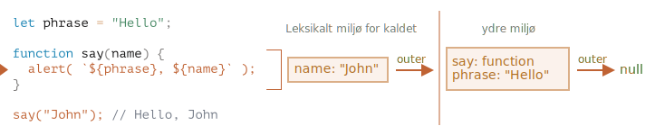
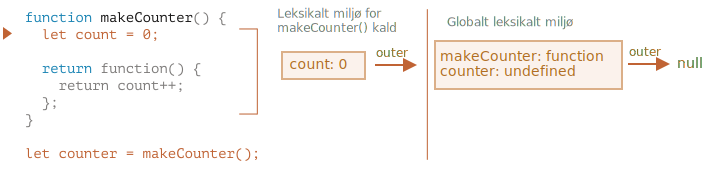
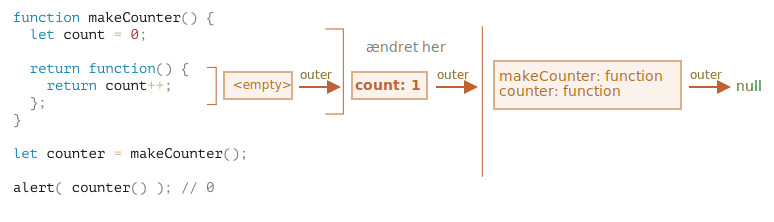

# Variable scope, closure

JavaScript er et meget funktionsorienteret sprog. Det giver os en masse frihed. En funktion kan skabes når som helst, overføres som argument til en anden funktion, og derefter kaldes fra et helt andet sted i koden.

Vi ved allerede, at en funktion kan tilgå variabler uden for den ("outer" variables).

Men hvad sker der hvis de ydre variabler ændres efter en funktion er skabt? Vil funktionen få de nyere værdier eller de gamle?

Og hvad hvis en funktion gives som et argument til en anden funktion og derefter kaldes fra et andet sted i koden, vil den da have adgang til de ydre variabler på det nye sted?

Lad os udvide forståelsen af funktioner for at håndtere mere komplekse situationer der gør brug af dem.

```smart header="Vi taler om `let/const` variable her"
I JavaScript er der tre måder at deklarere en variabel: `let`, `const` (de moderne måder), og `var` (et l"evn fra fortiden").

- I denne artikel bruger vi `let` til at deklarere variable i eksemplerne.
- Variable der er deklareret med `const`, opfører sig på samme måde, så denne artikel gælder også for dem.
- Den traditionelle `var` har en lidt anderledes opførsel, som beskrives i artiklen <info:var>.
```

## Kodeblokke

Hvis en variabel er deklareret inden for et kodeblok `{...}`, er den kun synlig inde i den blok.

For eksempel:

```js run
{
  // udfør kode med lokale variable der ikke skal være synlige uden for blokken

  let message = "Hej"; // kun synlig inde i denne blok

  alert(message); // Hej
}

alert(message); // Fejl: message er ikke defineret
```

Vi kan bruge dette til at isolere en del af koden, som har sin egen opgave og variable der kun tilhører den:

```js run
{
  // vis besked
  let message = "Hej";
  alert(message);
}

{
  // vis en anden besked
  let message = "Farvel";
  alert(message);
}
```

````smart header="Der ville være fejl uden blokke"
Bemærk at uden separate blokke ville der være en fejl, hvis vi bruger `let` med en eksisterende variabelnavn:

```js run
// vis besked
let message = "Hej";
alert(message);

// vis en anden besked
*!*
let message = "Farvel"; // Fejl: variabel allerede deklareret
*/!*
alert(message);
```
````

For `if`, `for`, `while` og så videre gælder det også at variable deklareret inden for `{...}` er kun synlige inde i blokken:

```js run
if (true) {
  let phrase = "Hej!";

  alert(phrase); // Hej!
}

alert(phrase); // Fejl, variablen findes ikke!
```

Fordi `if`-blokken er færdig kan `alert` nedenfor ikke se `phrase` - derfor fejlen.

Det er perfekt da det tillader os at deklarere lokale variable, specifikke for hver `if`-gren.

Det samme gælder for `for` og `while` løkker:

```js run
for (let i = 0; i < 3; i++) {
  // variablen i er kun synlig inde i denne for-løkke
  alert(i); // 0, så 1, så 2
}

alert(i); // Fejl, ingen sådan variabel
```

Visuelt er `let i` uden for de krøllede parenteser `{...}` men `for` konstruktionen er speciel her: Variablen der deklareres i den ses som en del af kodeblokken.

## Indlejrede funktioner

En funktion kaldes "indlejret" (nested) når den er oprettet inde i en anden funktion.

Det er nemt at gøre dette med JavaScript.

Vi kan bruge det til at organisere vores kode, som dette:

```js
function sayHiBye(firstName, lastName) {

  // Indlejret hjælpefunktion der bruges til at generere fulde navn
  function getFullName() {
    return firstName + " " + lastName;
  }

  alert( "Hello, " + getFullName() );
  alert( "Bye, " + getFullName() );

}
```

Her er den *indlejrede* funktion `getFullName()` oprettet for overskuelighed. Den kan tilgå de ydre variable og returnere det fulde navn. Indlejrede funktioner er meget almindelige i JavaScript.

Hvad er endnu mere interessant, en indlejret funktion kan returneres: enten som en egenskab af et nyt objekt eller som resultat af sig selv. Den kan derefter bruges et andet sted. Uanset hvor, den har stadig adgang til de samme ydre variable.

Nedenfor opretter `makeCounter` funktionen "counter" der returnerer næste tal ved hvert kald:
```js run
function makeCounter() {
  let count = 0;

  return function() {
    return count++;
  };
}

let counter = makeCounter();

alert( counter() ); // 0
alert( counter() ); // 1
alert( counter() ); // 2
```

Udover at være simpel, har små ændrede varianter af denne kode praktiske anvendelser, for eksempel som en [random number generator](https://en.wikipedia.org/wiki/Pseudorandom_number_generator) til at generere tilfældige værdier til automatiserede tests.

Hvordan virker dette? Hvis vi opretter flere counters, vil de være uafhængige? Hvad sker der med variablene her?

At forstå denne slags er godt for den generelle forståelse af JavaScripts måde at arbejde med variable og funktioner. Det er også god viden for at kunne arbejde med mere komplekse scenarier. Så lad os gå lidt mere i dybden.

## Leksikalt miljø (Lexical Environment)

```warn header="Here be dragons!"
Den dybere tekniske forklaring ligger foran os.

Selv om jeg gerne vil undgå detaljer om lavniveau sprog, vil enhver forståelse uden dem være mangelfuld og ufuldstændig, så gør jer klar.
```

For overskuelighedens skyld, er forklaringen opdelt i flere trin.

### Trin 1. Variable

I JavaScript har enhver kørende funktion, kodeblok `{...}`, og hele scriptet et internt (skjult) tilknyttet objekt kendt som *Leksikalt miljø* (Lexical Environment).

Det leksikale miljø består af to dele:

1. *Environment Record* -- et objekt som gemmer alle lokale variable som dens egenskaber (og nogle andre informationer som værdien af `this`).
2. En reference til det *ydre leksikale miljø*, det som er forbundet med ydre kode.

**En "variabel" er bare en egenskab af det specielle interne objekt, `Environment Record`. "At hente eller ændre en variabel" betyder "at hente eller ændre en egenskab af det objekt".**

I denne simple kode uden funktioner, findes der kun ét leksikalt miljø:


Dette er det såkaldte *globale* leksikale miljø, forbundet med hele scriptet.

På billedet ovenfor, betyder rektanglen Environment Record (variable store) og pilen ydre reference. Det globale leksikale miljø har ingen ydre reference, derfor peger pilen til `null`.

Mens koden afvikles, ændres det leksikale miljø.

Her er en lidt længere kode:


Rektanglerne på højre side demonstrerer hvordan det globale leksikale miljø ændrer sig under afvikling:

1. Når scriptet starter, er det leksikale miljø forudfyldt med alle deklarerede variable.
    - Oprindeligt er de i "Uninitialized" tilstanden. Det er en speciel intern tilstand, det betyder at motoren kender til variablen, men den ikke kan refereres før den er deklareret med `let`. Det er næsten det samme som om variablen ikke eksisterede.
2. Derefter optræder `let phrase` definitionen. Der er ingen tildeling endnu, så dens værdi er `undefined`. Vi kan bruge variablen fra dette tidspunkt og frem.
3. `phrase` tildeler en værdi.
4. `phrase` ændrer værdien.

Alting virker simpelt for nu, ikke?

- En variabel er en egenskab af et specielt internt objekt, forbundet med det aktuelt kørende blok/funktion/script.
- Arbejde med variable er faktisk arbejde med egenskaberne af det objekt.

```smart header="Det leksikale miljø er et specifikationsobjekt"
Det "leksikale miljø" er et specifikationsobjekt: det eksisterer kun "teoretisk" i [sprogspecifikationen](https://tc39.es/ecma262/#sec-lexical-environments) for at beskrive hvordan ting fungerer. Vi kan ikke få adgang til dette objekt i vores kode og manipulere det direkte.

JavaScript-motorer kan også optimere det, fjerne variable som ikke bruges for at spare hukommelse og udføre andre interne tricks, så længe det synlige adfærd forbliver som beskrevet.
```

### Trin 2. Deklarering af funktioner

En funktion er også en værdi, ligesom en variabel.

**Forskellen er at en Function Declaration er øjeblikkeligt fuldt initialiseret.**

Når et leksikalt miljø oprettes, bliver en Function Declaration øjeblikkeligt til en klar til brug funktion (forskellig fra `let`, som ikke kan bruges før deklarationen).

Når et leksikalt miljø oprettes, bliver en Function Declaration øjeblikkeligt til en klar til brug funktion (forskellig fra `let`, som ikke kan bruges før deklarationen).

Det er derfor vi kan bruge en funktion, deklareret som Function Declaration, selv før deklarationen selv.

For eksempel, her er det oprindelige tilstand af det globale leksikale miljø, når vi tilføjer en funktion:


Denne adfærd gælder kun for Function Declarations, ikke for Function Expressions hvor vi tildeler en funktion til en variabel, såsom `let say = function(name)...`.

### Trin 3. Indre og ydre leksikale miljøer

Når en funktion kører, oprettes et nyt leksikalt miljø automatisk for at gemme lokale variable og parametre for kaldet.

For eksempel, for `say("John")`, ser det ud som følger (køretidspunktet er markeret med en pil):

<!--
    ```js
    let phrase = "Hello";

    function say(name) {
     alert( `${phrase}, ${name}` );
    }

    say("John"); // Hello, John
    ```-->



Ved kald af funktionen har vi to leksikale miljøer: det indre (for funktionens kald) og det ydre (globalt):

- Det indre leksikale miljø svarer til den nuværende udførelse af `say`. Det har en enkelt egenskab: `name`, funktionens argument. Vi kalder `say("John")`, så værdien af `name` er `"John"`.
- Det ydre leksikale miljø er det globale leksikale miljø. Det har variablen `phrase` og selve funktionen.

Det indre leksikale miljø har en reference til det ydre.

**Når koden ønsker at tilgå en variabel -- søges det indre leksikale miljø først, derefter det ydre, og så videre indtil det globale miljø.**

Hvis en variabel ikke findes nogen steder, er det en fejl i strict mode (uden `use strict`, vil en tildeling til en ikke-eksisterende variabel skabe en ny global variabel, for kompatibilitet med gammel kode).

I dette eksempel går søgningen som følger:

- For variablen `name`, finder `alert` inden i `say` den øjeblikkeligt i det indre leksikale miljø.
- Når den forsøger at tilgå `phrase`, så findes den ikke lokalt, så den følger referencen til det ydre leksikale miljø og finder den der.


### Trin 4. Returnering af en funktion

Lad os vende tilbage til eksemplet med `makeCounter`.

```js
function makeCounter() {
  let count = 0;

  return function() {
    return count++;
  };
}

let counter = makeCounter();
```

I begyndelsen af hvert `makeCounter()` kald oprettes et nyt leksikalt miljøobjekt, for at gemme variabler for dette `makeCounter` kald.

Så vi har to indlejrede leksikale miljøer, lige som i eksemplet ovenfor:



Hvad der er forskelligt her er at der ved eksekvering  af `makeCounter()` oprettes en lille indlejret funktion der kun indeholder en linje: `return count++`. Vi kører den ikke, den oprettes kun.

Alle funktioner husker det leksikale miljø hvor de blev oprettet. Teknisk set er der ingen magi her: alle funktioner har den skjulte egenskab kaldet `[[Environment]]`, som holder referencen til det leksikale miljø hvor funktionen blev oprettet:


Så `counter.[[Environment]]` har referencen til `{count: 0}` leksikale miljø. Det er sådan funktionen husker hvor den blev oprettet, uanset hvor den kaldes. Referencen `[[Environment]]` sættes én gang og for altid ved oprettelsen af funktionen.

Senere, når `counter()` kaldes, oprettes et nyt leksikalt miljø for kaldet, og dens ydre leksikale miljøreference tages fra `counter.[[Environment]]`:


Når koden indeni `counter()` søger efter `count` variablen, søger den først i sit eget leksikale miljø (tomt, da der ikke er lokale variabler der), derefter i det ydre leksikale miljø af det ydre `makeCounter()` kald, hvor den finder og ændrer den.

**En variabel er opdateret i det leksikale miljø hvor den lever.**

Her er tilstanden efter eksekveringen af `counter()`:



Hvis vi kalder `counter()` flere gange, vil `count` variablen blive øget til `2`, `3` og så videre, på samme sted.

```smart header="Closure"
Der er et generelt term i programmering kaldet "closure", som udviklere generelt bør kende.

En [closure](https://en.wikipedia.org/wiki/Closure_(computer_programming)) er en funktion der husker sine ydre variable og kan tilgå dem. I nogle sprog er det ikke muligt, eller en funktion skal skrives på en speciel måde for at det skal virke. Men som forklaret ovenfor, i JavaScript, er alle funktioner naturligt closures (der er kun ét undtagelse, som beskrives i <info:new-function>).

Det vil sige: de husker automatisk hvor de blev oprettet ved hjælp af en skjult `[[Environment]]` egenskab, og derefter kan deres kode tilgå ydre variabler.

Når en frontend udvikler stilles et spørgsmål om "Hvad er en closure?", så er et gyldigt svar en definition af closure og en forklaring på at alle funktioner i JavaScript er closures, og måske et par flere ord om tekniske detaljer: egenskaben `[[Environment]]` og hvordan Lexical Environments virker.
```

## Garbage collection

Normalt vil et leksikalt miljø blive fjernet fra hukommelsen sammen med alle variablerne efter at funktionen er afsluttet. Det skyldes at der ikke er nogen referencer til det. Som ethvert JavaScript objekt, bliver det kun beholdt i hukommelsen så længe det er tilgængeligt.

Men, hvis der er en indlejret funktion som stadig er tilgængelig efter afslutningen af en funktion, så har den en `[[Environment]]` egenskab som refererer til det leksikale miljø.

I dette tilfælde er det leksikale miljø stadig tilgængeligt selv efter afslutningen af funktionen, så det bliver beholdt i hukommelsen.

For example:

```js
function f() {
  let value = 123;

  return function() {
    alert(value);
  }
}

let g = f(); // g.[[Environment]] gemmer en reference til det leksikale miljø
// af det tilsvarende f() kald
```

Bemærk at hvis `f()` kaldes mange gange, og de resulterende funktioner gemmes, så vil alle tilsvarende leksikale miljøobjekter også blive beholdt i hukommelsen. I koden nedenfor, vil alle 3 af dem gemmes:

```js
function f() {
  let value = Math.random();

  return function() { alert(value); };
}

// 3 funktioner i et array. Hvert af dem linjer til et leksikalt miljø
// af det tilsvarende f() kald
let arr = [f(), f(), f()];
```

Et leksikalt miljøobjekt dør når det bliver utilgængeligt (ligesom ethvert andet objekt). Med andre ord eksisterer det kun mens der er mindst én indlejret funktion der refererer til det.

I koden nedenfor, efter at den indlejrede funktion er fjernet, bliver dets omkringliggende leksikale miljø (og dermed `value`) ryddet fra hukommelsen:

```js
function f() {
  let value = 123;

  return function() {
    alert(value);
  }
}

let g = f(); // mens funktionen g eksisterer, bliver value beholdt i hukommelsen

g = null; // ...og nu bliver hukommelsen ryddet
```

### Optimeringer (lidt for meget i virkeligheden)

Som vi har set, i teorien eksisterer alle ydre variabler så længe en funktion lever.

Men i praksis forsøger JavaScript-motorer at optimere det. De analyserer brugen af variabler og hvis det er klart fra koden at en ydre variabel ikke bruges -- bliver den fjernet.

**En vigtig sideeffekt i V8 (Chrome, Edge, Opera) er at en sådan variabel ikke længere er tilgængelig i debugging.**

Prøv at køre følgende eksempel i Chrome med Developer Tools åbnet.

Når det stopper, skriv `alert(value)` i konsollen.

```js run
function f() {
  let value = Math.random();

  function g() {
    debugger; // i konsollen: skriv alert(value); No such variable!
  }

  return g;
}

let g = f();
g();
```

Som du kan se -- der er ingen sådan variabel! I teorien burde den være tilgængelig, men motoren har optimiseret den ud.

Det kan føre til morsomme (eller ikke så sjove) fejl i debugging. En af dem er at vi vil kunne se en ydre variabel der er navngivet med samme navn i stedet for den forventede:

```js run global
let value = "Overrasket!";

function f() {
  let value = "den tætteste værdi";

  function g() {
    debugger; // i konsollen: skriv alert(value); Overrasket!
  }

  return g;
}

let g = f();
g();
```

Denne feature i V8 er god at kende til. Hvis du debugger med Chrome/Edge/Opera, vil du til sidst møde den.

Det er ikke en fejl i debuggere, men snarere en speciel feature i V8. Måske vil det blive ændret på et tidspunkt. Du kan altid tjekke for det ved at køre eksemplerne på denne side.
