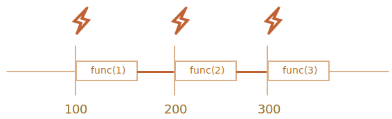
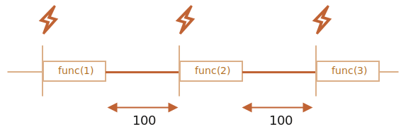

# Planlægning: setTimeout og setInterval

Vi kan vælge at undlade at køre en funktion lige nu, men i stedet planlægge dens kørsel til et bestemt tidspunkt i fremtiden. Det kaldes planlægning af kald eller "scheduling a call" på engelsk.

Der er to metoder til dette:

- `setTimeout` tillader os at køre en funktion én gang efter et angivet tidsinterval.
- `setInterval` tillader os at køre en funktion gentagne gange, startende efter et tidsinterval, og gentager derefter kontinuerligt med det samme interval.

De er ikke en del af JavaScript specificationen. Men de fleste miljøer har en intern scheduler og leverer disse metoder. De er understøttet af alle browsere og Node.js.

## setTimeout

Syntaksen:

```js
let timerId = setTimeout(func|code, [delay], [arg1], [arg2], ...)
```

Parametre:

`func|code`
: En funktion eller en kodelinje der skal eksekveres.
Normalt er det en funktion. Af historiske grunde kan en kodelinje sendes som en streng, men det anbefales ikke.

`delay`
: Første forsinkelse i millisekunder (1000 ms = 1 sekund), standardværdi er 0.


`arg1`, `arg2`...
: Argumenter til brug i funktionen `func`.

Denne kode kalder for eksempel `sayHi()` efter en sekund:

```js run
function sayHi() {
  alert('Hej');
}

*!*
setTimeout(sayHi, 1000);
*/!*
```

Med arugementer kan det se således ud:

```js run
function sayHi(phrase, who) {
  alert( phrase + ', ' + who );
}

*!*
setTimeout(sayHi, 1000, "Hej", "Karsten"); // Hej, Karsten
*/!*
```

Hvis det første argument er en streng, så opretter JavaScript en funktion fra den.

Så vil dette også virke:

```js run no-beautify
setTimeout("alert('Hej')", 1000);
```

Brugen at strenge er ikke anbefalet, brug arrow-funktioner i stedet, som dette:

```js run no-beautify
setTimeout(() => alert('Hej'), 1000);
```

````smart header="Videregiv en funktion. Lad være med køre den"
Du kunne komme til at tilføje parenteser `()` efter funktionens navn, som dette:

```js
// wrong!
setTimeout(sayHi(), 1000);
```
Det virker ikke fordi `setTimeout` forventer en reference til en funktion. Og her vil `sayHi()` (med parentes) køre funktionen og *resultatet af afviklingen* gives til `setTimeout`. I vores tilfælde er resultatet af `sayHi()` `undefined` (funktionen returnerer intet), så intet bliver planlagt til afvikling.
````

### Fortryd med clearTimeout

Et kald til `setTimeout` returnerer en "timer identifier" `timerId` som vi kan bruge til at fortryde den planlagte afvikling.

Syntaksen for at fortryde en planlagt afvikling er:

```js
let timerId = setTimeout(...);
clearTimeout(timerId);
```

I koden nedenfor planlægger vi en funktion og fortryder den med det samme (vi ændrer lidt hurtigt mening). Som resultat sker intet:

```js run no-beautify
let timerId = setTimeout(() => alert("sker ikke"), 1000);
alert(timerId); // timer identifier

clearTimeout(timerId);
alert(timerId); // samme identifier (den bliver ikke til null efter annulering)
```

Som vi kan se fra `alert` output, er timer identifikationen et tal (i en browser). I andre miljøer kan det være noget andet. For eksempel returnerer Node.js et timer objekt med yderligere metoder.

Der er ikke nogen universiel specifikation for metoderne, så man skal undersøge det miljø som koden afvikles i.

For browsere er timere beskrevet i sektionen [Timers](https://html.spec.whatwg.org/multipage/timers-and-user-prompts.html#timers) i dokumentet "HTML Living Standard".

## setInterval

Metoden `setInterval` har samme syntaks som `setTimeout`:

```js
let timerId = setInterval(func|code, [delay], [arg1], [arg2], ...)
```

Alle argumenter har samme betydning som med `setTimeout`. Men i modsætning til `setTimeout` kører den funktionen ikke kun én gang, men regelmæssigt efter det givne interval.

For at stoppe yderligere kald skal vi kalde `clearInterval(timerId)`.

Følgende eksempel viser beskeden hver 2. sekund. Efter 5 sekunder stoppes output:

```js run
// gentag hvert andet sekund
let timerId = setInterval(() => alert('tick'), 2000);

// stop efter 5 sekunder
setTimeout(() => { clearInterval(timerId); alert('stop'); }, 5000);
```

```smart header="Tiden fortsætter selvom `alert` vises"
I de fleste browsere, inklusiv Chrome og Firefox, fortsætter den interne timer "ticking" mens `alert/confirm/prompt` vises.

Så hvis du kører ovenstående kode og ikke lukker `alert` vinduet i en periode, så vil næste `alert` blive vist med det samme når du lukker det. Det faktiske interval mellem alerts vil være kortere end 2 sekunder.
```

## Indlejret setTimeout

Der er derfor umiddelbart to måder at køre kode regelmæssigt.

Den ene er med `setInterval`. Den anden er med et indlejret `setTimeout`, som dette:

```js
/** instead of:
let timerId = setInterval(() => alert('tick'), 2000);
*/

let timerId = setTimeout(function tick() {
  alert('tick');
*!*
  timerId = setTimeout(tick, 2000); // (*)
*/!*
}, 2000);
```

Ovenfor vil `setTimeout` planlægge det næste kald i slutningen af det nuværende `(*)`.

Indlejret `setTimeout` er en mere fleksibel metode end `setInterval`. Denne måde kan det næste kald planlægges forskelligt, afhængigt af resultatet af det nuværende kald.

For eksempel skal vi skrive en tjeneste, der sender en forespørgsel til serveren hver 5. sekund for at hente data, men hvis serveren er overbelastet, skal intervallet øges til 10, 20, 40 sekunder...

Her er pseudokoden:
```js
let delay = 5000;

let timerId = setTimeout(function request() {
  ...send request...

  if (forespørgsel fejlede på grund af serverbelastning) {
    // forøg intervallet inden næste kørsel
    delay *= 2;
  }

  timerId = setTimeout(request, delay);

}, delay);
```


Og, hvis funktionen vi planlægge er CPU-intensiv, så kan vi måle tiden brugt på udførelsen og planlægge det næste kald tidligere eller senere.

**Nested `setTimeout` tillader at sætte forsinkelsen mellem udførelserne mere præcist end `setInterval`.**

Lad os sammenligne to kodefragmenter. Det første bruger `setInterval`:

```js
let i = 1;
setInterval(function() {
  func(i++);
}, 100);
```

Den anden bruger indlejret `setTimeout`:

```js
let i = 1;
setTimeout(function run() {
  func(i++);
  setTimeout(run, 100);
}, 100);
```

For `setInterval` vil den interne planlægger vil køre `func(i++)` hver 100ms:



Bemærkede du noget?

**Den reelle forsinkelse mellem `func` kald for `setInterval` er mindre end i koden!**

Det er normalt fordi tiden det tager for at eksekvere `func` "forbruger" en del af intervallet.

Det er muligt at afviklingen af `func` kan ende med at tage længere tid end 100ms.

I det tilfælde venter browseren på at `func` er færdig. Derefter tjekker scheduleren om tiden er gået. Hvis den er det så kører den igen *med det samme*.

I edge-casen, hvis funktionen altid eksekveres længere end `delay` ms, så vil kaldene ske uden pause overhovedet.

Og her er billedet for det indlejrede `setTimeout`:



**Den indlejrede `setTimeout` garanterer den faste forsinkelse (her 100ms) mellem slutningen af et kald og begyndelsen af det næste.**

Det er fordi et nyt kald planlægges i slutningen af det forrige kald.

````smart header="Garbage collection og setInterval/setTimeout callback"
Når en funktion videregives til `setInterval/setTimeout`, oprettes en intern reference til den og gemmes i scheduleren. Det forhindrer funktionen i at blive slettet af garbage collector, selvom der ikke er andre referencer til den.

```js
// funktionen bliver i hukommelsen ind til planlæggeren kalder den
setTimeout(function() {...}, 100);
```

For `setInterval` bliver funktionen i hukommelsen indtil `clearInterval` kaldes.

Der er en sideeffekt. En funktion refererer til det ydre leksikale miljø, så mens den lever, lever også dens ydre variable. De kan tage meget mere hukommelse end selve funktionen. Så når vi ikke længere har brug for den planlagte funktion, er det bedre at annullere den - også selvom den er meget lille.
````

## setTimeout uden forsinkelse

Der er et særligt brugsscenarie: `setTimeout(func, 0)` eller bare `setTimeout(func)`.

Dette planlægger eksekvering af `func` så hurtigt som muligt. Men planlæggeren vil først kalde den efter det aktuelle script er færdigt.

Så funktionen planlægges til at køre "straks efter" det aktuelle script.

For eksempel, dette udskriver "Hello" og så "World" umiddelbart efter:

```js run
setTimeout(() => alert("World"));

alert("Hello");
```

Den første linje "putter et kald i kalenderen efter 0ms". Men planlæggeren vil først "kigge i kalenderen" efter det aktuelle script er færdigt, så `"Hello"` er først, og `"World"` -- efter det.

Der er også mere avencerede browserrelaterede brugsscenarier for "zero-delay timeout" som som vi vil diskutere i kapitlet <info:event-loop>.

````smart header="'Zero delay' er faktisk ikke 'zero' (i en browser)"
I en browser er der en begrænsning på hvor tit indlejrede timere kan køre. [HTML Living Standard](https://html.spec.whatwg.org/multipage/timers-and-user-prompts.html#timers) siger: "efter fem indlejrede timere, er intervallet tvunget til at være mindst 4 millisekunder".

Lad os demonstrere hvad det betyder med et eksempl (nedenfor). `setTimeout` kaldet i det planlægger at køre sig selv uden forsinkelse. Hvert kald husker den faktiske tid fra det forrige i `times` arrayet. Hvad ser de faktiske forsinkelser ud som? Lad os se:

```js run
let start = Date.now();
let times = [];

setTimeout(function run() {
  times.push(Date.now() - start); // husk forsinkelse fra det forrige kald

  if (start + 100 < Date.now()) alert(times); // viser forsinkelserne efter 100ms
  else setTimeout(run); // eller kør igen
});

// et eksempel på output:
// 1,1,1,1,9,15,20,24,30,35,40,45,50,55,59,64,70,75,80,85,90,95,100
```

De første par gange kører koden med det samme (som beskrevet i specifikationen) og derefter ser vi længere intervaller `9, 15, 20, 24...`. Det er det obligatoriske 4+ ms forsinkelsesinterval som kommer i spil.

Den samme ting sker hvis vi bruger `setInterval` i stedet for `setTimeout`: `setInterval(f)` kører `f` et par gange uden forsinkelse for derefter at falde ind med 4+ ms forsinkelse.

Denne begrænsning kommer helt tilbage fra de tidlige tider af JavaScript og mange scripts afhænger af den, så den eksisterer af historiske grunde.

For server-side JavaScript finde den begrænsning ikke og der findes andre måder at planlægge en umiddelbar asynkron job, som [setImmediate](https://nodejs.org/api/timers.html#timers_setimmediate_callback_args) for Node.js. Så denne note er specifikt målrettet browsere.
````

## Opsummering

- Metoderne `setTimeout(func, delay, ...args)` og `setInterval(func, delay, ...args)` tillader os at køre `func` én gang/periodisk efter `delay` millisekunder.
- For at annullere eksekveringen skal vi kalde `clearTimeout/clearInterval` med værdien returneret af `setTimeout/setInterval`.
- Indlejrede `setTimeout` kald er et mere fleksibelt alternativ til `setInterval`, hvilket tillader os at sætte tiden *mellem* eksekveringer mere præcist.
- Planlægning uden forsinkelse med `setTimeout(func, 0)` (det samme som `setTimeout(func)`) bruges til at planlægge kaldet "så snart som muligt, men efter det aktuelle script er færdigt".
- Browseren begrænser den minimale forsinkelse for fem eller flere indlejrede kald af `setTimeout` eller for `setInterval` (efter 5. kald) til 4ms. Det er for historiske grunde.

Bemærk at planlægningsmetoderne ikke *garanterer* den nøjagtige forsinkelse.

For eksempel, kan browserens timer blive langsommere af en række årsager:
- CPU'en er overbelastet.
- Browserfanebladet er i baggrundstilstand.
- Laptops batterisparingstilstand.

Hændelser som disse vil kunne øge den minimale "timeropløsning" ("timer resolution" på engelsk) til 300ms eller endda 1000ms afhængigt af browseren og OS-niveauets ydelseindstillinger.
