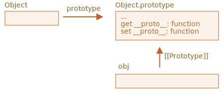
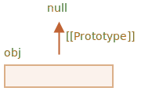

# Prototype metoder, objekter uden __proto__

I det første kapitel i denne sektion nævnte vi, at der er moderne metoder til at sætte en prototype.

At sætte eller læse en prototype med `obj.__proto__` er betragtet som forældet og noget deprecated (flyttet til såkaldte "Annex B" i JavaScript-standarden, kun tilgængelig i browser-motorer).

De moderne metoder til at få/sætte en prototype er:

- [Object.getPrototypeOf(obj)](mdn:js/Object/getPrototypeOf) -- returnerer `[[Prototype]]` af `obj`.
- [Object.setPrototypeOf(obj, proto)](mdn:js/Object/setPrototypeOf) -- sætter `[[Prototype]]` af `obj` til `proto`.

Den eneste brug af `__proto__`, der ikke rynkes på panden af er, som en en egenskab når der oprettes et nyt objekt: `{ __proto__: ... }`.

Selvom der egentlig er en speciel metode for dette også:

- [Object.create(proto[, descriptors])](mdn:js/Object/create) -- opretter et tomt objekt med given `proto` som `[[Prototype]]` og valgfrie beskrivelser af egenskaber.

For eksempel for at oprette et objekt med `animal` som prototype, kan vi bruge:

```js run
let animal = {
  eats: true
};

// opret et nyt objekt med animal som prototype
*!*
let rabbit = Object.create(animal); // samme som {__proto__: animal}
*/!*

alert(rabbit.eats); // true

*!*
alert(Object.getPrototypeOf(rabbit) === animal); // true
*/!*

*!*
Object.setPrototypeOf(rabbit, {}); // Ændring af rabbits prototype til {}
*/!*
```

Metoden `Object.create` er lidt mere kraftfuld, da den giver mulighed for at tilføje egenskaber til det nye objekt. Det er en valgfri anden parameter: egenskabsbeskrivelser.

Vi kan tilføje yderligere egenskaber til det nye objekt der, som dette:

```js run
let animal = {
  eats: true
};

let rabbit = Object.create(animal, {
  jumps: {
    value: true
  }
});

alert(rabbit.jumps); // true
```

Muligheden for beskrivelser er det samme format som beskrevet i kapitlet <info:property-descriptors>.

Vi kan bruge `Object.create` til at udføre en kloning af et objekt der er mere effektiv end at kopiere de enkelte egenskaber i et `for..in` loop:

```js
let clone = Object.create(
  Object.getPrototypeOf(obj), Object.getOwnPropertyDescriptors(obj)
);
```

Dette kald laver en helt præcis kopi af `obj`, inklusiv alle egenskaber: både enumerable og ikke-enumerable, data egenskaber og setters/getters -- alt, og med den rigtige `[[Prototype]]`.


## Et lille blik på historien bag

Der er SÅ mange måder at håndtere `[[Prototype]]`. Hvordan kunne det dog komme dertil?

Det er ganske enkelt en række historiske årsdager.

Nedarvning ved prototype har været muligt siden sprogets start, men måderne at håndtere den har udviklet sig over tid.

- Egenskaben `prototype` som led i en konstruktørfunktion har virket helt fra begyndelsen. Det er den ældste måde at oprette objekter med en given prototype.
- Senere, i 2012, blev `Object.create` vedtaget som standard. Den gav mulighed for at oprette objekter med en given prototype, men gav ikke mulighed for at bruge get/set på den. Nogle browsere implementerede den ikke-standard `__proto__` tilgang, som tillod brugeren at bruge get/set på en prototype uden for konstruktøren, for at give mere fleksibilitet til udviklere.
- Senere, i 2015, blev `Object.setPrototypeOf` og `Object.getPrototypeOf` tilføjet til standarden, for at udføre samme funktionalitet som `__proto__`. Da `__proto__` var de-facto implementeret overalt, blev det delvis deprecated og bragt til Annex B af standarden, altså valgfrit for ikke-browser miljøer.
- Senere, i 2022, blev det officielt tilladt at bruge `__proto__` i objekt-literaler `{...}` (flyttet ud af Annex B), men ikke som en getter/setter `obj.__proto__` (stadig i Annex B).

Hvorfor var `__proto__` erstattet af funktionerne `getPrototypeOf/setPrototypeOf`?

Hvorfor var `__proto__` delvist genindført så det er tilladt i objekt-literaler `{...}`, men ikke som en getter/setter `obj.__proto__`?

Det er et interessant spørgsmål, der kræver, at vi forstår hvorfor `__proto__` er dårlig.

Og snart vil vi få svaret.

```warn header="Lad være med at ændre `[[Prototype]]` på eksisterende objekter hvis hastighed er vigtig"
Teknisk set kan vi oprette can get/set på en `[[Prototype]]` når som helst. Men i praksis sker det næsten altid kun ved oprettelsen af objektet. Ofte sætter vi kun `[[Prototype]]` én gang ved oprettelsen af objektet og undlader efterfølgende at ændre den ikke igen: `rabbit` nedarver fra `animal`, og det ændres ikke.

JavaScript-motorer er højst optimerede til dette. Ændring af en prototype "on-the-fly" med `Object.setPrototypeOf` eller `obj.__proto__=` er en meget langsom operation, da den bryder interne optimeringer for objektegenskabstilgange. Undgå derfor at ændre prototypen, medmindre du ved hvad du gør, eller JavaScript-hastighed ikke spiller en rolle for dig.
```

## "Meget simple" objekter [#very-plain]

Som vi ved kan objekter bruges som associative arrays til at gemme nøgle/værdi-par.

...Men hvis vi forsøger at gemme *brugerdefinerede* nøgler i det (for eksempel en brugerdefineret ordbog), kan vi se et interessant glitch: alle nøgler virker fint, bortset fra `"__proto__"`.

Så for eksempel nedenfor:

```js run
let obj = {};

let key = prompt("Hvad er nøglen?", "__proto__");
obj[key] = "en værdi";

alert(obj[key]); // [object Object], ikke "en værdi"!
```

Her vil linje 4 ignoreres, hvis brugeren skriver `__proto__` i prompten!

Det er umiddelbart overraskende, men egentlig meget logisk, når vi husker på at egenskaben `__proto__` er lidt speciel: Den skal enten være et objekt eller `null`. En streng kan ikke blive en prototype. Derfor ignoreres tildeling af en streng til `__proto__`.

Det var var jo ikke vores *plan* at den skulle opføre sig på den måde, vel? Vi vil gerne gemme nøgle/værdi-par, og nøglen kaldt `"__proto__"` blev ikke korrekt gemt. Så det er en fejl!

Her er konsekvenserne ikke så farlige. Men i andre tilfælde kan vi gemme objekter i stedet for strenge i `obj`, og så vil prototypen faktisk blive ændret. Som resultat vil eksekveringen gå galt på helt uventede måder.

Det værre -- ofte tænker udviklere ikke over denne mulighed overhovedet. Det gør sådanne fejl svære at opdage og endda omvandles til sikkerhedsproblemer, især når JavaScript bruges på server-side.

Uventede ting kan også ske når vi tildeler til `obj.toString`, da det er en indbygget objektmetode.

Hvordan kan vi undgå dette problem?

Først og fremmest kan vi skifte til at bruge `Map` for lagring i stedet for almindelige objekter, så alt er i orden:

```js run
let map = new Map();

let key = prompt("Hvad er nøglen?", "__proto__");
map.set(key, "en værdi");

alert(map.get(key)); // "en værdi" (som det var meningen)
```

...Men `Object` syntaksen appelerer mere til de fleste - og den er kortere.

Heldigvis *kan* vi bruge objekter fordi udviklerne af sproget har tænkt over dette problem for længe siden.

Som vi ved er `__proto__` ikke i sig selv en egenskab af et objekt, men en accessor-egenskab af `Object.prototype`:



Så, hvis `obj.__proto__` læses eller sættes vil dens respektive getter/setter kaldes fra dens prototype, som så får eller sætter værdien af `[[Prototype]]`.

Som det blev sagt i begyndelsen: `__proto__` er en måde at tilgå `[[Prototype]]`, det er ikke selve objektet `[[Prototype]]`.

Så, hvis vi planlægger at bruge et objekt som et associativt array og være fri for sådanne problemer, kan vi gøre det med et lille trick:

```js run
*!*
let obj = Object.create(null);
// eller: obj = { __proto__: null }
*/!*

let key = prompt("Hvad er nøglen?", "__proto__");
obj[key] = "en værdi";

alert(obj[key]); // "en værdi"
```

`Object.create(null)` opretter et tomt objekt uden en prototype (`[[Prototype]]` er `null`):



På denne måde er der ingen arvede getter/setter for `__proto__`. Nu bliver det behandlet som en almindelig dataegenskab, så eksemplet ovenfor fungerer korrekt.

Vi kan kalde sådanne objekter "helt rene", fordi de er endnu mere simple end regulære rene objekter `{...}`.

En ulempe er, at sådanne objekter mangler alle indbyggede objektmetoder, f.eks. `toString`:

```js run
*!*
let obj = Object.create(null);
*/!*

alert(obj); // Fejl (ingen toString)
```

...men det er normalt ikke et problem for associative arrays.

Bemærk, at de fleste objektrelaterede metoder er `Object.something(...)`, som `Object.keys(obj)` -- de er ikke i prototype, så de vil fortsat fungere på denne slags objekter:


```js run
let chineseDictionary = Object.create(null);
chineseDictionary.hello = "你好";
chineseDictionary.bye = "再见";

alert(Object.keys(chineseDictionary)); // hello,bye
```

## Opsummering

- For at oprette et objekt med den givne prototype, brug:

    - literal syntax: `{ __proto__: ... }`, tillader at specificere flere egenskaber
    - eller [Object.create(proto[, descriptors])](mdn:js/Object/create), tillader at specificere egenskabsbeskrivelser.

    `Object.create` giver en let måde at lave en flad kopi af et objekt med alle beskrivelser:

    ```js
    let clone = Object.create(Object.getPrototypeOf(obj), Object.getOwnPropertyDescriptors(obj));
    ```

- Moderne metoder til at få eller sætte en prototype er:

    - [Object.getPrototypeOf(obj)](mdn:js/Object/getPrototypeOf) -- returnerer `[[Prototype]]` of `obj` (samme som `__proto__` getter).
    - [Object.setPrototypeOf(obj, proto)](mdn:js/Object/setPrototypeOf) -- sætter `[[Prototype]]` of `obj` til `proto` (samme som `__proto__` setter).

- At få eller sætte en prototype ved hjælp af de indbyggede `__proto__` getter/setter anbefales ikke, da det nu er i Annex B af specifikationen.

- Vi dækkede også objekter uden prototype, oprettet med `Object.create(null)` eller `{__proto__: null}`.

    Disse objekter bruges som "dictionary" (ordbøger) til at gemme enhver (muligvis bruger-genereret) nøgle.

    Normalt arver objekter indbyggede metoder og `__proto__` getter/setter fra `Object.prototype`, hvilket gør de tilsvarende nøgler "optaget" og potentielt forårsager sideeffekter. Med `null` prototype er objekterne virkelig tomme.
