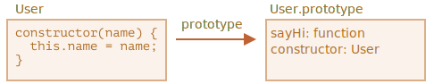

# Klasser: Grundlæggende syntaks

```quote author="Wikipedia"
I objekt-orienteret programmering, er en *klasse* (class) en udvidelig program-kodetemplate til at skabe objekter, der giver initiale værdier for tilstand (medlemsvariable) og implementeringer af adfærd (medlemsfunktioner eller metoder).
```

I praksis har vi ofte brug for at skabe mange objekter af samme type, som f.eks. brugere eller varer eller hvad som helst.

Som vi allerede ved fra kapitlet <info:constructor-new>, kan `new function` hjælpe med det.

Men i moderne JavaScript, er der en mere avanceret "class" konstruktion, der introducerer store nye funktioner, som er nyttige for objekt-orienteret programmering.

## Syntaks for "class"

Den grundlæggende syntaks er:
```js
class MyClass {
  // class methods
  constructor() { ... }
  method1() { ... }
  method2() { ... }
  method3() { ... }
  ...
}
```

Derefter bruges `new MyClass()` til at oprette et nyt objekt med alle de opførte metoder.

Metoden `constructor()` kaldes automatisk af `new`, så vi kan initialisere objektet der.

For eksempel:

```js run
class User {

  constructor(name) {
    this.name = name;
  }

  sayHi() {
    alert(this.name);
  }

}

// Usage:
let user = new User("Karsten");
user.sayHi();
```

Når `new User("Karsten")` kaldes, sker der følgende:
1. Et nyt objekt oprettes.
2. Metoden `constructor` kører med det givne argument og tildeler det til `this.name`.

...efter det kan vi kalde objektets metoder, såsom `user.sayHi()`.


```warn header="Ingen komma mellem class metoder"
En kendt fejl i begyndelsen er at putte kommaer mellem class metoder - det vil føre tilen syntaksfejl.

Den notation her er ikke at forveksle med object literals. Inden for class, er kommaer ikke nødvendige.
```

## Hvad er en class?

Så, hvad er `class` egentlig for en størrelse? Det er faktisk ikke så nyt et koncept på sprogniveau, som man måske skulle forestille sig.

Lad os prøve at pakke det ud lidt ad gangen. Det vil hjælpe med at forstå de mere komplekse aspekter.

I JavaScript er en klasse en slags funktion.

Lad os se på følgende:

```js run
class User {
  constructor(name) { this.name = name; }
  sayHi() { alert(this.name); }
}

// Bevis: User er en function
*!*
alert(typeof User); // function
*/!*
```

Det konstruktionen `class User {...}` i virkeligheden gør er:

1. Opretter en funktion kaldet `User`, som bliver resultatet af class-deklarationen. Funktionens kode bliver taget fra `constructor`-metoden (antaget tom, hvis vi ikke skriver en sådan).
2. Gemmer class-metoder, såsom `sayHi`, i `User.prototype`.

Efter at et `new User`-objekt er oprettet, når vi kalder dens metode, bliver den taget fra prototype, ligesom beskrevet i kapitlet <info:function-prototype>. Så har objektet adgang til class-metoder.

Vi kan illustrere resultatet af `class User`-deklarationen som:



Her er koden til at kigge nærmere på det:

```js run
class User {
  constructor(name) { this.name = name; }
  sayHi() { alert(this.name); }
}

// class er en function
alert(typeof User); // function

// ...eller, mere præcist, konstruktøren
alert(User === User.prototype.constructor); // true

// Metoderne findes i User.prototype, f. eks. sayHi:
alert(User.prototype.sayHi); // her er koden for metoden sayHi

// der er præcis to metoder i prototypen
alert(Object.getOwnPropertyNames(User.prototype)); // constructor, sayHi
```

## Det er ikke kun en syntactic sugar

Du vil høre folk sige at `class` er en "syntactic sugar" (syntaks der er designet til at gøre ting lettere at læse, men ikke introducerer noget nyt), fordi vi faktisk kunne erklære det samme uden at bruge `class`-nøgleordet:

```js run
// omskrivning af class User til kun at bruge funktioner

// 1. Opret constructor
function User(name) {
  this.name = name;
}
// En function prototype har egenskaben "constructor" som standard,
// så vi behøver ikke at oprette den

// 2. Tilføj metoden til prototype
User.prototype.sayHi = function() {
  alert(this.name);
};

// Brug:
let user = new User("Karsten");
user.sayHi();
```

Resultatet af denne definition er omkring det samme. Så, der er faktisk grunde til at `class` kan betragtes som en syntactic sugar til at definere en constructor sammen med dens prototype metoder.

Alligevel, der er vigtige forskelle.

1. Først, en funktion oprettet af `class` er mærket med en speciel intern egenskab `[[IsClassConstructor]]: true`. Så det er ikke helt det samme som at oprette den manuelt.

    SProget tjekker for denne egenskab i en række sammenhænge. For eksempel, i modsætning til en almindelig funktion, skal den kaldes med `new`:

    ```js run
    class User {
      constructor() {}
    }

    alert(typeof User); // function
    User(); // Error: Class constructor User cannot be invoked without 'new'
    ```

    Derudover vil en repræsentation af klassen som en streng i de fleste JavaScript-motorer starte med "class..."

    ```js run
    class User {
      constructor() {}
    }

    alert(User); // class User { ... }
    ```
    Der er også andre forskelle som vi snart vil se.

2. Class metoder er ikke-enumerable.
    En class definition sætter flaget `enumerable` til `false` for alle metoder i dens `"prototype"`.

    Det er godt, fordi hvis vi bruger `for..in` på et objekt, vil vi normalt ikke vil have dets class metoder.

3. Class bruger altid `use strict`.
    Al kode inde i en class konstruktion er automatisk sat til strict mode.

Der er også andre features ved `class` syntaksen som vi kigger på senere.

## Class Expression

På samme måde som funktioner, kan classes defineres indeni en andet udtryk (expression), videregives, returneres, tildeles osv.

Her er et eksempel på en class expression:

```js
let User = class {
  sayHi() {
    alert("Hello");
  }
};
```

På samme måde som "Named Function Expressions", kan class udtryk også have et navn.

Hvis et class udtryk har et navn, er det kun synligt inden for klassen selv:

```js run
// "Named Class Expression"
// (der er ikke sådan et navn i specifikationen, men det er det samme som med Named Function Expression)
let User = class *!*MyClass*/!* {
  sayHi() {
    alert(MyClass); // Navnet MyClass er kun synligt inden for klassen selv
  }
};

new User().sayHi(); // virker, viser MyClass definition

alert(MyClass); // fejl, navnet MyClass er ikke synligt uden for klassen
```

Vi kan endda oprette klasser dynamisk "on-demand", som dette:

```js run
function makeClass(phrase) {
  // deklarerer en klasse og returner den
  return class {
    sayHi() {
      alert(phrase);
    }
  };
}

// Opret en ny klasse
let User = makeClass("Hej!");

new User().sayHi(); // Hej!
```


## Getters/setters

På samme måde som med objekter kan klasser have getters og setters, computed properties osv.

Her er et eksempel for `user.name` implementeret ved hjælp af `get/set`:

```js run
class User {

  constructor(name) {
    // aktiverer dens setter
    this.name = name;
  }

*!*
  get name() {
*/!*
    return this._name;
  }

*!*
  set name(value) {
*/!*
    if (value.length < 4) {
      alert("Navnet er for kort.");
      return;
    }
    this._name = value;
  }

}

let user = new User("Karsten");
alert(user.name); // Karsten

user = new User("Bo"); // Navnet er for kort.
```

Teknisk set virker sådanne deklarationer ved at oprette getter og setter i `User.prototype`.

## Computed names [...]

Her er et eksempel hvor navnet på metoden er udregnet ved hjælp af brackets `[...]`:

```js run
class User {

*!*
  ['say' + 'Hi']() {
*/!*
    alert("Hej");
  }

}

new User().sayHi();
```

Nogle muligheder er nemme at huske, da de minder om dem fra normale objekter.

## Class fields

```warn header="Ældre browsere kan have brug for et polyfill"
Class fields er en relativ ny feature i JavaScript.
```

Tidligere havde klasser kun metoder.

"Class fields" er en syntaks der tillader os at tilføje vilkårlige egenskaber.

For eksempel, lad os tilføje egenskaben `name` til `class User`:

```js run
class User {
*!*
  name = "Karsten";
*/!*

  sayHi() {
    alert(`Hej ${this.name}!`);
  }
}

new User().sayHi(); // Hej Karsten!
```

Så vi skriver simpelthen "<property name> = <value>" i deklarationen, og det er det.

En vigtig forskel mellem class fields og almindelige metoder er, at de er sat på individuelle objekter, ikke `User.prototype`:

```js run
class User {
*!*
  name = "Karsten";
*/!*
}

let user = new User();
alert(user.name); // Karsten
alert(User.prototype.name); // undefined
```

Vi kan også tildele værdier ved hjælp af mere komplekse udtryk og funktionskald:

```js run
class User {
*!*
  name = prompt("Dit navn, tak?", "Karsten");
*/!*
}

let user = new User();
alert(user.name); // Karsten
```


### Gør bundne metoder til class fields

Som demonstreret i kapitlet <info:bind> har funktioner i JavaScript en dynamisk `this`. Det afhænger af konteksten for kaldet.

Så hvis en objektmetode bliver videregivet og kaldt i en anden kontekst, vil `this` ikke længere være en reference til objektet.

For eksempel vil denne kode vise `undefined`:

```js run
class Button {
  constructor(value) {
    this.value = value;
  }

  click() {
    alert(this.value);
  }
}

let button = new Button("hej");

*!*
setTimeout(button.click, 1000); // undefined
*/!*
```

Problemet kaldes populært at den "mister `this`" ("losing `this`").

Der er to tilgange til at fikse det, som vi diskuterede i kapitlet <info:bind>:

1. Videregiv en wrapper-funktion, i stil med `setTimeout(() => button.click(), 1000)`.
2. Bind metoden til objektet, f.eks. i constructor.

Class fields leverer en anden, ganske elegant syntaks:

```js run
class Button {
  constructor(value) {
    this.value = value;
  }
*!*
  click = () => {
    alert(this.value);
  }
*/!*
}

let button = new Button("hej");

setTimeout(button.click, 1000); // hej
```

class field `click = () => {...}` oprettes på individuelle objekter, så der er en seperat funktion for hver `Button`-objekt, med `this` inde i den, der refererer til det objekt. Vi kan overføre `button.click` hvor som helst, og værdien af `this` vil altid være korrekt.

Det er især nyttigt i browser-miljøet, for event-listeners.

## Opsummering

Den grundlæggende syntaks for klasser ser sådan ud:

```js
class MyClass {
  prop = value; // egenskab (class field)

  constructor(...) { // constructor
    // ...
  }

  method(...) {} // metode

  get something(...) {} // getter metode
  set something(...) {} // setter metode

  [Symbol.iterator]() {} // metode med beregnet navn (symbol her)
  // ...
}
```

`MyClass` er teknisk set en function (den vi leverer som `constructor`), mens metoder, getters og setters skrives i `MyClass.prototype`.

I de næste kapitler vil vi lære mere om klasser, nedarvning og andre funktioner.
