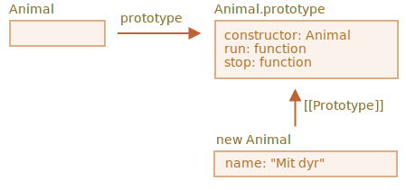
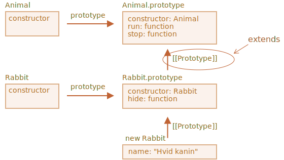
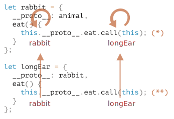
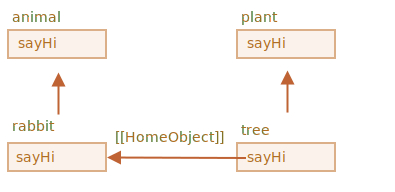

# Nedarvning af klasser

Nedarvning af klasser er en måde for en klasse at udvide en anden klasse.

Så vi kan skabe ny funktionalitet baseret på en eksisterende klasse.

## Nøgleordet "extends"

Lad os sige at vi har klassen `Animal`:

```js
class Animal {
  constructor(name) {
    this.speed = 0;
    this.name = name;
  }
  run(speed) {
    this.speed = speed;
    alert(`${this.name} løber ${this.speed} km/t.`);
  }
  stop() {
    this.speed = 0;
    alert(`${this.name} står stille.`);
  }
}

let animal = new Animal("Mit dyr");
```

Sådan her kan vi vise `animal` objekt og `Animal` klasse graphisk:



...nu vil vi gerne oprette en anden `class Rabbit`.

Da kaniner er dyr bør klassen `Rabbit` basere sig på `Animal`. På denne måde har kaninen adgang til metoderne fra `Animal` ogkan gøre det samme som "generiske" dyr.

Syntaksen for at udvide (extend) en anden klasse er: `class Child extends Parent`.

Lad os oprette `class Rabbit` som nedarver fra `Animal`:

```js
*!*
class Rabbit extends Animal {
*/!*
  hide() {
    alert(`${this.name} skjuler sig!`);
  }
}

let rabbit = new Rabbit("Hvid kanin");

rabbit.run(5); // Hvid kanin løber 5 km/t.
rabbit.hide(); // Hvid kanin skjuler sig!
```

Et objekt af klassen `Rabbit` har adgang til både `Rabbit` metoder, såsom `rabbit.hide()`, og også til `Animal` metoder, såsom `rabbit.run()`.

Internt bruger nøgleordet `extends` den gode gamle prototype mekanik. Det sætter `Rabbit.prototype.[[Prototype]]` til `Animal.prototype`. Så, hvis en metode ikke findes i `Rabbit.prototype`, tager JavaScript den fra `Animal.prototype`.



For eksempel, for at finde `rabbit.run` metode, tager motoren den (fra bunden til toppen på billedet):
1. `rabbit` objektet (har ingen `run`).
2. Dens prototype, som er `Rabbit.prototype` (har `hide`, men ikke `run`).
3. Dens prototype, som (på grund af `extends`) er `Animal.prototype`, har `run` metoden vi leder efter.

Som vi kan huske fra kapitlet <info:native-prototypes>, bruger JavaScript selv prototypisk nedarvning for indbyggede objekter. F.eks. er `Date.prototype.[[Prototype]]` lig med `Object.prototype`. Det er derfor, at datoer har adgang til generiske objektmetoder.

````smart header="Alle udtryk er tilladt efter `extends`"
Class syntaksen tillader dig at specificere ikke bare en klasse, men ethvert udtryk efter `extends`.

For eksempel kan et funktionskald generere den overordnede klasse:

```js run
function f(phrase) {
  return class {
    sayHi() { alert(phrase); }
  };
}

*!*
class User extends f("Hej") {}
*/!*

new User().sayHi(); // Hej
```
Her nedarver `class User` fra resultatet af `f("Hej")`.

Det kan være brugbart for avancerede programmeringsmønstre, når vi bruger funktioner til at generere klasser afhængigt af mange betingelser og kan nedarve fra dem.
````

## Tilsidesættelse af en metode (override)

Lad os gå lidt videre og se på hvordan vi tilsidesætter en metode. Som standard vil alle metoder der ikke er specificeret i `class Rabbit` blive brugt direkte "som de er" fra `class Animal`.

Men hvis vi specificerer vores egen metode i `Rabbit`, såsom `stop()`, så vil den blive brugt i stedet for `stop()` fra `Animal`:

```js
class Rabbit extends Animal {
  stop() {
    // ...nu vil denne blive brugt ved rabbit.stop()
    // i stedet for stop() fra klassen Animal
  }
}
```

Ofte vil vi dog ikke helt erstatte den nedarvede metode, men mere bygge videre på den eller ændre dens funktionalitet lidt. Vi vil dermed gøre noget i vores metode, men kalde den nedarvede metode (parent) på et tidspunkt i processen.

Klasser leverer nøgleordet `"super"` til at gøre dette.

- `super.method(...)` kalder "parent method" (metoden fra klassen der nedarves fra).
- `super(...)` kalder "parent constructor" (konstruktøren fra klassen der nedarves fra). Dette kan kun bruges i din constructor.

lad os for eksempel se på, hvordan vi kan lave en kanin, der automatisk skjuler sig, når den stopper:

```js run
class Animal {

  constructor(name) {
    this.speed = 0;
    this.name = name;
  }

  run(speed) {
    this.speed = speed;
    alert(`${this.name} løber ${this.speed} km/t.`);
  }

  stop() {
    this.speed = 0;
    alert(`${this.name} står stille.`);
  }

}

class Rabbit extends Animal {
  hide() {
    alert(`${this.name} skjuler sig!`);
  }

*!*
  stop() {
    super.stop(); // kalder stop() i parent
    this.hide(); // og derefter sin egen hide()
  }
*/!*
}

let rabbit = new Rabbit("Hvid kanin");

rabbit.run(5); // Hvid kanin løber 5 km/t.
rabbit.stop(); // Hvid kanin står stille. Hvid kanin skjuler sig!
```

Nu har `Rabbit` sin egen metode `stop` der kalder sin forælder via `super.stop()` i sin afvikling.

````smart header="Arrow funktioner har ingen `super`"
Som det tidligere blev nævnt i kapitlet <info:arrow-functions>, arrow funktioner har ingen `super`.

Hvis det forsøges, tages den fra den ydre funktion. For eksempel:

```js
class Rabbit extends Animal {
  stop() {
    setTimeout(() => super.stop(), 1000); // kalder stop() i parent efter 1sec
  }
}
```

`super` i arrow funktionen er den samme som i `stop()`, så det virker som forventet. Hvis vi havde brugt en "normal" funktion her, ville der være en fejl:

```js
// Unexpected super
setTimeout(function() { super.stop() }, 1000);
```
````

## Tilsidesættelse af constructor

Hvis du vil tilsidesætte constructor, så er det lidt mere tricky.

Ind til nu har `Rabbit` ikke sin egen `constructor`.

I følge [specifikationen](https://tc39.github.io/ecma262/#sec-runtime-semantics-classdefinitionevaluation), vil en klasse der nedarver fra en anden klasse og ikke har sin egen `constructor`, generere følgende "tomme" `constructor`:

```js
class Rabbit extends Animal {
  // genereres af klasser oprettet med extends og uden egen constructor
*!*
  constructor(...args) {
    super(...args);
  }
*/!*
}
```

Som vi kan se, kalder den i grundlæggende dens parent `constructor` og sender den alle argumenter. Det sker hvis vi ikke skriver en constructor af vores egen.

Lad os nu lave vores egen constructor til `Rabbit`. Den vil, ud over `name`, specificere `earLength`:

```js run
class Animal {
  constructor(name) {
    this.speed = 0;
    this.name = name;
  }
  // ...
}

class Rabbit extends Animal {

*!*
  constructor(name, earLength) {
    this.speed = 0;
    this.name = name;
    this.earLength = earLength;
  }
*/!*

  // ...
}

*!*
// Det virker ikke!
let rabbit = new Rabbit("White Rabbit", 10); // Error: this is not defined.
*/!*
```

Ups! Vi får en fejl. Nu kan vi ikke oprette kaniner. Hvad gik galt?

Det korte svar er:

- **Konstruktører der nedarver fra andre klasser skal kalde `super(...)`, og (!) det skal ske før `this` bruges.**

...Men hvorfor? Hvad sker der her? Det virker som et underligt krav.

Selvfølgelig er der en forklaring, så lad os gå i detaljer med det, så du forstår hvad der sker.

I JavaScript er der forskel på en constructor funktion fra en nedarvet klasse (kaldet "derived constructor" på dansk "afledt konstruktør") og andre funktioner. En derived constructor har en speciel intern egenskab `[[ConstructorKind]]:"derived"`som er en speciel intern label.

Denne label påvirker dens adfærd med `new`.

- Når en regulær funktion bliver eksekveret med `new`, opretter den et tomt objekt og tilknytter det til `this`.
- Men når en afledt konstruktør kører, gør den noget andet. Den forventer at konstruktøren fra parent udfører denne opgave.

Så en afledt konstruktør skal kalde `super` for at kunne udføre sin forælder konstruktør (base constructor), ellers vil objektet for `this` ikke blive oprettet. Og vi vil få en fejl.

For at `Rabbit` konstruktøren fungerer, skal den kalde `super()` før den bruger `this`, som her:

```js run
class Animal {

  constructor(name) {
    this.speed = 0;
    this.name = name;
  }

  // ...
}

class Rabbit extends Animal {

  constructor(name, earLength) {
*!*
    super(name);
*/!*
    this.earLength = earLength;
  }

  // ...
}

*!*
// nu er det fint
let rabbit = new Rabbit("Hvid kanin", 10);
alert(rabbit.name); // Hvid kanin
alert(rabbit.earLength); // 10
*/!*
```

### Tilsidesættelse af class fields: en tricky note

```warn header="Lidt avanceret note"
Denne note forventer at du har lidt erfaring med klasser, måske fra andre programmeringssprog.

Den giver lidt bedre indsigt i sproget og forklarer også en adfærd, der kan være en kilde til (relativt sjældne) bugs.

Hvis du har svært ved at forstå det, så gå videre, fortsæt læsningen, og vend tilbage til det senere.
```

Udover metoder kan vi også tilsidesætte class fields.

Men, det er en lidt tricky måde, vi tilgår et tilsidesat felt i en forældrekonstruktør. En måde der er ganske forskellig fra de fleste andre programmeringssprog.

Forestil dig dette eksempel:

```js run
class Animal {
  name = 'animal';

  constructor() {
    alert(this.name); // (*)
  }
}

class Rabbit extends Animal {
  name = 'rabbit';
}

new Animal(); // animal
*!*
new Rabbit(); // animal
*/!*
```

Her udvider `Rabbit` klassen `Animal` og tilsidesætter dens `name` felt med sin egen værdi.

Der er ikke nogen egen constructor i `Rabbit`, så `Animal` constructor er kaldt.

Det interessante er, at i begge tilfælde: `new Animal()` og `new Rabbit()`, viser `alert` i linjen `(*)` værdien `animal`.

**Med andre ord, den konstruktøren fra forælderen bruger altid sin egen feltværdi, ikke den tilsidesatte.**

Men hvad der der underligt ved det?

Hvis det ikke er helt klart, så lad os sammenligne med metoder.

Her er den samme kode, men i stedet for et `this.name` felt så kaldes metoden `this.showName()`:

```js run
class Animal {
  showName() {  // i stedet for this.name = 'animal'
    alert('animal');
  }

  constructor() {
    this.showName(); // i stedet for alert(this.name);
  }
}

class Rabbit extends Animal {
  showName() {
    alert('rabbit');
  }
}

new Animal(); // animal
*!*
new Rabbit(); // rabbit
*/!*
```

Bemærk: Nu er outputtet forskelligt.

Og det er som vi vil forvente. For når forældrekonstruktøren kaldes i den afledte klasse så bruges den afledte metode.

...Men for class fields er det ikke sådan. Som sagt, forælderens konstruktør bruger altid forælderens felter (class fields).

Hvorfor er der en forskel?

Grunden til det er rækkefølgen hvormed felterne initialiseres i JavaScript:
- Før konstruktøren for grundklassen (en klasse der ikke nedarver fra noget),
- Umiddelbart efter `super()` for en afledt klasse.

I vores tilfælde er `Rabbit` den afledte klasse. Den har ikke nogen `constructor()` i sig. Som tidligere nævnt er det det samme som om der var en tom constructor der kun indeholder `super(...args)`.

Så `new Rabbit()` kalder `super()` og eksekverer den overordnede constructor, og (i henhold til reglen for afledte klasser) først efter det bliver dens class fields initialiseret. Ved tidspunktet for eksekvering af den overordnede constructor, er der endnu ingen `Rabbit` class fields, hvorfor `Animal` fields bruges.

Denne lille forskel mellem felter og metoder er specifik for JavaScript.

Heldigvis viser denne adfærd til kun hvis et tilsidesat felt er brugt i forældrekonstruktøren. I det tilfælde kan det være svært at forstå hvad der sker - derfor forklarer jeg det her.

Hvis det bliver til et problem, kan man fikse det ved at bruge metoder eller getters/setters i stedet for felter.

## Super: internals, [[HomeObject]]

```warn header="Avanceret information"
Hvis du læser denne tutorial for første gang, kan du eventuelt springe denne sektion over. 

Den handler om de interne mekanismer bag nedarvning og `super`.
```

Lad os komme dybere ind under huden af `super`. Der sker nogle interessante ting undervejs.

Lad mig starte med at sige, fra alt hvad vi har lært indtil nu, er det umuligt for `super` at arbejde overhovedet!

Lad os spørge os selv: hvordan burde det teknisk set virke? Når en objektmetode kører, får den det nuværende objekt som `this`. Hvis vi kalder `super.method()` så skal motoren få `method` fra prototypen af det nuværende objekt. Men hvordan?

Opgaven kan virke simpel, men den er det ikke. Motoren kender det nuværende objekts `this`, så den kunne få den overordnede `method` som `this.__proto__.method`. Desværre vil en sådan "naiv" løsning ikke virke.

Lad mig demonstrere problemet. Uden klasser, men med rene objekter for overskuelighedens skyld.

Du kan springe denne sektion over og gå til undersektionen `[[HomeObject]]` hvis du ikke vil kende detaljerne. Det vil ikke gøre noget ondt. Eller læs videre, hvis du er interesseret i at forstå tingene i dybden.

I eksemplet nedenfor er `rabbit.__proto__ = animal`. Når vi prøver at kalde `rabbit.eat()` kalder vi `animal.eat()` ved hjælp af `this.__proto__`:

```js run
let animal = {
  name: "Dyr",
  eat() {
    alert(`${this.name} spiser.`);
  }
};

let rabbit = {
  __proto__: animal,
  name: "Kanin",
  eat() {
*!*
    // dette er hvordan super.eat() kunne forestilles at virke
    this.__proto__.eat.call(this); // (*)
*/!*
  }
};

rabbit.eat(); // Kanin spiser.
```

Ved linje `(*)` tager vi `eat` fra prototypen (`animal`) og kalder det i konteksten af det nuværende objekt. Bemærk at `.call(this)` er vigtig her, fordi en simpel `this.__proto__.eat()` ville eksekvere forældre `eat` i konteksten af prototypen, ikke det nuværende objekt.

Og i koden ovenfor fungerer det som ønsket: vi har den korrekte `alert`.

Nu lad os tilføje et ekstra objekt til kæden. Vi vil se hvordan tingene går i stykker:

```js run
let animal = {
  name: "Dyr",
  eat() {
    alert(`${this.name} spiser.`);
  }
};

let rabbit = {
  __proto__: animal,
  eat() {
    // ...Hopper rundt "rabbit-style" og kalder sin forælders (animal) metode
    this.__proto__.eat.call(this); // (*)
  }
};

let longEar = {
  __proto__: rabbit,
  eat() {
    // ...gør noget med lange ører og kalder forældermetoden (rabbit)
    this.__proto__.eat.call(this); // (**)
  }
};

*!*
longEar.eat(); // Fejl: Maximum call stack size exceeded
*/!*
```

Koden virker ikke mere! Vi kan se fejlen ved at forsøge at kalde `longEar.eat()`.

Det er måske ikke åbenlyst, men hvis vi sporer `longEar.eat()` kald, så kan vi se hvorfor. I begge linjer `(*)` og `(**)` er værdien af `this` det nuværende objekt (`longEar`). Det er afgørende: alle objektmetoder får det nuværende objekt som `this`, ikke en prototype eller noget andet.

Så i begge linjer `(*)` og `(**)` er værdien af `this.__proto__` nøjagtig den samme: `rabbit`. De kalder begge `rabbit.eat` uden at gå videre op i kæden i en uendelig løkke.

Her er et billede af, hvad der sker:



1. Inde i `longEar.eat()` kalder linjen `(**)` `rabbit.eat` og leverer `this=longEar`.
    ```js
    // inde i longEar.eat() har vi this = longEar
    this.__proto__.eat.call(this) // (**)
    // bliver til
    longEar.__proto__.eat.call(this)
    // som er
    rabbit.eat.call(this);
    ```
2. Derefter i linjen `(*)` af `rabbit.eat`, vil vi gerne overføre opkaldet endnu højere i kæden, men `this=longEar`, så `this.__proto__.eat` er igen `rabbit.eat`!

    ```js
    // inde i rabbit.eat() har vi this = longEar
    this.__proto__.eat.call(this) // (*)
    // bliver til
    longEar.__proto__.eat.call(this)
    // eller (igen)
    rabbit.eat.call(this);
    ```

3. ... så `rabbit.eat` kalder sig selv i et uendeligt loop, fordi den ikke kan komme videre.

Problemet kan ikke løses ved kun at bruge `this`.

### `[[HomeObject]]`

For at levere en løsning, tilføjer JavaScript en ekstra speciel intern egenskab for funktioner: `[[HomeObject]]`.

Når en funktion er specificeret som en klasse- eller objektmetode, bliver dens `[[HomeObject]]`-egenskab det pågældende objekt.

Så bruger `super` den til at løse forældre-prototypen og dennes metoder.

Lad os se, hvordan det virker, først med almindelige objekter:

```js run
let animal = {
  name: "Dyr",
  eat() {         // animal.eat.[[HomeObject]] == animal
    alert(`${this.name} spiser.`);
  }
};

let rabbit = {
  __proto__: animal,
  name: "Kanin",
  eat() {         // rabbit.eat.[[HomeObject]] == rabbit
    super.eat();
  }
};

let longEar = {
  __proto__: rabbit,
  name: "Langøret kanin",
  eat() {         // longEar.eat.[[HomeObject]] == longEar
    super.eat();
  }
};

*!*
// virker korrekt!
longEar.eat();  // Langøret kanin spiser.
*/!*
```

Det virker som forventet i kraft af `[[HomeObject]]` mekanikken. En metode som `longEar.eat` kender sit `[[HomeObject]]` og tager forældremethoden fra dens prototype. Uden nogen brug af `this`.

### Metoder er ikke "frie" funktioner

Som vi har lært fra tidligere, er funktioner generelt "frie", ikke bundet til objekter i JavaScript. Så de kan kopieres mellem objekter og kaldes med et andet `this`.

Selve eksisten af `[[HomeObject]]` bryder med dette princip, fordi metoder husker deres objekter. `[[HomeObject]]` kan ikke ændres, så denne forbindelse er for altid.

Det eneste sted i sproget hvor `[[HomeObject]]` bruges -- er `super`. Så, hvis en metode ikke bruger `super`, så kan vi stadig betragte den som fri og kopiere mellem objekter. Men med `super` kan ting gå galt.

Her er en demonstration af et forkert `super` resultat efter kopiering:

```js run
let animal = {
  sayHi() {
    alert(`Jeg er et dyr`);
  }
};

// rabbit nedarver fra animal
let rabbit = {
  __proto__: animal,
  sayHi() {
    super.sayHi();
  }
};

let plant = {
  sayHi() {
    alert("Jeg er en plante");
  }
};

// tree nedarver fra plant
let tree = {
  __proto__: plant,
*!*
  sayHi: rabbit.sayHi // (*)
*/!*
};

*!*
tree.sayHi();  // Jeg er et dyr (?!?)
*/!*
```

Et kald til `tree.sayHi()` viser "Jeg er et dyr". Det er forkert.

Grunden er simpel:
- I linjen `(*)` er metoden `tree.sayHi` kopieret fra `rabbit` - måske prøvede vi bare at undgå duplikering af kode?
- Dens `[[HomeObject]]` er `rabbit` da den var oprettet i `rabbit`. Der er ikke nogen måde at ændre `[[HomeObject]]`.
- Koden i `tree.sayHi()` har `super.sayHi()` inde i sig. Den går fra `rabbit` og tager metoden fra `animal`.

Her er et diagram over hvad der sker:



### Metoder, ikke function properties

`[[HomeObject]]` er defineret for metoder både i klasser og i almindelige objekter. Men for objekter skal metoder specificeres præcist som `method()`, ikke som `"method: function()"`.

Forskellen kan være unødvendig for os, men den er vigtig for JavaScript.

I eksemplet nedenfor bruges en ikke-metode syntaks til sammenligning. `[[HomeObject]]`-egenskaben er ikke sat, og nedarvning fungerer derfor ikke:

```js run
let animal = {
  eat: function() { // bevidst skrevet sådan her i stedet for eat() {...
    // ...
  }
};

let rabbit = {
  __proto__: animal,
  eat: function() {
    super.eat();
  }
};

*!*
rabbit.eat();  // Error calling super (fordi der ikke er noget [[HomeObject]])
*/!*
```

## Opsummering

1. For at udvide en klasse: `class Child extends Parent`:
    - Det betyder `Child.prototype.__proto__` vil blive `Parent.prototype` så dets metoder nedarves.
2. Når en konstruktør tilsidesættes:
    - er vi nødt til at kalde forældrekonstruktøren som `super()` i `Child`-konstruktøren før vi bruger `this`.
3. Når en anden metode tilsidesættes:
    - Vi kan bruge `super.method()` i en `Child`-metode for at kalde `Parent`-metoden.
4. Internt:
    - Metoder husker deres klasse/objekt i den interne `[[HomeObject]]`-egenskab. Det er sådan `super` løser forældremetoder.
    - Så det er ikke sikkert at kopiere en metode med `super` fra et objekt til et andet.

Derudover:
- Arrow funktioner har ikke deres egen `this` eller `super`, så de passer nemt ind i en omkringliggende sammenhæng.
