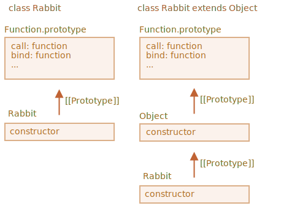

Lad os først se på, hvorfor den sidste kode ikke virker.

Grunden til det bliver tydelig hvis vi prøver at køre den. En arvende klassekonstruktør skal kalde `super()`. Ellers vil `"this"` ikke være "defineret".

Så her er en måde at fixe det på:

```js run
class Rabbit extends Object {
  constructor(name) {
*!*
    super(); // du skal kalde den overordnede konstruktør når du nedarver
*/!*
    this.name = name;
  }
}

let rabbit = new Rabbit("Rab");

alert( rabbit.hasOwnProperty('name') ); // true
```

Men det er ikke alt.

Selv efter denne rettelse er der en vigtig forskel mellem `"class Rabbit extends Object"` og `class Rabbit`.

Som vi ved, opretter "extends" syntaksen to prototyper:

1. Mellem `"prototype"` af constructor funktionerne (for metoder).
2. Mellem constructor funktionerne selv (for statiske metoder).

I tilfældet med `class Rabbit extends Object` betyder det, at `Rabbit` nedarver både de statiske og de normale metoder fra `Object`.:

```js run
class Rabbit extends Object {}

alert( Rabbit.prototype.__proto__ === Object.prototype ); // (1) true
alert( Rabbit.__proto__ === Object ); // (2) true
```

Så `Rabbit` giver nu adgang til de statiske metoder fra `Object` via `Rabbit`, som dette:

```js run
class Rabbit extends Object {}

*!*
// normalt kalder vi Object.getOwnPropertyNames
alert ( Rabbit.getOwnPropertyNames({a: 1, b: 2})); // a,b
*/!*
```

Men, hvis vi ikke har `extends Object` så bliver `Rabbit.__proto__` ikke sat til `Object`.

Her er en demonstration af dette:

```js run
class Rabbit {}

alert( Rabbit.prototype.__proto__ === Object.prototype ); // (1) true
alert( Rabbit.__proto__ === Object ); // (2) false (!)
alert( Rabbit.__proto__ === Function.prototype ); // som enhver funktion som standard

*!*
// fejl, sådan en funktion findes ikke i Rabbit
alert ( Rabbit.getOwnPropertyNames({a: 1, b: 2})); // Fejl
*/!*
```

Så `Rabbit` giver ikke adgang til de statiske metoder fra `Object` i det tilfælde.

Forresten så har`Function.prototype` også en "generiske" function metoder, såsom `call`, `bind` osv. De er i sidste ende tilgængelige i begge tilfælde, fordi for den indbyggede `Object` constructor, `Object.__proto__ === Function.prototype`.

Her er en oversigt over forskellene:



Så, kort fortalt er der to forskelle:

| class Rabbit | class Rabbit extends Object  |
|--------------|------------------------------|
| --             | skal kalde `super()` i constructor |
| `Rabbit.__proto__ === Function.prototype` | `Rabbit.__proto__ === Object` |
