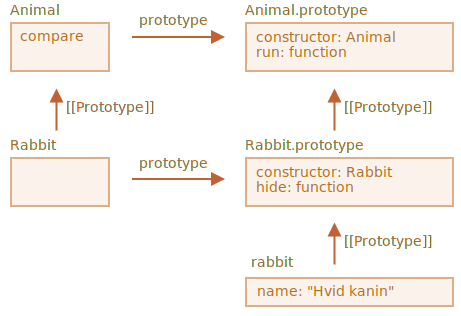

# Statiske egenskaber og metoder

Vi kan også tildele en metode til selve klassen som sådan. Sådanne metoder kaldes *statiske metoder*.

 en klasse-deklaration er de præfikseret med `static` nøgleordet, som her:

```js run
class User {
*!*
  static staticMethod() {
*/!*
    alert(this === User);
  }
}

User.staticMethod(); // true
```

Det gør faktisk det samme som at tildele det som en egenskab direkte:

```js run
class User { }

User.staticMethod = function() {
  alert(this === User);
};

User.staticMethod(); // true
```

Værdien af `this` i et `User.staticMethod()` kald er klassens konstruktør `User` selv ("objektet før punktum" reglen).

Normalt bruges statiske metoder til at implementere funktioner, der tilhører klassen som en helhed, men ikke et bestemt objekt af den.

For eksempel har vi `Article` objekter og har brug for en funktion til at sammenligne dem.

En naturlig løsning ville være at tilføje den statiske metode `Article.compare`, som kan sammenligne to artikler:

```js run
class Article {
  constructor(title, date) {
    this.title = title;
    this.date = date;
  }

*!*
  static compare(articleA, articleB) {
    return articleA.date - articleB.date;
  }
*/!*
}

// usage
let articles = [
  new Article("HTML", new Date(2027, 1, 1)),
  new Article("CSS", new Date(2027, 0, 1)),
  new Article("JavaScript", new Date(2027, 11, 1))
];

*!*
articles.sort(Article.compare);
*/!*

alert( articles[0].title ); // CSS
```

Her vil metoden `Article.compare` stå "over" de enkelte artikler, som et middel til at sammenligne dem. Det er ikke en metode for den enkelte artikel, men mere en for hele klassen.

Et andet eksempel ville være en såkaldt "factory" metode.

Lad os sige, vi har brug for flere måder at oprette en artikel på:

1. Opret ved hjælp af givne parametre (`title`, `date` etc).
2. Opret en tom artikel med dagens dato.
3. ...eller noget helt tredje.

Den første måde kan implementeres ved hjælp af konstruktøren. Og for den anden måde kan vi lave en statisk metode for klassen.

Sådan som `Article.createTodays()` her:

```js run
class Article {
  constructor(title, date) {
    this.title = title;
    this.date = date;
  }

*!*
  static createTodays() {
    // husk, this = Article
    return new this("Dagens sammendrag", new Date());
  }
*/!*
}

let article = Article.createTodays();

alert( article.title ); // Dagens sammendrag
```

Nu, hver gang vi vil oprette en dagens sammendrag, kan vi kalde `Article.createTodays()`. Igen, det er ikke en metode for den enkelte artikel, men en metode for hele klassen.

Statiske metoder bruges også i database-relaterede klasser til at søge/gemme/fjerne indlæg fra databasen, som dette:

```js
// forudsat at Article er en speciel klasse til at håndtere artikler
// statisk metode til at fjerne artiklen ved hjælp af id:
Article.remove({id: 12345});
```

````warn header="Statiske metoder er ikke tilgængelige for individuelle objekter"
Statiske metoder kan kun kaldes på klasser, ikke på individuelle objekter.

F.eks. vil følgende kode ikke virke, fordi `createTodays` er en statisk metode og ikke findes på det enkelte artikelobjekt:

```js
// ...
article.createTodays(); /// Fejl: article.createTodays is not a function
```
````

## Statiske egenskaber

[recent browser=Chrome]

Statiske egenskaber er også mulige, de ser ud som normale klasseegenskaber, men er præfikseret med `static`:

```js run
class Article {
  static publisher = "Ilya Kantor";
}

alert( Article.publisher ); // Ilya Kantor
```

Dette er det samme som en direkte tildeling til `Article`:

```js
Article.publisher = "Ilya Kantor";
```

## Nedarvning af statiske egenskaber og metoder [#statics-and-inheritance]

Statiske egenskaber og metoder nedarves.

For eksempel, `Animal.compare` og `Animal.planet` i koden nedenfor nedarves og er tilgængelige som `Rabbit.compare` og `Rabbit.planet`:

```js run
class Animal {
  static planet = "Jorden";

  constructor(name, speed) {
    this.speed = speed;
    this.name = name;
  }

  run(speed = 0) {
    this.speed += speed;
    alert(`${this.name} løber ${this.speed} km/t.`);
  }

*!*
  static compare(animalA, animalB) {
    return animalA.speed - animalB.speed;
  }
*/!*

}

// Nedarver fra Animal
class Rabbit extends Animal {
  hide() {
    alert(`${this.name} skjuler sig!`);
  }
}

let rabbits = [
  new Rabbit("Hvid kanin", 10),
  new Rabbit("Sort kanin", 5)
];

*!*
rabbits.sort(Rabbit.compare);
*/!*

rabbits[0].run(); // Sort kanin løber 5 km/t.

alert(Rabbit.planet); // Jorden
```

Nu, når vi kalder `Rabbit.compare` vil `Animal.compare` blive kaldt.

Hvordan virker det? Igen, ved hjælp af prototyper. Som du nok har gættet så vil `extends` pege `Rabbit` referencen `[[Prototype]]` til `Animal`.



Så, `Rabbit extends Animal` opretter to `[[Prototype]]` referencer:

1. `Rabbit` funktioner nedarver via prototype fra `Animal` funktioner.
2. `Rabbit.prototype` nedarver via prototype fra `Animal.prototype`.

Som resultat virker nedarvning både for normale og statiske metoder.

Lad os tjekke det med kode:

```js run
class Animal {}
class Rabbit extends Animal {}

// for statiske metoder
alert(Rabbit.__proto__ === Animal); // true

// for regulære metoder
alert(Rabbit.prototype.__proto__ === Animal.prototype); // true
```

## Opsummering

Statiske metoder bruges til funktionalit, der hører til klassen "som en helhed". Det relaterer sig ikke til en konkrete klasseinstans.

For eksempel, en metode til sammenligning `Article.compare(article1, article2)` eller en factory-metode `Article.createTodays()`.

De er mærket med ordet `static` i klassedeklarationen.

Statiske egenskaber bruges, når vi vil gemme data på klasseniveau, som ikke er bundet til en instans.

Syntaksen er den samme for både statiske metoder og egenskaber:

```js
class MyClass {
  static property = ...;

  static method() {
    ...
  }
}
```

Teknisk set er en statisk deklaration det samme som at tildele til selve klassen:

```js
MyClass.property = ...
MyClass.method = ...
```

Statiske egenskaber og metoder nedarves.

For `class B extends A` vil prototypen af klassen `B` selv pege på `A`: `B.[[Prototype]] = A`. Så hvis et felt ikke findes i `B`, søges der videre i `A`.
