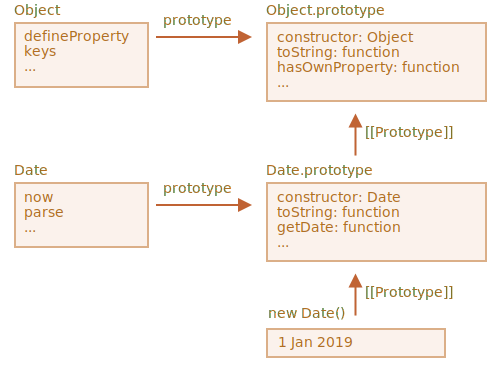

# Udvid indbyggede klasser

Indbyggede klasser som Array, Map kan også udvides.

I dette eksempel, arver `PowerArray` fra den indbyggede `Array`:

```js run
// tilføj en ekstra metode til den (nu kan den lidt mere)
class PowerArray extends Array {
  isEmpty() {
    return this.length === 0;
  }
}

let arr = new PowerArray(1, 2, 5, 10, 50);
alert(arr.isEmpty()); // false

let filteredArr = arr.filter(item => item >= 10);
alert(filteredArr); // 10, 50
alert(filteredArr.isEmpty()); // false
```

Bemærk noget interessant. Indbyggede metoder som `filter`, `map` og andre -- returnerer nye objekter af præcis den arvede type `PowerArray`. Deres interne implementering bruger objektets `constructor`-egenskab til det.

I eksemplet ovenfor,

```js
arr.constructor === PowerArray
```

Når `arr.filter()` kaldes, vil den internt oprette det nye array af resultater ved hjælp af denne `arr.constructor`, ikke fra den underliggende `Array`. Det er praktisk, fordi vi kan fortsætte med at bruge `PowerArray`-metoderne på yderligere oprettede objekter.

Vi kan også tilpasse adfærden.

Vi kan tilføje en speciel statisk getter `Symbol.species` til klassen. Hvis den eksisterer, skal den returnere konstruktøren, som JavaScript vil bruge internt til at oprette nye entiteter i `map`, `filter` og så videre.

Hvis vi gerne vil have, at indbyggede metoder som `map` eller `filter` skal returnere almindelige arrays, kan vi returnere `Array` i `Symbol.species`, som her:

```js run
class PowerArray extends Array {
  isEmpty() {
    return this.length === 0;
  }

*!*
  // indyggede metoder vil bruge denne som konstruktør
  static get [Symbol.species]() {
    return Array;
  }
*/!*
}

let arr = new PowerArray(1, 2, 5, 10, 50);
alert(arr.isEmpty()); // false

// filter opretter nyt array ved hjælp af arr.constructor[Symbol.species] som konstruktør
let filteredArr = arr.filter(item => item >= 10);

*!*
// filteredArr er ikke PowerArray, men Array
*/!*
alert(filteredArr.isEmpty()); // Error: filteredArr.isEmpty is not a function
```

Som det ses vil `.filter` nu returnere `Array`. Så den udvidede funktionalitet bliver ikke videregivet.

```smart header="Andre samlinger arbejder på samme måde"
Andre samlinger, såsom `Map` og `Set`, arbejder på samme måde. De bruger også `Symbol.species`.
```

## Ingen statisk nedarvning i indbyggede objekter

Indbyggede objekter har deres egne statiske metoder, for eksempel `Object.keys`, `Array.isArray` etc.

Som vi allerede ved så udvider indbyggede klasser hinanden. For eksempel, `Array` udvider `Object`.

Normalt, når en klasse udvider en anden, arves både statiske og ikke-statiske metoder. Dette blev grundigt forklaret i artiklen [](info:static-properties-methods#statics-and-inheritance).

Men indbyggede klasser er en undtagelse. De arver ikke statiske metoder fra hinanden.

For eksempel nedarver både `Array` og `Date` fra `Object`, så deres instanser har metoder fra `Object.prototype`. Men `Array.[[Prototype]]` refererer ikke til `Object`, så der er ingen, for eksempel, `Array.keys()` (eller `Date.keys()`) statisk metode.

Her er billedet for `Date` og `Object`:



Som du ser her er der ingen sammenhæng mellem `Date` og `Object`. De er uafhængige, kun `Date.prototype` arver fra `Object.prototype`.

Det er en vigtig forskel i arv mellem indbyggede objekter og hvad vi får med `extends`.
