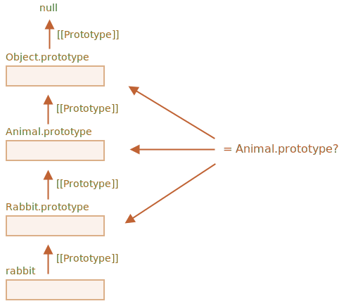

# Tjek en klasse: "instanceof"

Operatoren `instanceof` tillader at tjekke om et objekt tilhører en bestemt klasse. Den tager også arv i betragtning.

Sådan en tjek kan være nødvendig i mange tilfælde. For eksempel kan den bruges til at bygge en *polymorfisk* funktion, som behandler argumenter forskelligt afhængigt af deres type.

## instanceof operatoren [#ref-instanceof]

Syntaksen er:
```js
obj instanceof Class
```

Den returnerer `true` hvis `obj` tilhører `Class` eller en klasse som arver fra den.

For eksempel:

```js run
class Rabbit {}
let rabbit = new Rabbit();

// er det et objekt der er skabt af Rabbit klassen?
*!*
alert( rabbit instanceof Rabbit ); // true
*/!*
```

Det virker også med constructor funktioner:

```js run
*!*
// istedet for class
function Rabbit() {}
*/!*

alert( new Rabbit() instanceof Rabbit ); // true
```

... og med indbyggede klasser som `Array`:

```js run
let arr = [1, 2, 3];
alert( arr instanceof Array ); // true
alert( arr instanceof Object ); // true
```

Bemærk at `arr` også tilhører `Object`-klassen. Det er fordi `Array` prototypisk arver fra `Object`.

Normalt undersøger `instanceof` prototype-kæden for tjekket. Vi kan også sætte en tilpasset logik i den statiske metode `Symbol.hasInstance`.

Algoritmen for `obj instanceof Class` fungerer cirka sådan:

1. Hvis der er en statisk metode `Symbol.hasInstance`, så kald den: `Class[Symbol.hasInstance](obj)`. Den skal returnere enten `true` eller `false`, og så er vi færdige. På den måde kan vi tilpasse adfærden for `instanceof`.

    For eksempel:

    ```js run
    // sæt et instanceof tjek der regner med
    // at alt med en canEat egenskab er et dyr
    class Animal {
      static [Symbol.hasInstance](obj) {
        if (obj.canEat) return true;
      }
    }

    let obj = { canEat: true };

    alert(obj instanceof Animal); // true: Animal[Symbol.hasInstance](obj) kaldes
    ```

2. De fleste klasser har ikke `Symbol.hasInstance`. I det tilfælde bruges standardlogikken: `obj instanceof Class` tjekker om `Class.prototype` er lig med en af prototyperne i `obj`'s prototypekæde.

    Med andre ord, sammenlign en efter en:
    ```js
    obj.__proto__ === Class.prototype?
    obj.__proto__.__proto__ === Class.prototype?
    obj.__proto__.__proto__.__proto__ === Class.prototype?
    ...
    // hvis en af svarene er true, returner true
    // ellers, hvis vi nåede enden af kæden, returner false
    ```

    I eksemplet ovenfor `rabbit.__proto__ === Rabbit.prototype`, så det giver svaret øjeblikkeligt.

    I tilfældet af nedarvning vil matchningen være på det andet trin:

    ```js run
    class Animal {}
    class Rabbit extends Animal {}

    let rabbit = new Rabbit();
    *!*
    alert(rabbit instanceof Animal); // true
    */!*

    // rabbit.__proto__ === Animal.prototype (no match)
    *!*
    // rabbit.__proto__.__proto__ === Animal.prototype (match!)
    */!*
    ```

Her er en illustration af hvad`rabbit instanceof Animal` sammenligner med `Animal.prototype`:



Forresten er der også en metode kaldet [objA.isPrototypeOf(objB)](mdn:js/object/isPrototypeOf), der returnerer `true` hvis `objA` er et eller andet sted i kæden af prototyper for `objB`. Så testen af `obj instanceof Class` kan omformuleres som `Class.prototype.isPrototypeOf(obj)`.

Det er lidt morsomt, men `Class` konstruktøren deltager ikke selve i checket! Det er kun kæden af prototyper og `Class.prototype` der har betydning.

Dette kan føre til interessante konsekvenser når en `prototype` egenskab ændres efter objektet er oprettet.

Lige som her:

```js run
function Rabbit() {}
let rabbit = new Rabbit();

// ændret prototypen
Rabbit.prototype = {};

// ...ikke en "Rabbit" mere!
*!*
alert( rabbit instanceof Rabbit ); // false
*/!*
```

## Bonus: Object.prototype.toString for typen

Vi ved allerede at rene objekter er konverteret til streng som `[object Object]`:

```js run
let obj = {};

alert(obj); // [object Object]
alert(obj.toString()); // det samme: [object Object]
```

Det er deres implementering af `toString`. Men der er en skjult feature der faktisk gør `toString` mere kraftfuld end det. Vi kan bruge den som en udvidet `typeof` og et alternativ til `instanceof`.

Lyder det underligt? Ja, det gør! Men lad os afmystificere det.

I [specifikationen](https://tc39.github.io/ecma262/#sec-object.prototype.tostring) står der, at den indbyggede `toString` kan trækkes fra objektet og udføres i konteksten af en anden værdi. Og dens resultat afhænger af den værdi.

- For et tal: `[object Number]`
- For en boolean: `[object Boolean]`
- For `null`: `[object Null]`
- For `undefined`: `[object Undefined]`
- For arrays: `[object Array]`
- ...etc (customizable).

Lad os demonstrere:

```js run
// kopier toString til en variabel for nemhedens skyld
let objectToString = Object.prototype.toString;

// hvad type er den?
let arr = [];

alert( objectToString.call(arr) ); // [object *!*Array*/!*]
```

Her bruger vi [call](mdn:js/function/call) som beskrevet i kapitlet [](info:call-apply-decorators) til at udføre funktionen `objectToString` i konteksten `this=arr`.

Internt undersøger `toString` algoritmen `this` og returnerer det tilsvarende resultat. Flere eksempler kunne være:

```js run
let s = Object.prototype.toString;

alert( s.call(123) ); // [object Number]
alert( s.call(null) ); // [object Null]
alert( s.call(alert) ); // [object Function]
```

### Symbol.toStringTag

The behavior of Object `toString` can be customized using a special object property `Symbol.toStringTag`.

For instance:

```js run
let user = {
  [Symbol.toStringTag]: "User"
};

alert( {}.toString.call(user) ); // [object User]
```

For de fleste miljøspecifikke objekter, er der en sådan egenskab. Her er nogle browser-specifikke eksempler:

```js run
// toStringTag til miljøspecifikke objekter og klasser:
alert( window[Symbol.toStringTag]); // Window
alert( XMLHttpRequest.prototype[Symbol.toStringTag] ); // XMLHttpRequest

alert( {}.toString.call(window) ); // [object Window]
alert( {}.toString.call(new XMLHttpRequest()) ); // [object XMLHttpRequest]
```

Som du kan se, er resultatet præcis `Symbol.toStringTag` (hvis den eksisterer), omskrevet til `[object ...]`.

I enden har vi "typeof on steroids" som ikke kun virker for primitive data typer, men også for indbyggede objekter og endda kan tilpasses.

Vi kan bruge `{}.toString.call` i stedet for `instanceof` for indbyggede objekter, når vi vil have typen som en streng i stedet for blot at tjekke.

## Opsummering

Lad os opsummere de type-tjekker, vi kender:

|               | virker for   |  returnerer      |
|---------------|-------------|---------------|
| `typeof`      | primitiver  |  string       |
| `{}.toString` | primitiver, indbyggede objekter, objekter med `Symbol.toStringTag`   |       streng |
| `instanceof`  | objekter     |  true/false   |

Som vi kan se er `{}.toString` teknisk set en "mere avanceret" `typeof`.

Og `instanceof` operatoren kommer virkelig til sin ret når vi arbejder med en klassehierarki og vil tjekke for klassen med hensyn til arv.
