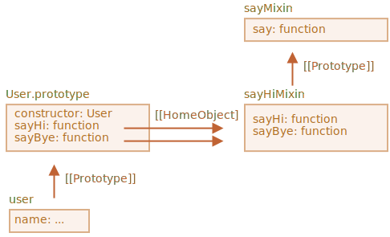

# Mixins

I JavaScript kan vi kun nedarve fra et enkelt objekt. Der kan kun være en `[[Prototype]]` for et objekt. Og en klasse kan kun udvide en anden klasse.

Men nogle gange føles det begrænset. For eksempel har vi en klasse `StreetSweeper` og en klasse `Bicycle`, og vi vil lave deres kombination: en `StreetSweepingBicycle`.

Eller vi har en klasse `User` og en klasse `EventEmitter` som implementerer oprettelse af begivenheder, og vi vil gerne tilføje funktionaliteten af `EventEmitter` til `User`, så vores brugere kan sende begivenheder.

Der er et koncept der kan hjælpe her, kaldet "mixins".

Fra Wikipedia står der, at [mixin](https://en.wikipedia.org/wiki/Mixin) er en klasse der indeholder metoder, der kan bruges af andre klasser uden at skulle nedarve fra den.

Med andre ord, en *mixin* leverer metoder, der implementerer en bestemt adfærd, men vi bruger den ikke alene, vi bruger den til at tilføje adfærd til andre klasser.

## Et mixin eksempel

Den nemmeste måde at implementere en mixin i JavaScript er at lave et objekt med et par nyttige metoder, som vi så nemt kan flette dem ind i en prototype af enhver klasse.

Her er for eksempel en mixin kaldet `sayHiMixin` der kan bruges til at tilføje noget "tale" for klassen `User`:

```js run
*!*
// mixin
*/!*
let sayHiMixin = {
  sayHi() {
    alert(`Hej, ${this.name}!`);
  },
  sayBye() {
    alert(`Farvel, ${this.name}!`);
  }
};

*!*
// usage:
*/!*
class User {
  constructor(name) {
    this.name = name;
  }
}

// kopier metoderne
Object.assign(User.prototype, sayHiMixin);

// nu kan User sige hej
new User("Karsten").sayHi(); // Hej, Karsten!
```

Der er ingen nedarvning - kun simpel kopiering af metoder. Så `User` kan nedarve fra en anden klasse og også inkludere mixin'en for at "mikse" de yderligere metoder, som dette:

```js
class User extends Person {
  // ...
}

Object.assign(User.prototype, sayHiMixin);
```

Mixins kan gøre brug af nedarvning inden i sig selv.

For eksempel, her nedarver `sayHiMixin` fra `sayMixin`:

```js run
let sayMixin = {
  say(phrase) {
    alert(phrase);
  }
};

let sayHiMixin = {
  __proto__: sayMixin, // (eller vi kan bruge Object.setPrototypeOf til at sætte prototype her)

  sayHi() {
    *!*
    // kald forældermetoden
    */!*
    super.say(`Hej ${this.name}`); // (*)
  },
  sayBye() {
    super.say(`Farvel ${this.name}`); // (*)
  }
};

class User {
  constructor(name) {
    this.name = name;
  }
}

// kopier metoderne
Object.assign(User.prototype, sayHiMixin);

// nu kan User sige hej
new User("Karsten").sayHi(); // Hej, Karsten!
```

Bemærk at kaldet til forældremetoden `super.say()` fra `sayHiMixin` (på linjer mærket med `(*)`) leder efter metoden i prototypen for den mixin, ikke klassen.

Her er et diagram over det (se den højre del):



Det er fordi metoderne `sayHi` og `sayBye` indledningsvis blev oprettet i `sayHiMixin`. Så selvom de blev kopieret, henviser deres `[[HomeObject]]` interne egenskab til `sayHiMixin`, som vist i billedet ovenfor.

Da `super` leder efter forældremetoder i `[[HomeObject]].[[Prototype]]`, betyder det, at det søger i `sayHiMixin.[[Prototype]]`.

## EventMixin

Lad os nu oprette en mixin der bruges i virkeligheden.

En vigtig mulighed for mange browserobjekter (for eksempel) er, at de kan generere hændelser. Hændelser er en fantastisk måde at "kommunisere information" til enhver, der ønsker det. Så lad os lave en mixin, der gør det nemt at tilføje event-relaterede funktioner til enhver klasse/objekt.

- Denne mixin vil tilbyde en metode `.trigger(name, [...data])` til at "generere en hændelse" når noget vigtigt sker med den. `name`-argumentet er et navn på hændelsen. Det næste argument er valgfrit og giver mulighed for at sende data med hændelsen.
- Metoden `.on(name, handler)` tilføjer `handler`-funktionen som lytter til hændelser med det givne navn. Den vil blive kaldt når en hændelse med det givne `name` udløses, og får argumenterne fra kaldet til `.trigger`.
- ...Endelig er der `.off(name, handler)` som fjerner `handler`-lytteren.

Efter at have tilføjet mixin'en, vil et objekt `user` være i stand til at generere en hændelse `"login"` når en besøgende logger ind. Et andet objekt, for eksempel `calendar` kan lytte efter sådan en hændelse for at indlæse kalenderen for den person der er logget ind.

Eller en `menu`, kan generere hændelsen `"select"` når et menu-element er valgt, og andre objekter kan tildele funktioner (kaldet handlers) til at reagere på hændelsen. Og så videre.

Her er koden til sådan en mixin:

```js run
let eventMixin = {
  /**
   * Abonner på en hændelse, brug:
   *  menu.on('select', function(item) { ... }
  */
  on(eventName, handler) {
    if (!this._eventHandlers) this._eventHandlers = {};
    if (!this._eventHandlers[eventName]) {
      this._eventHandlers[eventName] = [];
    }
    this._eventHandlers[eventName].push(handler);
  },

  /**
   * Annuller abonnering, brug:
   *  menu.off('select', handler)
   */
  off(eventName, handler) {
    let handlers = this._eventHandlers?.[eventName];
    if (!handlers) return;
    for (let i = 0; i < handlers.length; i++) {
      if (handlers[i] === handler) {
        handlers.splice(i--, 1);
      }
    }
  },

  /**
   * Opret en hændelse med det givne navn og data
   *  this.trigger('select', data1, data2);
   */
  trigger(eventName, ...args) {
    if (!this._eventHandlers?.[eventName]) {
      return; // ingen handlers der abonnerer på den hændelse
    }

    // kald gemte handlers
    this._eventHandlers[eventName].forEach(handler => handler.apply(this, args));
  }
};
```


- `.on(eventName, handler)` -- tildeler funktionen `handler` opgaven at køre når en hændelse med det givne navn opstår. Teknisk set, er der en `_eventHandlers`-egenskab, der gemmer en liste af handlers for hvert hændelsesnavn, og den tilføjer bare funktionen til listen.
- `.off(eventName, handler)` -- fjerner funktionen fra handler-listen.
- `.trigger(eventName, ...args)` -- genererer hændelsen: alle handlers fra `_eventHandlers[eventName]` kaldes med en liste af argumenter `...args`.

Brug af mixin'en er simpel:

```js run
// Opret en klasse der bruger mixin'en
class Menu {
  choose(value) {
    this.trigger("select", value);
  }
}
// Tilføj mixin'en med event-relaterede metoder
Object.assign(Menu.prototype, eventMixin);

let menu = new Menu();

// tilføj en handler, der skal kaldes ved valg:
*!*
menu.on("select", value => alert(`Valgte værdi: ${value}`));
*/!*

// trigger en hændelse => handleren ovenfor kører og viser:
// Valgte værdi: 123
menu.choose("123");
```

Nu, hvis vi vil have kode til at reagere på et menuvalg, kan vi lytte efter det med `menu.on(...)`.

Derudover gør `eventMixin` mixin nemt at tilføje sådan adfærd til så mange klasser som vi ønsker, uden at påvirke arvekæden.

## Opsummering

*Mixin* -- er en generisk objektorienteret programmeringsterm: en klasse, der indeholder metoder for andre klasser.

Nogle andre sprog tillader nedarvning fra flere klasser. Det gør JavaScript ikke, men mixins kan implementere noget der minder om det ved at kopiere metoder ind i en prototype.

Vi kan bruge mixins som en måde at udvide en klasses adfærd, som f. eks. event-handling som vi har set ovenfor.

Mixins kan blive et problem, hvis de tilfældigt overskriver eksisterende klassemetoder. Så det er en god idé at tænke godt over navngivningen af metoderne i en mixin, for at minimere sandsynligheden for, at det sker.
