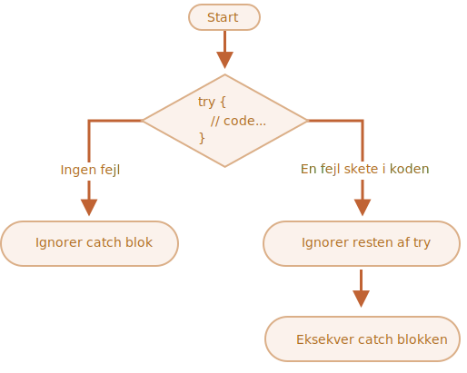

# Håndtering af fejl, "try...catch"

Uanset hvor gode vi er til programmering, så har vores scripts periodisk fejl. De kan opstå på grund af vores fejl, et uventet brugerinput, et fejlbehæftet server svar, og for tusind andre grunde.

Normalt dør et script (stoppes øjeblikkeligt) når en fejl opstår, og fejlen udskrives til konsollen.

Men der er en konstruktion `try...catch` som tillader os at "fange" fejl, så scriptet kan gøre noget mere fornuftigt end at dø.

## Syntaksen "try...catch"

Konstruktionen `try...catch` har to hovedblokke: `try`, og derefter `catch`:

```js
try {

  // kode...

} catch (err) {

  // fejlhåndtering

}
```

Det virker sådan:

1. Først vil koden i `try {...}` blive kørt.
2. Hvis der ikke er nogen fejl, så ignoreres `catch (err)`: eksekveringen når til slutningen af `try` og går videre, springer over `catch`.
3. Hvis en fejl opstår, så stoppes `try`-eksekveringen, og kontrol flyttes til begyndelsen af `catch (err)`. Den `err`-variabel (vi kan bruge et hvilket som helst navn) vil indeholde et fejlobjekt med detaljer om, hvad der skete.



Så, hvis der sker en fejl inde i `try {...}` blokken, så dør scriptet ikke -- vi har en chance til at håndtere den i `catch`.

Lad os se på et par eksempler.

- Et eksempel uden fejl: viser `alert` `(1)` og `(2)`:

    ```js run
    try {

      alert('Start på "try runs"');  // *!*(1) <--*/!*

      // ...ingen fejl her

      alert('Slut på "try runs"');   // *!*(2) <--*/!*

    } catch (err) {

      alert('Catch ignoreres fordi der ikke var fejl'); // (3)

    }
    ```
- Et eksempel med en fejl: viser `(1)` og `(3)`:

    ```js run
    try {

      alert('Start på "try runs"');  // *!*(1) <--*/!*

    *!*
      lalala; // fejl, variable is not defined!
    */!*

      alert('Slut på "try runs"');  // (2)

    } catch (err) {

      alert(`Der skete en fejl!`); // *!*(3) <--*/!*

    }
    ```


````warn header="`try...catch` virker kun for runtime errors"
For at `try...catch` skal virke skal koden kunne køre. Med anre ord skal det være gyldig (valid) JavaScript.

Den virker ikke hvis syntaksen er forkert. For eksempel hvis der er rod med parenteser:

```js run
try {
  {{{{{{{{{{{{
} catch (err) {
  alert("Motoren forstår ikke denne kode, den er ugyldig");
}
```

JavaScript-motoren læser koden først, og derefter kører den. De fejl, der opstår under læsningen, kaldes "parse-time" fejl og er unrecoverable (fra inde i koden). Det er fordi motoren ikke kan forstå koden.

Så, `try...catch` kan kun håndtere fejl, der opstår i gyldig kode. Sådanne fejl kaldes "runtime errors" eller, nogle gange, "exceptions".
```


````warn header="`try...catch` virker synkront"
Hvis en exception opstår i "planlagt" kode, som i `setTimeout`, så vil `try...catch` ikke fange den:

```js run
try {
  setTimeout(function() {
    noSuchVariable; // script will die here
  }, 1000);
} catch (err) {
  alert( "det her virker ikke" );
}
```

Det er fordi at selve funktionen først afvikles senere - det har motoren allerede forladt `try...catch` konstruktionen.

For at fange en exception inde i en planlagt funktion, skal `try...catch` være inde i selve funktionen:
```js run
setTimeout(function() {
  try {    
    noSuchVariable; // try...catch håndterer fejlen!
  } catch {
    alert( "fejlen fanges her!" );
  }
}, 1000);
```
````

## Error objekt

Når der opstår en fejl, genererer JavaScript et objekt, der indeholder detaljerne om fejlen. Objektet sendes derefter som et argument til `catch`:

```js
try {
  // ...
} catch (err) { // <-- her er "error objektet", du kan sagtens bruge et andet navn istedet for err
  // ...
}
```

For alle indbyggede fejl har error objektet to hovedegenskaber:

`name`
: Navnet på fejlen. Hvis det for eksempel er en ikke-defineret variabel, så indeholder den `"ReferenceError"`.

`message`
: En tekst der beskriver fejlen.

Der er andre ikke-standard egenskaber tilgængelige i de fleste miljøer. En af de mest brugte og understøttede er:

`stack`
: Aktuel kaldestak: en streng med information om sekvensen af indlejrede kald, der ledte til fejlen. Bruges til fejlfinding.

For eksempel:

```js run untrusted
try {
*!*
  lalala; // fejl, variablen er ikke defineret!
*/!*
} catch (err) {
  alert(err.name); // ReferenceError
  alert(err.message); // lalala is not defined
  alert(err.stack); // ReferenceError: lalala is not defined at (...call stack)

  // Kan også vise en fejl som et samlet output
  // Fejlen konverteres til en streng som "name: message"
  alert(err); // ReferenceError: lalala is not defined
}
```

## Frivillig "catch" binding

[recent browser=new]

Hvis vi ikke behøver detaljer om fejlen, kan `catch` udelade den:

```js
try {
  // ...
} catch { // <-- uden (err)
  // ...
}
```

## Brug af "try...catch"

Lad os udforske brugsscenarier for `try...catch`.

Som vi allerede ved så understøtter JavaScript metoden [JSON.parse(str)](mdn:js/JSON/parse) til at læse JSON værdier.

Normalt bruges den til at afkode data der er modtaget over netværket, fra serveren eller anden kilde.

Vi modtager det og kalder `JSON.parse` sådan her:

```js run
let json = '{"name":"John", "age": 30}'; // data from the server

*!*
let user = JSON.parse(json); // konverterer tekstrepræsentation til JS-objekt
*/!*

// nu er user et objekt med egenskaber fra strengen
alert( user.name ); // John
alert( user.age );  // 30
```

Du kan finde mere detaljeret information om JSON i kapitlet <info:json>.

**Hvis `json` indeholder fejl vil `JSON.parse` generere en fejl, så scriptet "dør".**

Skal vi stille os tilfreds med det? Nej, selvfølgelig ikke!

På denne måde, hvis der er noget galt med data, vil besøgende aldrig vide det (medmindre de åbner konsollen). Og folk kan ikke li', når noget "bare dør" uden nogen fejlbesked.

Lad os bruge `try...catch` til at håndtere fejlen:

```js run
let json = "{ bad json }";

try {

*!*
  let user = JSON.parse(json); // <-- når en fejl opstår...
*/!*
  alert( user.name ); // virker ikke

} catch (err) {
*!*
  // ...hopper afviklingen her til
  alert( "Desværre indeholder vores data fejl, vi vil forsøge at anmode om den en gang til." );
  alert( err.name );
  alert( err.message );
*/!*
}
```

Her bruger vi kun `catch` blokken til at vise en besked, men vi kan gøre meget andet: sende et nyt netværkskald, foreslå et alternativ til besøgende, send information om fejlen til en log, ... alle muligheder der er meget bedre end bare at dø.

## Kaste vores egne fejl

Hvad hvis `json` er syntactisk korrekt, men ikke har en påkrævet `name` egenskab?

Som dette:

```js run
let json = '{ "age": 30 }'; // ufuldstændige data

try {

  let user = JSON.parse(json); // <-- ingen fejl
*!*
  alert( user.name ); // intet navn!
*/!*

} catch (err) {
  alert( "afvikles ikke" );
}
```

Her kører `JSON.parse` normalt, men fraværet af `name` er faktisk en fejl for os.

For at ensrette fejlhåndteringen, vil vi bruge `throw` operatoren.

### "Throw" operator

Operatoren `throw` genererer en fejl.

Syntaksen er:

```js
throw <error object>
```

Teknisk set kan vi kaste hvad som helst som et error objekt. Det kan endda være en primitiv, som et tal eller en streng, men det er bedre at bruge objekter, især med `name` og `message` egenskaber (for at forblive nogenlunde kompatibel med de indbyggede fejl).

JavaScript har mange indbyggede konstruktører for standardfejl: `Error`, `SyntaxError`, `ReferenceError`, `TypeError` og andre. Vi kan bruge dem til at oprette fejlobjekter.

Deres syntaks er:

```js
let error = new Error(message);
// eller
let error = new SyntaxError(message);
let error = new ReferenceError(message);
// ...
```

For indbyggede fejl (ikke for objekter generelt, kun for fejl) er `name` egenskaben præcis det samme som navnet på konstruktøren, og `message` er taget fra argumentet.

For eksempel:

```js run
let error = new Error("Things happen o_O");

alert(error.name); // Error
alert(error.message); // Things happen o_O
```

Lad os se hvilken fejl `JSON.parse` genererer, når den ikke kan læse data:

```js run
try {
  JSON.parse("{ bad json o_O }");
} catch (err) {
*!*
  alert(err.name); // SyntaxError
*/!*
  alert(err.message); // Unexpected token b in JSON at position 2
}
```

Som vi kan se er det en `SyntaxError`.

Og i vores tilfælde er fraværet af `name` en fejl, da brugere skal have et `name`.

Så lad os kaste den fejl, og håndtere den i `catch`:

```js run
let json = '{ "age": 30 }'; // ufuldstændige data

try {

  let user = JSON.parse(json); // <-- no errors

  if (!user.name) {
*!*
    throw new SyntaxError("Ufuldstændige data: name mangler"); // (*)
*/!*
  }

  alert( user.name );

} catch (err) {
  alert( "JSON Error: " + err.message ); // JSON Error: Ufuldstændige data: name mangler
}
```

I linjen med `(*)`, genererer `throw` operatoren en `SyntaxError` med den angivne `message`, på samme måde som JavaScript ville generere det selv. Afviklingen af `try` stopper med det samme og kontrollen af flower overgår til `catch`.

Nu bliver `catch` det eneste sted for al fejlhåndtering: både for `JSON.parse` og for andre scenarier.

## Rethrowing

I eksemplet ovenfor bruger vi `try...catch` til at håndtere forkert data i JSON filen. Men er det muligt at *en anden uventet fejl* opstår inden for `try {...}` blokken? Som en programmeringsfejl (variabel er ikke defineret) eller noget andet, ikke bare denne "forkerte data" ting.

For eksempel:

```js run
let json = '{ "age": 30 }'; // ufuldstændige data

try {
  user = JSON.parse(json); // <-- glemte at putte "let" foran user

  // ...
} catch (err) {
  alert("JSON Fejl: " + err); // JSON Fejl: ReferenceError: user is not defined
  // (faktisk ikke en JSON fejl)
}
```

Selvfølgelig, alt er muligt! Programmører laver fejl. Selv i open-source værktøjer der er brugt af millioner i årtier -- pludselig kan en fejl blive opdaget, der fører til frygtelige hacks.

I vores tilfælde, `try...catch` er placeret for at fange "forkerte data" fejl. Men selve konstrulktionen dikterer at `catch` får *alle* fejl fra `try`. Her får det en uventet fejl, men viser stadig den samme `"JSON Error"` besked. Det er forkert og gør også koden sværere at debugge.

For at undgå sådanne problemer, kan vi bruge "rethrowing" teknikken. Reglen er simpel:

**Catch skal kun behandle fejl, den kender, og "rethrow" alle andre.**

Teknikken "rethrowing" kan forklares lidt mere detaljeret som:

1. Opfang alle fejl.
2. I blokken `catch (err) {...}` analyserer vi error objektet.
3. Hvis vi ikke ved, hvordan vi skal håndtere den, kaster vi den med `throw err`.

Normalt kan vi tjekke fejltypen ved hjælp af `instanceof` operatoren:

```js run
try {
  user = { /*...*/ };
} catch (err) {
*!*
  if (err instanceof ReferenceError) {
*/!*
    alert('ReferenceError'); // "ReferenceError" for at tilgå en variabel der er undefineret
  }
}
```

Vi kan også få fejlens navn fra `err.name` egenskaben. Alle indbyggede fejl har den. En anden option er at læse `err.constructor.name`.

I koden nedenfor, vi bruger rethrowing så `catch` kun håndterer `SyntaxError`:

```js run
let json = '{ "age": 30 }'; // ufuldstændige data
try {

  let user = JSON.parse(json);

  if (!user.name) {
    throw new SyntaxError("Ufuldstændige data: name mangler");
  }

*!*
  blabla(); // uventet fejl
*/!*

  alert( user.name );

} catch (err) {

*!*
  if (err instanceof SyntaxError) {
    alert( "JSON fejl: " + err.message );
  } else {
    throw err; // rethrow (*)
  }
*/!*

}
```

Fejlkastningen på linjen med `(*)` inde i `catch` blokken "falder ud" af `try...catch` og kan enten blive fanget af en ydre `try...catch` construct (hvis den eksisterer), eller også dør scriptet.

Så `catch` blokken håndterer faktisk kun fejl, den ved hvordan den skal håndtere, og "dropper" alle andre.

Eksemplet nedenfor viser, hvordan sådanne fejl kan blive fanget af et ekstra niveau af `try...catch`:

```js run
function readData() {
  let json = '{ "age": 30 }';

  try {
    // ...
*!*
    blabla(); // fejl!
*/!*
  } catch (err) {
    // ...
    if (!(err instanceof SyntaxError)) {
*!*
      throw err; // rethrow (ved ikke hvordan man skal håndtere det)
*/!*
    }
  }
}

try {
  readData();
} catch (err) {
*!*
  alert( "Ydre catch modtog: " + err ); // fangede den!
*/!*
}
```

Her ved `readData` kun hvordan den skal håndtere `SyntaxError`, mens den ydre `try...catch` ved hvordan den skal håndtere alt.

## try...catch...finally

vent, der er mere endnu.

Konstruktionen `try...catch` har en såkaldt klausul mere, nemlig `finally`.

Hvis den eksisterer, kører den i alle tilfælde:

- efter `try`, hvis der ikke var nogen fejl,
- efter `catch`, hvis der var fejl.

Den udvidede syntaks ser sådan ud:

```js
*!*try*/!* {
   ... prøv at afvikle noget kode ...
} *!*catch*/!* (err) {
   ... håndter fejl ...
} *!*finally*/!* {
   ... kører altid til sidst ...
}
```

Prøv at køre denne kode for at se, hvordan det fungerer:

```js run
try {
  alert( 'try' );
  if (confirm('Skal der laves en fejl?')) BAD_CODE();
} catch (err) {
  alert( 'catch' );
} finally {
  alert( 'finally' );
}
```

Koden har to måder at blive afviklet på:

1. Hvis du svarer "Ja" til "Skal der laves en fejl?", så `try -> catch -> finally`.
2. Hvis du svarer "Nej", så `try -> finally`.

Klausulen `finally` bruges ofte, når vi starter noget og vil have det afsluttet uanset resultatet.

For eksempel, vi vil måle tiden, det tager at køre en Fibonacci tal funktion `fib(n)`. Naturligvis kan vi starte måling før den kører og afslutte efterfølgende. Men hvad hvis der er en fejl under funktionskaldet? Især implementationen af `fib(n)` i koden nedenfor returnerer en fejl for negative eller ikke-heltalstal.

`finally` klausulen er et godt sted at afslutte målingerne uanset hvad.

Her garanterer `finally` at tiden vil blive målt korrekt i begge situationer -- i tilfælde af en succesfuld udførelse af `fib` og i tilfælde af en fejl i den:

```js run
let num = +prompt("Skriv et positivt heltal?", 35)

let diff, result;

function fib(n) {
  if (n < 0 || Math.trunc(n) != n) {
    throw new Error("Tallet må ikke være negativt, og det skal være et heltal.");
  }
  return n <= 1 ? n : fib(n - 1) + fib(n - 2);
}

let start = Date.now();

try {
  result = fib(num);
} catch (err) {
  result = 0;
*!*
} finally {
  diff = Date.now() - start;
}
*/!*

alert(result || "der skete en fejl");

alert( `udførelsen tog ${diff}ms` );
```

Du kan nu køre koden med at indtaste `35` i `prompt` -- den kører normalt, `finally` efter `try`. Prøv bagefter at indtaste `-1` -- der vil umiddelbart være en fejl, og udførelsen vil tage `0ms`. Begge målinger er udført korrekt.

Med andre ord, funktionen kan slutte med `return` eller `throw`, det spiller ingen rolle. Klausulen `finally` udføres i begge tilfælde.


```smart header="Variable er lokale inde i `try...catch...finally`"
Bemærk at `result` og `diff` variablene i koden ovenfor er deklareret *før* `try...catch`.

Ellers, hvis vi deklarerede `let` i `try` blokken, ville den kun være synlig inden for den.
```

````smart header="`finally` og `return`"
Klausulen `finally` virker for *alle* udgange fra `try...catch`. Det indbefatter også en eksplicit `return`.

I eksemplet nedenfor, er der en `return` i `try`. I dette tilfælde, udføres `finally` lige før kontrol returnerer til den ydre kode.

```js run
function func() {

  try {
*!*
    return 1;
*/!*

  } catch (err) {
    /* ... */
  } finally {
*!*
    alert( 'finally' );
*/!*
  }
}

alert( func() ); // først kommer alert fra finally, og derefter kommer denne der kalder func()
```
````

````smart header="`try...finally`"

Konstruktionen `try...finally` uden klausulen `catch` kan også være brugbar. Den bruger vi, hvis vi ikke vil håndtere fejl her (lad dem falde gennem), men vil være sikker på, at processer, vi har startet, bliver afsluttet.

```js
function func() {
  // start noget der skal afsluttes (som målinger, eller en databaseforbindelse, eller noget andet)
  try {
    // ...
  } finally {
    // førdiggør eller ryd op lige meget om det fejler eller ej
  }
}
```
I koden ovenfor vil en fejl inde `try` altid falde ud, fordi der ikke er en `catch`. Men `finally` virker før afviklingsflowet forlader funktionen.
````

## Global catch

```warn header="Miljøspecifikt"
Informationen i denne sektion er ikke en del af selve JavaScript sproget.
```

Lad os forestille os, at vi får en fatal fejl uden for `try...catch`, og scriptet dør. Som en programmeringsfejl eller noget andet skrækkeligt.

Er der en måde at reagere på sådanne tilfælde? Vi vil måske logge fejlen, vise noget til brugeren (normalt ser de ikke fejlbeskeder), etc.

Der er ingen i specifikationen, men miljøer ofte leverer det, fordi det er virkelig nyttigt. For eksempel har Node.js [`process.on("uncaughtException")`](https://nodejs.org/api/process.html#process_event_uncaughtexception) for det. Og i browseren kan vi tildele en funktion til den specielle [window.onerror](mdn:api/GlobalEventHandlers/onerror) egenskab, som vil køre i tilfælde af en ikke-fanget fejl.

Syntaksen er:

```js
window.onerror = function(message, url, line, col, error) {
  // ...
};
```

`message`
: Fejlmeddelelsen.

`url`
: URL for det script hvor fejlen opstod.

`line`, `col`
: Linje og kolonne numre hvor fejlen opstod.

`error`
: Error objekt.

For eksempel, denne kode har en fejl, og den vil blive fanget af `window.onerror`:

```html run untrusted refresh height=1
<script>
*!*
  window.onerror = function(message, url, line, col, error) {
    alert(`${message}\n At ${line}:${col} of ${url}`);
  };
*/!*

  function readData() {
    badFunc(); // Ups, noget gik galt!
  }

  readData();
</script>
```

Rollen for den globale håndtering med `window.onerror` er normalt ikke for at genskabe scripteksekveringen -- det er sandsynligvis umuligt i tilfælde af programmeringsfejl, men for at sende fejlmeddelelsen til udviklerne.

Der er også web-tjenester, der leverer fejllogning for sådanne tilfælde, som <https://muscula.com> eller <https://www.sentry.io>.

De virker sådan her:
1.Vi registrerer os hos services og får et stykke JS-kode (eller en URL til et script) fra dem til at indsætte på sider.
2. Dette JS-script sætter en brugerdefineret `window.onerror` funktion.
3. Når der sker en fejl, sender den en network request omkring det til tjenesten.
4. Vi kan så logge ind på tjenestens webinterface og se fejl.

## Opsummering

Konstruktionen `try...catch` tillade os at håndtere runtime-fejl. Det tillader os bogstaveligt talt at "prøve" at køre koden og "fange" fejl, der kan opstå i den.

Syntaksen er:

```js
try {
  // kør denne kode
} catch (err) {
  // hvis der sker en fejl, så hop hertil
  // err er et objekt der indeholder fejlinformationen
} finally {
  // gør dette uanset om der sker en fejl eller ej
}
```

Der behøver ikke at være en `catch` klausul eller en `finally` klausul, så kortere konstruktioner `try...catch` og `try...finally` er også gyldige.

Error objekter har følgende egenskaber:

- `message` -- fejlmeddelelsen.
- `name` -- strengen med fejlnavnet (konstruktoren navn).
- `stack` (ikke-standard, men ret udbredt) -- stakken ved øjeblikket for fejl oprettelsen.

Hvis vi ikke behøver et error object, kan du udelade det ved at bruge `catch {` i stedet for `catch (err) {`.

Vi kan også generere vores egne fejl ved hjælp af `throw` operatoren. Teknisk set kan argumentet for `throw` være hvad som helst, men normalt er det et error object, der nedarver fra den indbyggede `Error` klasse. Mere om at udvide fejl i næste kapitel.

*Rethrowing* er en meget vigtig mønster for fejlhåndtering: en `catch` blok forventes typisk at vide, hvordan den skal håndtere den specifikke fejltype, så den bør kaste fejlen igen, hvis den ikke kender til den.

Selv hvis vi ikke har `try...catch`, tillader de fleste miljøer os at opsætte en "global" fejlhåndtering for at fange fejl, der "falder ud". I browseren er det `window.onerror`.
