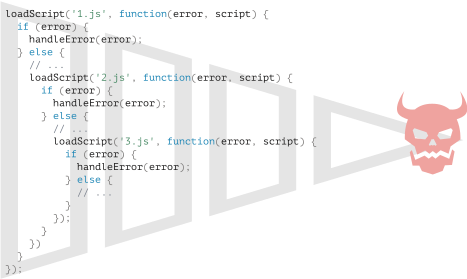

# Introduktion: callbacks

```warn header="Vi bruger browser metoder i eksemplerne her"
For at demonstrere brugen af callbacks, promises og andre abstrakte koncepter, vil vi bruge nogle browser metoder: specifikt, indlæsning af scripts og udførelse af simple manipulationer af dokumentet.

Hvis du ikke er fortrolig med disse metoder, og brugen af dem i eksemplerne er forvirrende, kan du med fordel læse et par kapitler fra den [næste del](/document) af tutorialen.

Vi vil dog forsøge at gøre tingene så simple og klare som muligt. Der vil ikke være noget virkelig komplekst browser-baseret.
```

Mange funktioner leveret af JavaScript host miljøer tillader dig at planlægge *asynkrone* handlinger. Med andre ord, handlinger som vi starter nu, men de afsluttes senere.

For eksempel, en sådan funktion er `setTimeout` funktionen.

Der er andre eksempler på asynkrone handlinger i den virkelige verden, f.eks. indlæsning af scripts og moduler (vi vil dække dem i senere kapitler).

Tag et kig på funktionen `loadScript(src)`, som loader et script med det givne `src`:

```js
function loadScript(src) {
  // opretter et <script> tag og tilføjer det til siden
  // dette vil få scriptet med den givne src til at starte indlæsning og køre når det er færdigt
  let script = document.createElement('script');
  script.src = src;
  document.head.append(script);
}
```

Det sætter et dynamisk oprettet <script> tag til dokumentet med den givne `src`. Browseren starter automatisk indlæsningen og kører scriptet når det er færdigt.

Vi kan bruge funktionen sådan:

```js
// hent og udfør scriptet på det givne sted
loadScript('/my/script.js');
```

Dette script udføres "asynkront", da det starter indlæsningen nu, men kører senere, når funktionen allerede er færdig.

Hvis der er noget kode under `loadScript(…)`, venter det ikke på at scriptet er færdig med at blive indlæst.

```js
loadScript('/my/script.js');
// kode under loadScript
// venter ikke på at scriptet er færdig med at blive indlæst
// ...
```

Lad os antage at vi vil bruge det nye script så snart det er indlæst. Det deklarerer nye funktioner, og vi vil køre dem.

Men hvis vi gør det umiddelbart efter `loadScript(…)` kaldet, vil det ikke virke, fordi scriptet ikke er indlæst endnu:

```js
loadScript('/my/script.js'); // scriptet har "function newFunction() {…}"

*!*
newFunction(); // funktionen findes ikke endnu!
*/!*
```

Naturligvis har browseren med al sandsynlighed ikke haft tid til at indlæse scriptet - funktioner tilbyder ikke en måde at spore en indlæsning. Scriptet indlæses og kører til sidst, det er alt vi kan bede om. Men her vil vi gerne vide, når det sker, så vi kan bruge de nye funktioner og variabler fra scriptet.

Lad os tilføje en `callback` funktion som andet argument til `loadScript` som skal køre når scriptet er indlæst:

```js
function loadScript(src, *!*callback*/!*) {
  let script = document.createElement('script');
  script.src = src;

*!*
  script.onload = () => callback(script);
*/!*

  document.head.append(script);
}
```

Hændelsen `onload` er beskrevet i artiklen <info:onload-onerror#loading-a-script>, den eksekverer grundlæggende en funktion efter at scriptet er indlæst og udført.

Nu, hvis vi vil køre nye funktioner fra scriptet, skal vi skrive det i callbacken:

```js
loadScript('/my/script.js', function() {
  // denne callback kører efter at scriptet er indlæst
  newFunction(); // så det virker nu
  ...
});
```

Det er ideen: det andet argument er en funktion (ofte anonym) som kører når handlingen er færdig.

Her er et eksempel med et virkeligt script:

```js run
function loadScript(src, callback) {
  let script = document.createElement('script');
  script.src = src;
  script.onload = () => callback(script);
  document.head.append(script);
}

*!*
loadScript('https://cdnjs.cloudflare.com/ajax/libs/lodash.js/3.2.0/lodash.js', script => {
  alert(`Sådan! Scriptet ${script.src} er indlæst`);
  alert( _ ); // _ er en funktion som er deklareret i det indlæste script
});
*/!*
```

Dette kaldes en "callback-baseret" form for asynkron programmering. En funktion som gør noget asynkront bør levere et `callback` argument hvor vi putter funktionen som skal køres efter at den er færdig.

Her gjorde vi det i `loadScript`, men det er en generel tilgang.

## Callback ii callback

Hvordan kan vi hente to scripts sekventielt: det første og så det andet efter det?

Den naturlige løsning ville være at putte det andet `loadScript` kald inden i callbacken, sådan her:

```js
loadScript('/my/script.js', function(script) {

  alert(`Scriptet ${script.src} er indlæst, lad os hente et til`);

*!*
  loadScript('/my/script2.js', function(script) {
    alert(`Sådan! Det andet script er indlæst`);
  });
*/!*

});
```

Efter det ydre `loadScript` er færdig, initierer callbacken det indre kald.

Hvad hvis vi vil have endnu et script...?

```js
loadScript('/my/script.js', function(script) {

  loadScript('/my/script2.js', function(script) {

*!*
    loadScript('/my/script3.js', function(script) {
      // ... fortsætter efter alle scripts er indlæst
    });
*/!*

  });

});
```

Så enhver ny handling er inde i en callback. Det er fint et par gange, men ikke godt hvis det bliver for dybt. Vi ser på andre muligheder om lidt.

## Håndtering af fejl

I eksemplet ovenfor har vi ikke taget højde for fejl. Hvad hvis scriptet ikke kan indlæses? Vores callback bør være i stand til at reagere på det.

Her er en forbedret version af `loadScript` der fanger indlæsningsfejl:

```js
function loadScript(src, callback) {
  let script = document.createElement('script');
  script.src = src;

*!*
  script.onload = () => callback(null, script);
  script.onerror = () => callback(new Error(`Fejl under indlæsning af script ${src}`));
*/!*

  document.head.append(script);
}
```

Den kalder `callback(null, script)` hvis det lykkedes med at indlæse scriptet og ellers `callback(error)`.

Brug af det ser sådan ud:
```js
loadScript('/my/script.js', function(error, script) {
  if (error) {
    // handle error
  } else {
    // script loaded successfully
  }
});
```

Igen, denne opskrift på `loadScript` er faktisk ret udbredt. Denne stil kaldes for "error-first callback".

Konventionen er:
1. Det første argument af `callback` er reserveret for en fejl, hvis den opstår. Så kaldes `callback(err)`.
2. Det andet argument (og de næste, hvis det er nødvendigt) er for det succesfulde resultat. Så kaldes `callback(null, result1, result2…)`.

Så bruges den ene `callback`-funktion både til at rapportere fejl og til at sende resultater tilbage.

## Dommedagspyramiden (Pyramid of Doom)

Ved første øjekast ser det ud til at være en mulig tilgang til asynkron programmering. Og faktisk er det det. For en eller to indlejrede kald er det ok.

Men for flere asynkrone handlinger der følger efter hinanden, vil vi have kode som denne:

```js
loadScript('1.js', function(error, script) {

  if (error) {
    handleError(error);
  } else {
    // ...
    loadScript('2.js', function(error, script) {
      if (error) {
        handleError(error);
      } else {
        // ...
        loadScript('3.js', function(error, script) {
          if (error) {
            handleError(error);
          } else {
  *!*
            // ... fortsæt efter alle scripts er indlæst (*)
  */!*
          }
        });

      }
    });
  }
});
```

I koden ovenfor:
1. Vi henter `1.js`, derefter, hvis der ikke er nogen fejl...
2. Vi henter `2.js`, derefter, hvis der ikke er nogen fejl...
3. Vi henter `3.js`, derefter, hvis der ikke er nogen fejl -- gør noget andet `(*)`.

Efterhånden som kald bliver mere indlejrede, bliver koden dybere og stadig vanskeligere at administrere, især hvis vi har rigtig kode i stedet for `...` som kan inkludere flere loops, betingede udsagn og så videre.

Det kaldes nogle gange "callback hell" eller ["pyramid of doom"](https://en.wikipedia.org/wiki/Pyramid_of_doom_(programming)).

<!--
loadScript('1.js', function(error, script) {
  if (error) {
    handleError(error);
  } else {
    // ...
    loadScript('2.js', function(error, script) {
      if (error) {
        handleError(error);
      } else {
        // ...
        loadScript('3.js', function(error, script) {
          if (error) {
            handleError(error);
          } else {
            // ...
          }
        });
      }
    });
  }
});
-->



Denne "pyramide" af indlejrede kald vokser til højre med hvert asynkrone handling og ender ude af kontrol.

Så, det er ikke en god måde at kode på.

Vi kan afhjælpe problemet ved at gøre hver handling til en selvstændig funktion, som dette:

```js
loadScript('1.js', step1);

function step1(error, script) {
  if (error) {
    handleError(error);
  } else {
    // ...
    loadScript('2.js', step2);
  }
}

function step2(error, script) {
  if (error) {
    handleError(error);
  } else {
    // ...
    loadScript('3.js', step3);
  }
}

function step3(error, script) {
  if (error) {
    handleError(error);
  } else {
    // ... fortsæt efter alle scripts er indlæst (*)
  }
}
```

Kan du set det? Det gør det samme, og der er ikke nogen dyb indlejring mere, fordi vi gjorde hver handling til en separat top-level funktion.

Det virker, men koden ligner mere et regneark, der er revet i stykker. Det er svært at læse, og du har sandsynligvis bemærket, at øjet skal springe mellem stykkerne mens man læser det. Det er ukomfortabelt, især hvis læseren ikke er vant til koden og ikke ved hvor man skal kigge.

Endelig er alle funktionerne med navnet `step*` kun brugt en gang - de er der kun for at undgå "pyramid of doom." Ingen vil genbruge dem uden for "kæden af funktioner". Så der er en lille smule namespace kludder her.

Vi vil gerne have noget bedre.

Heldigvis er der andre måder at undgå sådanne pyramider. En af de bedste måder er at bruge "promises", beskrevet i næste kapitel.
