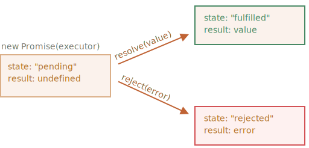
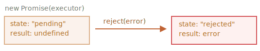

# Promise

Forestil dig at du er en kendt sanger og fans spørger dag og nat efter din kommende sang.

For at få noget ro til at indspille, lover du at sende den til dem, når den er udgivet. Du giver dine fans en liste. De kan udfylde deres e-mailadresser, så når sangen bliver tilgængelig, modtager alle abonnerede parter den øjeblikkeligt. Og selv hvis noget går meget galt, f.eks. en brand i studiet, så du ikke kan udgive sangen, vil de stadig blive underrettet.

Alle er glade: du, fordi folk ikke længere presser dig, og dine fans, fordi de ikke kommer til at misse sangen.

Dette er en analogi fra virkeligheden for en situation vi ofte har i programmering:

1. En "producerende kode" der gør noget der tager tid. For eksempel koder der henter data over et netværk - det er "sangeren".
2. En "konsumerende kode" der vil have resultatet af den "producerende kode" når den er klar. Mange funktioner kan have brug for dette resultat - disse er "fans".
3. Et *promise* (på dansk et "løfte") er et specielt JavaScript-objekt, der forbinder "producerende kode" og "konsumerende kode". I vores analogi er dette "abonnementslisten". "Producerende kode" tager den tid det kræver for at producere det lovede resultat, og "promise" gør dette resultat tilgængeligt for alle der har skrevet sig på listen, når den er klar.

Analogien er ikke helt nøjagtig, fordi JavaScript-promises er mere komplekse end en simpel abonnementsliste: de har ekstra funktioner og begrænsninger. Men det er fint nok til at begynde med.

Konstruktør-syntaksen for et promise-objekt er:

```js
let promise = new Promise(function(resolve, reject) {
  // udfører (den producerende kode, "sanger")
});
```

Den funktion der gives til `new Promise` kaldes *executor* (i stil med udfører på dansk). Når `new Promise` er oprettet, køres executor'en automatisk. Den indeholder den producerende kode, som bør producere resultatet i sidste ende. I termer af vores analogi: executor'en er "sangeren".

Dens argumenter `resolve` og `reject` er callbacks leveret af JavaScript selv. Vores kode er kun inde i executor'en.

Når executor'en får resultatet, uanset hvor hurtigt eller langsomt, spiller det ingen rolle, så bør den kalde en af disse callbacks:

- `resolve(value)` — hvis jobbet er færdigt med succes, med resultat `value`.
- `reject(error)` — hvis der er opstået en fejl, `error` er fejl-objektet.

Så for at opsummere: Executor'en kører automatisk og forsøger at udføre et job. Når det er færdigt med forsøget, kalder den `resolve` hvis det lykkedes eller `reject` hvis der var en fejl.

Objektet `promise` som returneres af `new Promise` constructor har disse interne egenskaber:

- `state` — starter med at være `"pending"`, men ændres til enten `"fulfilled"` når `resolve` kaldes eller `"rejected"` når `reject` kaldes.
- `result` — starter med at være `undefined`, men ændres til `value` når `resolve(value)` kaldes eller `error` når `reject(error)` kaldes.

Så executor'en bevæger `promise` til en af disse tilstande:



Senere vil vi se, hvordan "fans" kan abonnere på disse ændringer.

Her er et eksempel på en promise konstruktør og en simpel executor-funktion med  "producerende kode" der tager tid (via `setTimeout`):

```js
let promise = new Promise(function(resolve, reject) {
  // funktionen udføres automatisk når promise'et er konstrueret

  // efter 1 sekund signalerer at jobbet er færdigt med resultatet   "done"
  setTimeout(() => *!*resolve("done")*/!*, 1000);
});
```

Vi kan se to ting ved at køre koden ovenfor:

1. Executor'en kaldes automatisk og umiddelbart (af `new Promise`).
2. Executor'en modtager to argumenter: `resolve` og `reject`. Disse funktioner er foruddefinerede af JavaScript-motoren, så vi behøver ikke at oprette dem. Vi bør kun kalde en af dem når vi er klar.

    Efter et sekund af "behandling", kalder executor'en `resolve("done")` for at producere resultatet. Dette ændrer tilstanden på `promise`-objektet til `"fulfilled"` og sætter `result` til `"done"`:

    

Det var et eksempel på et succesfuldt job, et "fuldført løfte".

Og nu et eksempel på executor'en afviser løftet med en fejl:

```js
let promise = new Promise(function(resolve, reject) {
  // efter 1 sekund signalerer at jobbet er færdigt med en fejl
  setTimeout(() => *!*reject(new Error("Whoops!"))*/!*, 1000);
});
```

Kaldet til `reject(...)` flytter promise objektet til `"rejected"` state:



For at opsummere, executor udfører et job (ofte noget der tager tid) og kalder så `resolve` eller `reject` for at ændre tilstanden på det tilsvarende promise-objekt.

Et løfte der enten opfyldes eller afvises kaldes for "settled", modsat den oprindelige tilstand "pending".

````smart header="Der kan der kun være et enkelt resultat eller en fejl"
Executor'en bør kun kalde en enkelt `resolve` eller en enkelt `reject`. Enhver ændring af state er endelig.

Alle efterfølgende kald af `resolve` og `reject` ignoreres:

```js
let promise = new Promise(function(resolve, reject) {
*!*
  resolve("done");
*/!*

  reject(new Error("…")); // ignoreret
  setTimeout(() => resolve("…")); // ignoreret
});
```

Idéen er at når et job er færdigt, kan det kun have ét resultat eller en fejl.

Derudover arbejder `resolve`/`reject` med kun ét argument (eller intet) og vil ignorere yderligere argumenter.
````

```smart header="Afvis med `Error` objekter"
I det tilfælde at noget går galt, bør executor'en kalde `reject`. Det kan gøres med enhver type af argument (ligesom `resolve`). Men det er anbefalet at bruge `Error` objekter (eller objekter der nedarver fra `Error`). Årsagen til det vil snart blive klart.
```

````smart header="Umiddelbart kald af `resolve`/`reject`"
I praksis udfører en executor en job asynkront og kalder `resolve`/`reject` efter noget tid, men det behøver ikke at være tilfældet. Vi kan også kalde `resolve` eller `reject` umiddelbart, som her:

```js
let promise = new Promise(function(resolve, reject) {
  // det tager ikke nogen tid at gøre jobbet
  resolve(123); // giv resultatet med det samme: 123
});
```

Det kan ske, hvis vi starter et job, men derefter ser, at alt allerede er fuldført og cached.

Det er helt fint. Så har vi bare umiddelbart et resolved promise.
````

```smart header="`state` og `result` er interne"
Egenskaberne `state` og `result` fra Promise objektet er interne. Vi kan ikke tilgå dem direkte. Vi kan bruge metoderne `.then`/`.catch`/`.finally` til det. De er beskrevet nedenfor.
```

## Forbrugerne: then, catch

Et Promise objekt fungerer som en link mellem executor (den "producerende kode" eller "sanger") og de forbrugerfunktioner (de "fans"), som vil modtage resultatet eller fejlen. Forbrugerfunktioner kan registrere sig (abonnere) ved hjælp af metoderne `.then` og `.catch`.

### then

Det vigtigste (og fundamentale) er `.then`.

Syntaksen er:

```js
promise.then(
  function(result) { *!*/* håndter et succesfuldt resultat */*/!* },
  function(error) { *!*/* håndter en fejl */*/!* }
);
```

Det første argument af `.then` er en funktion der kører når løftet opfyldes og vi modtager et resultat.

Det andet argument af `.then` er en funktion der kører når løftet afvises og vi modtager en fejl.

Her er et eksempel på en reaktion til et succesfuldt løft:

```js run
let promise = new Promise(function(resolve, reject) {
  setTimeout(() => resolve("done!"), 1000);
});

// resolve kører den første funktion i .then
promise.then(
*!*
  result => alert(result), // viser "done!" efter 1 sekund
*/!*
  error => alert(error) // kører ikke
);
```

Den første funktion blev eksekveret.

Og i tilfælde af en afvisning, den anden funktion:

```js run
let promise = new Promise(function(resolve, reject) {
  setTimeout(() => reject(new Error("Ups!")), 1000);
});

// reject kører den anden funktion i .then
promise.then(
  result => alert(result), // kører ikke
*!*
  error => alert(error) // viser "Error: Ups!" efter 1 sekund
*/!*
);
```

Hvis vi kun er interesseret i succesfulde afslutninger, så kan vi nøjes med kun at give et argument til `.then`:

```js run
let promise = new Promise(resolve => {
  setTimeout(() => resolve("done!"), 1000);
});

*!*
promise.then(alert); // viser "done!" efter 1 sekund
*/!*
```

### catch

Hvis vi kun er interesseret i fejl, så kan vi bruge `null` som det første argument: `.then(null, errorHandlingFunction)`. Eller vi kan bruge `.catch(errorHandlingFunction)`, som er præcis det samme:


```js run
let promise = new Promise((resolve, reject) => {
  setTimeout(() => reject(new Error("Ups!")), 1000);
});

*!*
// .catch(f) is the same as promise.then(null, f)
promise.catch(alert); // viser "Error: Ups!" efter 1 sekund
*/!*
```

Klausulen `.catch(f)` er fuldstændig det samme som `.then(null, f)`.

## Oprydning: finally

Ligesom der er en `finally` klausul i en `try {...} catch {...}`, er der også en `finally` i promises.

Kaldet til `.finally(f)` minder om `.then(f, f)` i den forstand at `f` altid kører, når promise er blevet afsluttet: enten resolve eller reject.

Idéen med `finally` er at opstille håndtering der rydder op eller færdiggører processen efter de tidligere operationer er fuldført.

Det kan være ting som at stoppe loading indicators, lukke forbindelser der ikke længere er nødvendige, etc.

Tænk på det som en oprydder efter festen. Det er ligegyldigt om festen var god eller dårlig, hvor mange venner der var med oev. Vi skal stadig (eller i det mindste bør vi stadig) rydde op efter den.

Koden kan se sådan ud:

```js
new Promise((resolve, reject) => {
  /* gør noget der tager tid, og kald derefter resolve eller reject */
})
*!*
  // køres når promise er blevet afsluttet, det spiller ingen rolle om det lykkes eller ej
  .finally(() => stop loading indicator)
  // Kode der gør at loading indikatoren er altid stoppet før vi går videre
*/!*
  .then(result => show result, err => show error)
```

Bemærk at `finally(f)` ikke helt er det samme som `then(f,f)`.

Der er nogle vigtig forskelle:

1. En `finally` handler har ingen argumenter. I `finally` ved vi ikke om løftet er opfyldt eller ej. Det er ok, da vores opgave her ofter er at udføre "generelle" opgaver for at afslutte processen.

    Tag et kig på eksemplet ovenfor: som du kan se, har `finally` handler ingen argumenter, og promise udfaldet håndteres af den næste handler.
2. En `finally` handler "sender information igennem" til den næste egnede handler - hvad end det er et result eller error.

    Her sendes resultatet for eksempel gennem `finally` til `then`:

    ```js run
    new Promise((resolve, reject) => {
      setTimeout(() => resolve("value"), 2000);
    })
      .finally(() => alert("Promise klart")) // trigger først
      .then(result => alert(result)); // <-- .then viser "value"
    ```

    Som du kan se sendes værdien `value` der returneres fra det første promise til `finally` og gennem den videre til den næste `then`.

    Det er meget praktisk fordi `finally` er ikke sat i verden for at behandling resultatet af dit promise. Som sagt, er det et sted til generel oprydning, uanset hvad udfaldet var.

    He rer et eksempel med en fejl, for os at vise hvordan den bliver sendt gennem `finally` til `catch`:

    ```js run
    new Promise((resolve, reject) => {
      throw new Error("error");
    })
      .finally(() => alert("Promise klart")) // trigger først
      .catch(err => alert(err));  // <-- .catch viser fejlen
    ```

3. En `finally` handler skal heller ikke returnere noget. Hvis den gør, ignoreres den returnerede værdi stille.

    Den eneste undtagelse til den regel er, når en `finally` handler smider en fejl. Så er det denne fejl der bliver sendt til den næste handler, istedet for et tidligere resultat.

For at opsummere:

- En `finally` handler får ikke det resultat fra den forrige handler (den har ingen argumenter). Dette resultat bliver i stedet sendt videre til den næste egnede handler.
- Hvis en `finally` handler returnerer noget, ignoreres det.
- Når `finally` kaster en fejl, går udførelsen til den nærmeste fejlhandler.

Disse funktioner er hjælpsome og gør at tingene fungerer på den rigtige måde, hvis vi bruger `finally` som det er ment: til generelle oprydningsprocedurer.

````smart header="Vi kan tilføje handlers til afsluttede promises"
Hvis et promise står som pending, `.then/catch/finally` vil handlers vente på dets resultat.

Der kan være tilfælde, vore et løfte allerede er afsluttet, når handleren bliver tilføjet.

I sådanne tilfælde vil disse handlers bare køre med det samme:

```js run
// Denne promise bliver sat til resolved med det samme den oprettes
let promise = new Promise(resolve => resolve("done!"));

promise.then(alert); // done! (Vises med det samme)
```

Bemærk at dette gør promises mere kraftfulde end scenariet med "subscription list" i det virkelige liv. Hvis en sanger forsynlig har frigivet deres sang og en person tilmelder sig på abonnementslisten efterfølgende, vil de sandsynligvis ikke modtage den sang der allerede er udkommet. Abonnementer i det virkelige liv skal foretages før begivenheden for at virke.

Promises er mere fleksible. Vi kan tilføje handlers når som helst: hvis resultatet allerede er der, så udføres de bare.
````

## Eksempel: loadScript [#loadscript]

Lad os nu se et par praktiske eksempler på hvordan promises kan hjælpe os med at skrive asynkron kode.

Vi har `loadScript` funktionen der henter et script fra det forrige kapitel.

Her er den callback-baserede variant, for lige at genopfriske hukommelsen:

```js
function loadScript(src, callback) {
  let script = document.createElement('script');
  script.src = src;

  script.onload = () => callback(null, script);
  script.onerror = () => callback(new Error(`Script load error for ${src}`));

  document.head.append(script);
}
```

Lad os omskrive den til at gøre brug af Promises.

Den nye funktion `loadScript` kræver ikke en callback. I stedet vil den oprette og returnere et Promise-objekt, der løser sig, når indlæsningen er fuldført. Den ydre kode kan tilføje handlers (abonnentfunktioner) til det ved hjælp af `.then`:

```js run
function loadScript(src) {
  return new Promise(function(resolve, reject) {
    let script = document.createElement('script');
    script.src = src;

    script.onload = () => resolve(script);
    script.onerror = () => reject(new Error(`Script load error for ${src}`));

    document.head.append(script);
  });
}
```

Den bruges således:

```js run
let promise = loadScript("https://cdnjs.cloudflare.com/ajax/libs/lodash.js/4.17.11/lodash.js");

promise.then(
  script => alert(`${script.src} er hentet!`),
  error => alert(`Fejl: ${error.message}`)
);

promise.then(script => alert('Endnu en handler...'));
```

Vi kan med det samme se et par fordele i forhold til det callback-baserede mønster:


| Promises | Callbacks |
|----------|-----------|
| Promises tillader os at gøre tingene i den naturlige rækkefølge. Først kører vi `loadScript(script)`, og `.then` skriver vi, hvad vi vil gøre med resultatet. | Vi skal have en `callback`-funktion til rådighed, når vi kalder `loadScript(script, callback)`. Med andre ord skal vi vide, hvad vi vil gøre med resultatet *før* `loadScript` kaldes. |
| Vi kan kalde `.then` på et Promise så mange gange som vi vil. Hver gang tilføjer vi en ny "fan", en ny abonnentfunktion, til "abonnementslisten". Mere om dette i næste kapitel: [](info:promise-chaining). | Der kan kun være én callback. |

Så promises giver os bedre kodeflow og fleksibilitet. Men der er mere. Det vil vi se nærmere på i næste kapitler.
