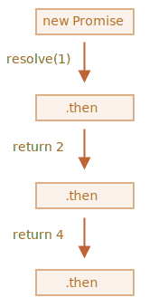
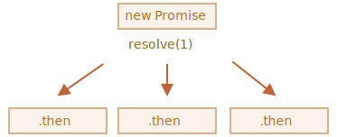
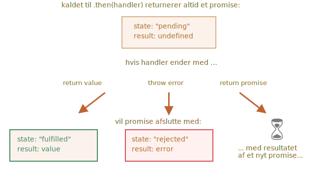

# Sammenkædning af promises (chaining)

Lad os vende tilbage til problemet nævnt i kapitlet <info:callbacks>: vi har en sekvens af asynkrone opgaver, der skal udføres efter hinanden — for eksempel, indlæsning af scripts. Hvordan kan vi kode det godt?

Promises leverer et par metoder til at gøre det.

I dette kapitel dækker vi promise chaining.

Det ser ud som dette:

```js run
new Promise(function(resolve, reject) {

  setTimeout(() => resolve(1), 1000); // (*)

}).then(function(result) { // (**)

  alert(result); // 1
  return result * 2;

}).then(function(result) { // (***)

  alert(result); // 2
  return result * 2;

}).then(function(result) {

  alert(result); // 4
  return result * 2;

});
```

Idéen her er, at resultatet sendes gennem en kæde af `.then`-håndteringer.

Her er flowet:
1. Det indledende promise løser sig efter 1 sekund `(*)`,
2. Derefter kaldes `.then` handleren `(**)`, der derefter opretter et nyt promise (løst med værdien `2`).
3. Det næste `then` `(***)` får resultatet fra den forrige, behandler det (dobbelt) og sender det videre til den næste handler.
4. ...og sådan videre.

Efterhånden som resultatet sendes gennem kæden af håndteringer, kan vi se en sekvens af `alert`-kald: `1` -> `2` -> `4`.



Dette virker, fordi hvert kald til en `.then` returnerer et nyt promise, så vi kan kalde næste `.then` på det.

Når en handler returnerer en værdi, bliver den til resultatet af det promise, så næste `.then` kaldes med den.

**En klassisk begynderfejl: teknisk set kan vi også tilføje mange `.then` til et enkelt promise. Dette er ikke chaining.**

For example:
```js run
let promise = new Promise(function(resolve, reject) {
  setTimeout(() => resolve(1), 1000);
});

promise.then(function(result) {
  alert(result); // 1
  return result * 2;
});

promise.then(function(result) {
  alert(result); // 1
  return result * 2;
});

promise.then(function(result) {
  alert(result); // 1
  return result * 2;
});
```

Det vi har gjort her er blot at tilføje flere håndteringer til et enkelt promise. De sender ikke resultatet videre til hinanden; de behandler det uafhængigt.

Her er et billede (til sammenligning med kæden ovenfor):



Alle `.then` der direkte er tilknyttet det samme promise får det samme resultat -- resultatet af det promise. Så i koden ovenfor viser alle `alert` den samme værdi: `1`.

I praksis har vi sjældent brug for flere håndteringer for et enkelt promise. Kæden bruges meget mere ofte.

## Returnering af promises

En handler brugt i `.then(handler)` må oprette og returnere et promise.

I det tilfælde venter næste håndteringer på, at det promise bliver løst, og derefter får de dets resultat.

For eksempel:

```js run
new Promise(function(resolve, reject) {

  setTimeout(() => resolve(1), 1000);

}).then(function(result) {

  alert(result); // 1

*!*
  return new Promise((resolve, reject) => { // (*)
    setTimeout(() => resolve(result * 2), 1000);
  });
*/!*

}).then(function(result) { // (**)

  alert(result); // 2

  return new Promise((resolve, reject) => {
    setTimeout(() => resolve(result * 2), 1000);
  });

}).then(function(result) {

  alert(result); // 4

});
```

Her viser den første `.then` `1` og returnerer `new Promise(…)` i linjen `(*)`. Efter et sekund løser den sig, og resultatet (argumentet for `resolve`, her er det `result * 2`) sendes videre til håndtereren for den anden `.then`. Den håndterer er i linjen `(**)`, den viser `2` og gør det samme.

Så outputtet er det samme som i det forrige eksempel: 1 -> 2 -> 4, men nu med 1 sekund forsinkelse mellem `alert`-kald.

Returnering af promises tillader os at bygge kæder af asynchronous handlinger.

## Eksempel: loadScript

Lad os bruge den mulighed i vores "promisificerede" `loadScript`, som vi oprettede i [sidste kapitel](info:promise-basics#loadscript), til at hente scripts et ad gangen, i sekvens:

```js run
loadScript("/article/promise-chaining/one.js")
  .then(function(script) {
    return loadScript("/article/promise-chaining/two.js");
  })
  .then(function(script) {
    return loadScript("/article/promise-chaining/three.js");
  })
  .then(function(script) {
    // udfør funktionerne deklareret i de hentede scripts
    // for at vise, at de rent faktisk er hentet
    one();
    two();
    three();
  });
```

Denne kode kan gøres lidt kortere med arrow funktioner:

```js run
loadScript("/article/promise-chaining/one.js")
  .then(script => loadScript("/article/promise-chaining/two.js"))
  .then(script => loadScript("/article/promise-chaining/three.js"))
  .then(script => {
    // scripts er alle hentet. Nu kan vi bruge funktionerne
    one();
    two();
    three();
  });
```


Her returnerer hvert kald til `loadScript` et promise og den næste `.then` kører, når det løses (resolve). Derefter initialiseres hentning af det næste script. Så scripts er hentet en efter en.

Vi kan tilføje endnu flere asynkrone handlinger til kæden. Bemærk, at koden stadig er "flad" — den vokser ned, ikke til højre. Der er ingen tegn på "pyramid of doom".

Teknisk set kunne vi tilføje `.then` direkte til hvert `loadScript`, som dette:

```js run
loadScript("/article/promise-chaining/one.js").then(script1 => {
  loadScript("/article/promise-chaining/two.js").then(script2 => {
    loadScript("/article/promise-chaining/three.js").then(script3 => {
      // denne funktion har adgang til variablene script1, script2 and script3
      one();
      two();
      three();
    });
  });
});
```

Denne kode gør det samme: henter 3 scripts i sekvens. Men den "vokser til højre". Så vi har det samme problem som med callbacks.

Folk der starter med at bruge promises ved ikke altid om chaining, så de skriver det på denne måde. Generelt set er chaining at foretrække.

Nogle gange er det i orden at skrive `.then` direkte, fordi den indlejrede funktion har adgang til det ydre scope. I eksemplet ovenfor har den mest indlejrede callback adgang til alle variabler `script1`, `script2`, `script3`. Men det er mere en undtagelse end en regel.


````smart header="Thenables"
For at være præcis, kan en handler returnerer ikke nødvendigvis et promise, men et såkaldt "thenable" objekt - et vilkårligt objekt som har en metode `.then`. Det vil blive behandlet på samme måde som en promise.

Ideen er, at 3rd-party biblioteker kan implementere deres egne "promise-kompatible" objekter. De kan have et udvidet sæt af metoder, men også være kompatible med native promises, fordi de implementerer `.then`.

Her er et eksempel på et thenable objekt:

```js run
class Thenable {
  constructor(num) {
    this.num = num;
  }
  then(resolve, reject) {
    alert(resolve); // function() { native kode }
    // resolve med this.num*2 efter 1 sekund
    setTimeout(() => resolve(this.num * 2), 1000); // (**)
  }
}

new Promise(resolve => resolve(1))
  .then(result => {
*!*
    return new Thenable(result); // (*)
*/!*
  })
  .then(alert); // vis 2 efter 1000ms
```

JavaScript tjekker objektet der returneres af `.then` handleren i linje `(*)`: Hvis den har en kaldbar metode kaldet `then`, så kalder den den metode og giver native funktioner `resolve`, `reject` som argumenter (ligner en executor) og venter indtil en af dem bliver kaldt. I eksemplet ovenfor bliver `resolve(2)` kaldt efter 1 sekund `(**)`. Derefter sendes resultatet videre ned ad kæden.

Denne feature tillader os at integrere custom objekter med promise kæder uden at skulle arve fra `Promise`.
```

## Et større eksempel: fetch

I frontend programmering bruges promises ofte til forespørgsler over netværket. Så lad os se på et eksempel på det.

Vi vil bruge metoden [fetch](info:fetch) til at indlæse informationen om brugeren fra den eksterne server. Den har en masse valgfrie parametre dækket i [separate kapitler](info:fetch), men den grundlæggende syntaks er ganske enkel:

```js
let promise = fetch(url);
```

Dette opretter en netværksforespørgsel til `url` og returnerer en promise. Promise'en løser med et `response`-objekt, når den eksterne server svarer med headers, men *før hele svaret er downloadet*.

For at læse hele svaret, bør vi kalde metoden `response.text()`: den returnerer en promise, der løser, når hele teksten er downloadet fra den eksterne server, med den tekst som resultat.

Koden nedenfor laver en forespørgsel til `user.json` og indlæser dens tekst fra serveren:

```js run
fetch('/article/promise-chaining/user.json')
  // .then nedenfor kører når remote serveren svarer
  .then(function(response) {
    // response.text() returnerer et nyt promise der løses med den fulde tekst af det eksterne fil, 
    // når den er indlæst
    return response.text();
  })
  .then(function(text) {
    // ... og her er indholdet af det eksterne fil
    alert(text); // {"name": "iliakan", "isAdmin": true}
  });
```

`response` objektet der returneres fra `fetch` indeholder også metoden `response.json()` som læser de eksterne data og parser dem som JSON. I vores tilfælde er det endnu mere praktisk, så lad os skifte til det.

Vi vil også bruge arrow funktioner for at gøre koden kortere:

```js run
// samme som ovenfor, men response.json() oversætter det hentede indhold som JSON
fetch('/article/promise-chaining/user.json')
  .then(response => response.json())
  .then(user => alert(user.name)); // iliakan, tog user.name
```

Lad os gøre noget med den hentede bruger.

For eksempel, vi kan lave et kald mere til GitHub, hente brugerens profil og vise en avatar:

```js run
// Opret en forespørgsel på user.json
fetch('/article/promise-chaining/user.json')
  // Hent det ind som JSON
  .then(response => response.json())
  // Lav en forespørgsel til GitHub
  .then(user => fetch(`https://api.github.com/users/${user.name}`))
  // Hent svaret som JSON
  .then(response => response.json())
  // Vis avatar billedet (githubUser.avatar_url) i 3 sekunder (måske animér det)
  .then(githubUser => {
    let img = document.createElement('img');
    img.src = githubUser.avatar_url;
    img.className = "promise-avatar-example";
    document.body.append(img);

    setTimeout(() => img.remove(), 3000); // (*)
  });
```

Koden virker; se eventuelt kommentarer for flere detaljer. Men, der er et potentielt problem - en typisk fejl for dem, der begynder at bruge promises.

Kig på linjen `(*)`: hvordan kan vi gøre noget *efter* at avataren er færdig med at blive vist og fjernet? Hvis vi for eksempel vil vise muligheder for at redigere brugeren eller noget i den stil. Som det er nu, er det ikke muligt.

For at kunne udvide kæden, må vi returnere en promise, der løses, når avataren er færdig med at blive vist.

Som dette:

```js run
fetch('/article/promise-chaining/user.json')
  .then(response => response.json())
  .then(user => fetch(`https://api.github.com/users/${user.name}`))
  .then(response => response.json())
*!*
  .then(githubUser => new Promise(function(resolve, reject) { // (*)
*/!*
    let img = document.createElement('img');
    img.src = githubUser.avatar_url;
    img.className = "promise-avatar-example";
    document.body.append(img);

    setTimeout(() => {
      img.remove();
*!*
      resolve(githubUser); // (**)
*/!*
    }, 3000);
  }))
  // trigger efter 3 sekunder
  .then(githubUser => alert(`Færdig med at vise ${githubUser.name}`));
```

Nu vil `.then` handleren i linje `(*)` returnere et `new Promise`, der først afsluttes efter kaldet til `resolve(githubUser)` i `setTimeout` `(**)`. Det næste `.then` i kæden vil vente på det.

Det er god praksis at en asynkron handling altid bør returnere et promise. Det gør det muligt at planlægge handlinger efter den; selv hvis vi ikke planlægger at udvide kæden nu, kan vi have brug for det senere.

Endelig kan vi splitte koden op i funktioner der kan genbruges:

```js run
function loadJson(url) {
  return fetch(url)
    .then(response => response.json());
}

function loadGithubUser(name) {
  return loadJson(`https://api.github.com/users/${name}`);
}

function showAvatar(githubUser) {
  return new Promise(function(resolve, reject) {
    let img = document.createElement('img');
    img.src = githubUser.avatar_url;
    img.className = "promise-avatar-example";
    document.body.append(img);

    setTimeout(() => {
      img.remove();
      resolve(githubUser);
    }, 3000);
  });
}

// Brug dem således:
loadJson('/article/promise-chaining/user.json')
  .then(user => loadGithubUser(user.name))
  .then(showAvatar)
  .then(githubUser => alert(`Færdig med at vise ${githubUser.name}`));
  // ...
```

## Opsummering

Hvis en `.then` (eller `catch/finally`, for den sags skyld) handler returnerer et promise, vil resten af kæden vente indtil den bliver løst. Når det sker, videregives resultatet (eller fejlen) videre.

Her er et overbliksbillede:


