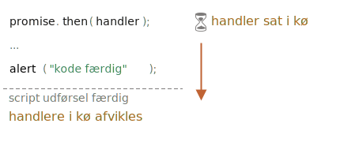

# Microtasks

Promise handlers `.then`/`.catch`/`.finally` er altid asynkrone.

Selv når et promise løses umiddelbart, vil koden på linjerne *under* `.then`/`.catch`/`.finally` stadig køre før disse handlers.

Her er et eksempel:

```js run
let promise = Promise.resolve();

promise.then(() => alert("promise færdig!"));

alert("kode færdig"); // denne kode vises først
```

Hvis du kører det, ser du `kode færdig` først, og så `promise færdig!`.

Det er mærkeligt, fordi promise er helt sikkert færdig fra starten.

Hvorfor aktiverede `.then` efterfølgende? Hvad sker der?

## Microtasks queue

Asynkrone opgaver har brug for korrekt håndtering. Til det formål specificerer ECMA-standarden en intern kø `PromiseJobs`, som ofte refereres til som "microtask queue" (V8 term).

Som angivet i [specifikationen](https://tc39.github.io/ecma262/#sec-jobs-and-job-queues):

- Køen er first-in-first-out: opgaver, der er sat i køen først, køres først.
- Udførelse af en opgave initieres kun, når intet andet er i gang.

Eller, sagt på en simpel måde, når et promise er færdigt, bliver dets `.then/catch/finally` handlers sat i køen; de bliver ikke udført endnu. Når JavaScript-motoren bliver ledig fra den nuværende kode, tager den en opgave fra køen og udfører den.

Det er derfor "kode færdig" i eksemplet ovenfor vises først.



Promise handlers går altid gennem denne interne kø.

Hvis der er en kæde med flere `.then/catch/finally`, så udføres hver enkelt asynkront. Det vil sige, at de først sættes i køen, og derefter udføres, når den nuværende kode er færdig og tidligere satte handlers er færdige.

**Hvad hvis rækkefølgen er vigtig for os? Hvordan kan vi få `kode færdig` til at vises efter `promise færdig`?**

Simpelthen ved at putte det i køen med `.then`:

```js run
Promise.resolve()
  .then(() => alert("promise færdig!"))
  .then(() => alert("kode færdig"));
```

Nu er rækkefølgen som ønsket.

## Uhåndteret afvisning

Husker du `unhandledrejection` eventen fra artiklen <info:promise-error-handling>?

Nu kan vi se præcis hvordan JavaScript finder ud af, at der er en uhåndteret afvisning.

**En "uhåndteret afvisning" opstår, når en promise fejl ikke håndteres i slutningen af microtask-køen.**

Normalt, hvis vi forventer en fejl, tilføjer vi `.catch` til promise-kæden for at håndtere den:

```js run
let promise = Promise.reject(new Error("Promise fejlet!"));
*!*
promise.catch(err => alert('fanget'));
*/!*

// kører ikke: fejlen er håndteret
window.addEventListener('unhandledrejection', event => alert(event.reason));
```

Men hvis vi glemmer at tilføje `.catch`, så udløser motoren eventet, efter at microtask-køen er tom, og den ser, at der er en promise i "afvist" tilstand:

```js run
let promise = Promise.reject(new Error("Promise fejlet!"));

// Promise fejlet!
window.addEventListener('unhandledrejection', event => alert(event.reason));
```

Hvad hvis vi håndterer fejlen senere? Sådan her:

```js run
let promise = Promise.reject(new Error("Promise fejlet!"));
*!*
setTimeout(() => promise.catch(err => alert('fanget')), 1000);
*/!*

// Error: Promise fejlet!
window.addEventListener('unhandledrejection', event => alert(event.reason));
```

Hvis vi kører koden vil vi se `Promise fejlet!` først og derefter `fanget`.

Hvis vi ikke kendte til microtasks-køen, kunne vi undre os: "Hvorfor kørte `unhandledrejection` handleren? Vi fangede og håndterede fejlen!"

Men nu forstår vi, at `unhandledrejection` genereres, når microtask-køen er tom: motoren undersøger promises, og hvis en af dem er i "rejected" tilstand, så udløser eventet.

I eksemplet ovenfor kan vi se et `.catch` blive tilføjet af `setTimeout` som også udløses - men det sker senere. På det tidspunkt er `unhandledrejection` allerede opstået, så det ændrer ikke på noget.

## Opsummering

Håndtering af promises er altid asynkron, da alle promise-handlinger går gennem den interne "promise jobs" kø, også kaldet "microtask kø" (V8 term).

Så `.then/catch/finally` handlers kaldes altid efter, at den nuværende kode er færdig.

Hvis vi har brug for at garantere, at en del af koden bliver udført efter `.then/catch/finally`, kan vi tilføje den til en kædet `.then` kald.

I de fleste Javascript motorer, inklusiv browsere og Node.js, er konceptet microtasks tæt forbundet med "event loop" og "macrotasks". Da disse ikke har en direkte relation til promises, er de behandlet i en anden del af tutorialen, i artiklen <info:event-loop>.
