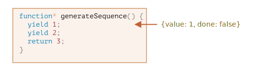
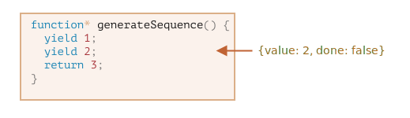
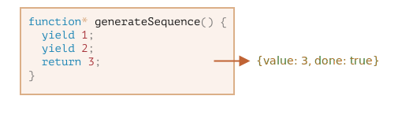
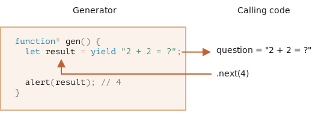
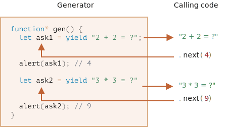

# Generatorer

Normale funktioner returnerer kun en enkelt værdi (eller intet).

Generatorer kan returnere ("yield") flere værdier, en efter en, på anmodning. De fungerer godt med [iterable](info:iterable) og gør det nemt at oprette datastrømme.

## Generatorfunktioner

For at oprette en generator har vi brug for en speciel syntaks: `function*`, såkaldt "generatorfunktion".

Det ser sådan ud:

```js
function* generateSequence() {
  yield 1;
  yield 2;
  return 3;
}
```

Generatorfunktioner opfører sig anderledes end normale funktioner. Når en sådan funktion kaldes, kører dens kode ikke. I stedet returnerer den et specielt objekt, kaldet et "generator objekt", der håndterer eksekveringen.

Here, take a look:

```js run
function* generateSequence() {
  yield 1;
  yield 2;
  return 3;
}

// "generatorfunktionen" opretter et "generator objekt"
let generator = generateSequence();
*!*
alert(generator); // [object Generator]
*/!*
```

Funktionens kode er ikke startet endnu, og den er klar til at blive kørt. Det er det, der adskiller generatorer fra normale funktioner: de starter ikke, når de kaldes. I stedet returnerer de et objekt, der kan bruges til at styre eksekveringen.


Hovedmetoden for en generator er `next()`. Når den kaldes, kører den eksekveringen indtil den nærmeste `yield <value>` sætning (`value` kan udelades, da den så er `undefined`). Derefter pauser funktionens eksekvering, og den `value` der gives ved yield returneres til det ydre kode.

Resultatet af `next()` er altid et objekt med to egenskaber:
- `value`: værdien som er *yielded*.
- `done`: `true` hvis funktionens kode er færdig, ellers `false`.

Her opretter vi en generator og får dens første yielded værdi:

```js run
function* generateSequence() {
  yield 1;
  yield 2;
  return 3;
}

let generator = generateSequence();

*!*
let one = generator.next();
*/!*

alert(JSON.stringify(one)); // {value: 1, done: false}
```

Som det står nu har vi kun fået den første værdi, og funktionens eksekvering er på den anden linje: `yield 2`. Det er derfor `done: false` og `value: 1`. Generatoren er ikke færdig, og den har returneret `1` som det første resultat.



Lad os kalde `generator.next()` igen. Det genoptager eksekvering af funktionens kode og returnerer den næste `yield`:

```js
let two = generator.next();

alert(JSON.stringify(two)); // {value: 2, done: false}
```



Og, hvis vu kalder den for tredje gang, vil eksekveringen nå `return`-sætningen, som afslutter funktionen.

```js
let three = generator.next();

alert(JSON.stringify(three)); // {value: 3, *!*done: true*/!*}
```



Nu er generatoren færdig. Vi ser det med værdierne `done:true` og `value:3` som det endelige resultat.

New calls to `generator.next()` don't make sense any more. If we do them, they return the same object: `{done: true}`.

```smart header="`function* f(…)` eller `function *f(…)`?"
Begge syntakser er korrekte.

Men den første syntaks er normalt foretrukket. Stjernen `*` indikerer at det er en generatorfunktion, den beskriver typen, ikke navnet, så den bør fastholde sig ved `function`-nøgleordet.
```

## Generatororer er itererbare

Som du nok allerede har gættet på, når du kigger på metoden `next()`, er generatorer [itererbare](info:iterable).

Vi kan loope over deres værdier ved hjælp af `for..of`:

```js run
function* generateSequence() {
  yield 1;
  yield 2;
  return 3;
}

let generator = generateSequence();

for(let value of generator) {
  alert(value); // 1, then 2
}
```

Det ser pænere ud end at kalde `.next().value`, ikke?

...Men husk: eksemplet ovenfor viser `1`, så `2`, og det er alt. Det viser ikke `3`!

Det er fordi `for..of` iteration ignorerer den sidste `value`, når `done: true`. Så, hvis vi vil have alle resultater vist af `for..of`, skal vi returnere dem med `yield` i stedet for `return`:

```js run
function* generateSequence() {
  yield 1;
  yield 2;
*!*
  yield 3;
*/!*
}

let generator = generateSequence();

for(let value of generator) {
  alert(value); // 1, then 2, then 3
}
```

Da generatorer er itererbare, kan vi kalde al relateret funktionalitet, f.eks. spread-syntaksen `...`:

```js run
function* generateSequence() {
  yield 1;
  yield 2;
  yield 3;
}

let sequence = [0, ...generateSequence()];

alert(sequence); // 0, 1, 2, 3
```

I koden ovenfor omdannes `...generateSequence()` det det itererbare objekt til et array af elementer (læs mere om spread-syntaksen i kapitlet [](info:rest-parameters-spread#spread-syntax))

## Brug generatorer med itererbare objekter

For noget tid siden, i kapitlet [](info:iterable) oprettede vi et itererbart `range`-objekt, der returnerer værdier `from..to`.

Her, lad os lige huske koden:

```js run
let range = {
  from: 1,
  to: 5,

  // for..of range kalder denne metode en gang i begyndelsen
  [Symbol.iterator]() {
    // ...den returnerer iterator-objektet:
    // efterfølgende vil for..of kun virke med det objekt, og kun når det spørges om næste værdier
    return {
      current: this.from,
      last: this.to,

      // next() bliver kaldt ved hver iteration af for..of-løkken
      next() {
        // den skal returnere værdien som et objekt {done:.., value :...}
        if (this.current <= this.last) {
          return { done: false, value: this.current++ };
        } else {
          return { done: true };
        }
      }
    };
  }
};

// iteration over range returnerer tal fra range.from til range.to
alert([...range]); // 1,2,3,4,5
```

Vi kan bruge en generatorfunktion til at iterere ved at levere den som `Symbol.iterator`.

Her er den samme `range`, men mere kompakt:

```js run
let range = {
  from: 1,
  to: 5,

  *[Symbol.iterator]() { // Kort måde at skrive [Symbol.iterator]: function*()
    for(let value = this.from; value <= this.to; value++) {
      yield value;
    }
  }
};

alert( [...range] ); // 1,2,3,4,5
```

Det virker fordi `range[Symbol.iterator]()` nu returnerer en generator, og generatormetoder er netop det, `for..of` forventer:
- den har en `.next()`-metode
- som returnerer værdier i formen `{value: ..., done: true/false}`

Det er selvfølgelig ikke en tilfældighed. Generatorer blev tilføjet til JavaScript-sproget med iteratorer i tankerne, for at kunne implementere dem nemt.

Versionen med en generator er meget mere kompakt end den originale iterable kode for `range`, og beholder samme funktionalitet.

```smart header="Generatorer kan generere værdier for evigt"
I eksemplet ovenfor genererede vi endelige sekvenser, men vi kan også lave en generator, der producerer værdier for evigt. For eksempel en uendelig sekvens af pseudo-tilfældige tal.

Det vil selvfølgelig kræve en `break` (eller `return`) i `for..of` over sådan en generator. Ellers ville løkken gentage for evigt og låse systemet.
```

## Generator komposition

Generator komposition er en speciel feature ved generatorer der tillader os at indlejre generatorer indeni andre generatorer.

Her har vi for eksempel en funktion, der genererer en række tal:

```js
function* generateSequence(start, end) {
  for (let i = start; i <= end; i++) yield i;
}
```

Nu vil vi gerne genbruge den til at at generere en mere kompleks sekvens:
- først, tal `0..9` (med karakterkoderne 48..57),
- efterfulgt af alfabet med store bogstaver `A..Z` (karakterkoderne 65..90)
- efterfulgt af små bogstaver `a..z` (karakterkoderne 97..122)

Vi kan bruge denne sekvens til f.eks. at skabe passwords ved at vælge tegn fra den (kunne tilføje syntaks-tegn også), men lad os generere den først.

I en normal funktion, for at kombinere resultater fra flere andre funktioner, kalder vi dem, gemmer resultaterne og sammenkæder dem til sidst.

For generatorer, er der en speciel `yield*`-syntaks til at "indlejre" (sammensætte) en generator i en anden.

Den komponerede generator:

```js run
function* generateSequence(start, end) {
  for (let i = start; i <= end; i++) yield i;
}

function* generatePasswordCodes() {

*!*
  // 0..9
  yield* generateSequence(48, 57);

  // A..Z
  yield* generateSequence(65, 90);

  // a..z
  yield* generateSequence(97, 122);
*/!*

}

let str = '';

for(let code of generatePasswordCodes()) {
  str += String.fromCharCode(code);
}

alert(str); // 0..9A..Za..z
```

Direktivet `yield*` *delegerer* udførelsen til en anden generator. Dette udtryk betyder, at `yield* gen` itererer over generator `gen` og videreformidler dens yields uden for. Som om værdierne blev produceret af den ydre generator.

Resultatet er det samme som hvis vi inkoorporerede koden fra den indlejrede generatorer:

```js run
function* generateSequence(start, end) {
  for (let i = start; i <= end; i++) yield i;
}

function* generateAlphaNum() {

*!*
  // yield* generateSequence(48, 57);
  for (let i = 48; i <= 57; i++) yield i;

  // yield* generateSequence(65, 90);
  for (let i = 65; i <= 90; i++) yield i;

  // yield* generateSequence(97, 122);
  for (let i = 97; i <= 122; i++) yield i;
*/!*

}

let str = '';

for(let code of generateAlphaNum()) {
  str += String.fromCharCode(code);
}

alert(str); // 0..9A..Za..z
```

En generator komposition er en naturlig måde at indsætte ef flow fra en generator i en anden. Den bruger ikke ekstra hukommelse til at gemme mellemresultater.

## "yield" virker begge veje

Op til nu har generatorer fungeret som iterable objekter, med en speciel syntaks til at generere værdier. Men faktisk er de meget mere kraftfulde og fleksible.

Det skyldes, at `yield` kan køre i begge retninger: den returnerer ikke kun resultatet til udvikleren, men kan også sende en værdi ind i generatoren.

For at gøre det, skal vi kalde `generator.next(arg)`, med et argument. Det argument bliver resultatet af `yield`.

Lad os se et eksempel:

```js run
function* gen() {
*!*
  // Send et spørgsmål til det ydre kode og vent på et svar
  let result = yield "2 + 2 = ?"; // (*)
*/!*

  alert(result);
}

let generator = gen();

let question = generator.next().value; // <-- yield returnerer værdien

generator.next(4); // --> sender resultatet til generatoren
```



1. Det første kald til `generator.next()` skal altid laves uden et argument (det argument ignoreres hvis det sendes). Det starter eksekveringen og returnerer resultatet af den første `yield "2+2=?"`. På dette tidspunkt pauser generatoren eksekveringen, mens den bliver på linjen `(*)`.
2. Derefter, som vist på billedet ovenfor, kommer resultatet af `yield` ind i `question` variablen i det ydre kode.
3. På `generator.next(4)`, genstartes generatoren, og `4` kommer ind som resultatet: `let result = 4`.

Bemærk venligst, at det ydre kode ikke behøver at kalde `next(4)` umiddelbart. Det kan tage tid. Det er ikke et problem: generatoren vil vente.

For eksempel:

```js
// fortsæt generatoren efter noget tid
setTimeout(() => generator.next(4), 1000);
```

Som vi kan se så, modsat normale funktioner, kan en generator og det ydre kode bytte resultater ved at sende værdier i `next/yield`.

For at gøre tingene mere klart, her er et andet eksempel med flere kald:

```js run
function* gen() {
  let ask1 = yield "2 + 2 = ?";

  alert(ask1); // 4

  let ask2 = yield "3 * 3 = ?"

  alert(ask2); // 9
}

let generator = gen();

alert( generator.next().value ); // "2 + 2 = ?"

alert( generator.next(4).value ); // "3 * 3 = ?"

alert( generator.next(9).done ); // true
```

Et billede over udførelsen:



1. Det første `.next()` starter udførelsen... Den rammer det første `yield`.
2. Resultatet returneres til det ydre kode.
3. Det andet `.next(4)` sender `4` tilbage til generatoren som resultatet af det første `yield`, og genstarter eksekveringen.
4. ...Det rammer det andet `yield`, som bliver resultatet af generatorkaldet.
5. Det tredje `next(9)` sender `9` ind i generatoren som resultatet af det andet `yield` og genstarter eksekveringen, der når slutningen af funktionen, så `done: true`.

Det er som et "ping-pong" spil. Hvert `next(value)` (undtagen det første) sender en værdi ind i generatoren, som bliver resultatet af den nuværende `yield`, og får så tilbage resultatet af den næste `yield`.

## generator.throw

Som vi har set i eksemplerne ovenfor, kan den ydre kode sende en værdi ind i generatoren som resultatet af `yield`.

... men det kan også udløse (throw) en fejl der. Det er egentligt naturligt, da en fejl jo er en slags resultat.

For at sende en fejl til en `yield`, skal vi kalde `generator.throw(err)`. I det tilfælde bliver `err` kastet i linjen med den pågældende `yield`.

Her er for eksempel et yield med `"2 + 2 = ?"` der leder til en fejl:

```js run
function* gen() {
  try {
    let result = yield "2 + 2 = ?"; // (1)

    alert("Udførelsen når ikke her til fordi en fejl er kastet ovenfor");
  } catch(e) {
    alert(e); // vis fejlen
  }
}

let generator = gen();

let question = generator.next().value;

*!*
generator.throw(new Error("Svaret findes ikke i min database")); // (2)
*/!*
```

Fejlen smides in i generatoren på linjen `(2)`, hvilket fører til en fejl i linjen `(1)` med `yield`. I eksemplet ovenfor fanger `try..catch` fejlen og viser den.

Hvis vi ikke fanger den, så "falder den ud" som enhver anden fejl - ud af generatoren til det ydre kode.

Den aktuelle linje i det ydre kode er linjen med `generator.throw`, mærket som `(2)`. Så vi kan fange den her således:

```js run
function* generate() {
  let result = yield "2 + 2 = ?"; // Fejl i denne linje
}

let generator = generate();

let question = generator.next().value;

*!*
try {
  generator.throw(new Error("Svaret findes ikke i min database"));
} catch(e) {
  alert(e); // vis fejlen
}
*/!*
```

HVis vi ikke fanger fejlen her så vil den, som sædvanlig, falde igennem til den ydre kaldende kode, hvis der er en. Hvis den ikke fanges her, vil scriptet dø.

## generator.return

`generator.return(value)` afslutter eksekveringen af generatoren og returnerer den givne `value`.

```js
function* gen() {
  yield 1;
  yield 2;
  yield 3;
}

const g = gen();

g.next();        // { value: 1, done: false }
g.return('foo'); // { value: "foo", done: true }
g.next();        // { value: undefined, done: true }
```

Hvis vi bruger `generator.return()` i en færdig generator, vil den returnere den givne værdi igen ([MDN](https://developer.mozilla.org/en-US/docs/Web/JavaScript/Reference/Global_Objects/Generator/return)).

Ofte bruger vi det ikke, da vi ofte vil have alle de returnerede værdier, men det kan være nyttigt, når vi vil stoppe generatoren i en bestemt tilstand.

## Opsummering

- Generatorer oprettes af generator funktioner `function* f(…) {…}`.
- Inde i generatorer (og kun generatorer) kan der eksistere en `yield` operator.
- Det ydre kode og generatoren kan udveksle resultater via `next/yield` kald.

I moderne JavaScript bruges generatorer sjældent. De kan dog være praktiske, fordi de giver en funktion evnen til at udveksle data med den ydre kode under eksekveringen, hvilket er ganske unik. Og, så de er fantastiske til at oprette iterable objekter.

I næste kapitel vil vi lære om async generatorer. De bruges til at læse streams af asynkront genererede data (f.eks. paginerede fetches over et netværk) i `for await ... of` loops.

I web-programmering arbejdes der ofte med streamed data, så det er et andet meget vigtig scenarie.
