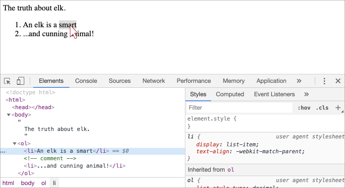
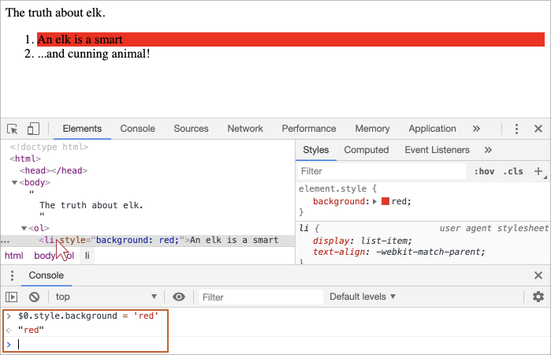

libs:
  - d3
  - domtree

---

# DOM træet

Rygraden i et HTML dokument er tags.

Ifølge Document Object Model (DOM) er alle HTML tag objekter. Indlejrede tags kaldes "Børn" ("children" på engelsk)af det omkransende tag. Fri tekst inde i et tag er også objekter.

Alle disse objekter er tilgængelige ved hjælp af JavaScript, og vi kan bruge dem til at ændre siden.

For eksempel er `document.body` objektet, der repræsenterer `<body>` tagget.

Hvis vi kører denne kode, vil `<body>` blive rød i 3 sekunder:

```js run
document.body.style.background = 'red'; // gør baggrunden rød

setTimeout(() => document.body.style.background = '', 3000); // vend tilbage
```

Her bruger vi `style.background` til at ændre baggrundsfarven på `document.body`, men der er mange andre egenskaber, såsom:

- `innerHTML` -- HTML-indholdet af noden.
- `offsetWidth` -- nodens bredde (i pixels)
- ...og så videre.

Snart vil vi lære flere måder at manipulere DOM'en på, men først skal vi kende dens struktur.

## Et eksempel på DOM'en

Lad os starte med følgende simple dokument:

```html run no-beautify
<!DOCTYPE HTML>
<html>
<head>
  <title>About elk</title>
</head>
<body>
  The truth about elk.
</body>
</html>
```

DOM'en repræsenterer HTML dokumentet som en træstruktur af tags. Her er hvordan det ser ud:

<div class="domtree"></div>

<script>
let node1 = {"name":"HTML","nodeType":1,"children":[{"name":"HEAD","nodeType":1,"children":[{"name":"#text","nodeType":3,"content":"\n  "},{"name":"TITLE","nodeType":1,"children":[{"name":"#text","nodeType":3,"content":"About elk"}]},{"name":"#text","nodeType":3,"content":"\n"}]},{"name":"#text","nodeType":3,"content":"\n"},{"name":"BODY","nodeType":1,"children":[{"name":"#text","nodeType":3,"content":"\n  The truth about elk.\n"}]}]}

drawHtmlTree(node1, 'div.domtree', 690, 320);
</script>

```online
På billedet ovenfor kan du klikke på elementer og deres børn vil åbne/lukke.
```

Hver node i træet er et objekt.

Tags er *element-noder* (eller bare elementer) og danner træstrukturer: `<html>` er på roden, så `<head>` og `<body>` er dens børn, etc.

Teksten inde i elementer danner *tekst noder*, mærket som `#text`. En text node indeholder kun en streng. Den må ikke have børn og kan ses som et blad (leaf på engelsk) i træet.

For eksempel har `<title>` tagget teksten `"About elk"`.

Bemærk de specielle tegn i text noder:

- en ny linie: `↵` (i JavaScript ofte skrevet som `\n`)
- et mellemrum: `␣`

Mellemrum og linjeskift er gyldelige tegn, ligesom bogstaver og cifre. De danner text noder og bliver en del af DOM'en. Således bliver teksten i eksemplet ovenfor, som indeholder mellemrum før `<title>`, til en `#text` node (den indeholder en ny linie og nogle mellemrum).

Der er kun to top-niveau undtagelser:
1. Mellemrum og linjeskift før `<head>` ignoreres af historiske grunde.
2. Hvis vi putter noget efter `</body>`, så flyttes det automatisk ind i `body`, ved enden, da HTML specifikationen kræver, at alt indhold skal være inde i `<body>`. Så der kan ikke være nogle mellemrum efter `</body>`.

I alle andre tilfælde er det lige ud af landevejen - hvis der er mellemrum (ligesom ethvert tegn) i dokumentet, så bliver de til tekst noder i DOM'en, og hvis vi fjerner dem, så vil der ikke være nogle.

Her er et eksempel på en DOM med tekst noder uden mellemrum eller linjeskift:

```html no-beautify
<!DOCTYPE HTML>
<html><head><title>About elk</title></head><body>The truth about elk.</body></html>
```

<div class="domtree"></div>

<script>
let node2 = {"name":"HTML","nodeType":1,"children":[{"name":"HEAD","nodeType":1,"children":[{"name":"TITLE","nodeType":1,"children":[{"name":"#text","nodeType":3,"content":"About elk"}]}]},{"name":"BODY","nodeType":1,"children":[{"name":"#text","nodeType":3,"content":"The truth about elk."}]}]}

drawHtmlTree(node2, 'div.domtree', 690, 210);
</script>

```smart header="Mellemrum ved start/slut af tekststreng og tekst noder der kun indeholder mellemrum skjules ofte i værktøjer"
Browser værktøjer (som vil blive dækket snart) der arbejder med DOM'en viser ofte ikke mellemrum ved start/end af teksten og tomme tekst noder (linjeskift) mellem tags.

Det er en måde for udviklerværktøjet at spare på pladsen.

Ved fremtidige DOM billeder vil vi ofte udelade dem, når de er irrelevante. Sådanne mellemrum påvirker normalt ikke, hvordan dokumentet vises.
```

## Autokorrektur

Hvis browseren møder fejlformateret HTML, korrigere den automatisk når DOM'en oprettes.

For eksempel er første tag altid `<html>`. Selv hvis det ikke eksisterer i dokumentet, vil det eksistere i DOM'en, fordi browseren vil oprette det. Det samme gælder for `<body>`.

Som et eksempel, hvis HTML-filen er det ene ord `"Hello"`, vil browseren pakke det ind i `<html>` og `<body>`, og tilføje det nødvendige `<head>`, og DOM'en vil være:


<div class="domtree"></div>

<script>
let node3 = {"name":"HTML","nodeType":1,"children":[{"name":"HEAD","nodeType":1,"children":[]},{"name":"BODY","nodeType":1,"children":[{"name":"#text","nodeType":3,"content":"Hello"}]}]}

drawHtmlTree(node3, 'div.domtree', 690, 150);
</script>

Når DOM'en genereres, korrigere browseren automatisk fejl i dokumentet, lukker tags og så videre.

Et dokument med åbne tags:

```html no-beautify
<p>Hello
<li>Mom
<li>and
<li>Dad
```

...vil blive til et normalt DOM træ, da browseren læser tags og gendanner de manglende dele:

<div class="domtree"></div>

<script>
let node4 = {"name":"HTML","nodeType":1,"children":[{"name":"HEAD","nodeType":1,"children":[]},{"name":"BODY","nodeType":1,"children":[{"name":"P","nodeType":1,"children":[{"name":"#text","nodeType":3,"content":"Hello"}]},{"name":"LI","nodeType":1,"children":[{"name":"#text","nodeType":3,"content":"Mom"}]},{"name":"LI","nodeType":1,"children":[{"name":"#text","nodeType":3,"content":"and"}]},{"name":"LI","nodeType":1,"children":[{"name":"#text","nodeType":3,"content":"Dad"}]}]}]}

drawHtmlTree(node4, 'div.domtree', 690, 360);
</script>

````warn header="Tabeller har altid `<tbody>`"
Et interessant "særtilfælde" er ved tabeller. Ifølge DOM specifikationen skal de have `<tbody>` tag, men HTML tekst kan udelade det. Derfor opretter browseren `<tbody>` i DOM'en automatisk.

For HTML der ser sådan ud:

```html no-beautify
<table id="table"><tr><td>1</td></tr></table>
```

vil DOM-strukturen være:
<div class="domtree"></div>

<script>
let node5 = {"name":"TABLE","nodeType":1,"children":[{"name":"TBODY","nodeType":1,"children":[{"name":"TR","nodeType":1,"children":[{"name":"TD","nodeType":1,"children":[{"name":"#text","nodeType":3,"content":"1"}]}]}]}]};

drawHtmlTree(node5,  'div.domtree', 600, 200);
</script>

Kan du se det? Tagget `<tbody>` skabes ud af det blå. Det er værd at have i baghovedet, når vi arbejder med tabeller for at undgå overraskelser.
````

## Andre typer af noder

Der findes et par andre noder end elementer og tekstnoder.

For eksempel, kommentarer:

```html
<!DOCTYPE HTML>
<html>
<body>
  The truth about elk.
  <ol>
    <li>An elk is a smart</li>
*!*
    <!-- comment -->
*/!*
    <li>...and cunning animal!</li>
  </ol>
</body>
</html>
```

<div class="domtree"></div>

<script>
let node6 = {"name":"HTML","nodeType":1,"children":[{"name":"HEAD","nodeType":1,"children":[]},{"name":"BODY","nodeType":1,"children":[{"name":"#text","nodeType":3,"content":"\n  The truth about elk.\n  "},{"name":"OL","nodeType":1,"children":[{"name":"#text","nodeType":3,"content":"\n    "},{"name":"LI","nodeType":1,"children":[{"name":"#text","nodeType":3,"content":"An elk is a smart"}]},{"name":"#text","nodeType":3,"content":"\n    "},{"name":"#comment","nodeType":8,"content":"comment"},{"name":"#text","nodeType":3,"content":"\n    "},{"name":"LI","nodeType":1,"children":[{"name":"#text","nodeType":3,"content":"...and cunning animal!"}]},{"name":"#text","nodeType":3,"content":"\n  "}]},{"name":"#text","nodeType":3,"content":"\n\n\n"}]}]};

drawHtmlTree(node6, 'div.domtree', 690, 500);
</script>

Her ser vi en ny type node -- *kommentar node*, mærket som `#comment`, imellem to tekstnoder.

Vi kan tænke -- hvorfor bliver en kommentar tilføjet til DOM'en? Det påvirker ikke den visuelle repræsentation på nogen måde. Men der er en regel -- hvis noget er i HTML, så skal det også være i DOM-træet.

**Alt i HTML, også kommentarer, bliver en del af DOM'en.**

Selv `<!DOCTYPE...>`-direktivet i begyndelsen af HTML er også en DOM-node. Den er i DOM-træet lige før `<html>`. Få mennesker ved det. Vi kommer ikke til at røre den node, vi tegner den heller ikke på diagrammer, men den er der.

Objektet `document` der repræsenterer hele dokumentet er formelt set også en DOM node.

Der er [12 typer af noder](https://dom.spec.whatwg.org/#node). I praksis arbejder vi mest med fire af dem:

1. `document` -- "hoveddøren" ind til DOM.
2. element noder -- HTML-tags, byggeblokkene til selve træset.
3. tekst noder -- indeholder tekst.
4. kommentarer -- Vi kan placere information der, det vil ikke blive vist, men JS kan læse det fra DOM'en.

## Test det selv

For at se DOM-strukturen i realtid, kan du prøve at bruge [Live DOM Viewer](https://software.hixie.ch/utilities/js/live-dom-viewer/). Skriv blot i dokumentet, og det vil blive vist som en DOM med det samme.

En anden måde at udforske DOM'en er at bruge browserens udviklerværktøjer. Faktisk er det, vi bruger, når vi udvikler.

For at gøre det, åbn web siden [elk.html](elk.html), slå browserens udviklerværktøjer til og skift til Elements-fanen.

Det burde se ud i stil med dette:


Du kan se din DOM, klikke på elementer for at se detaljer etc.

Bemærk, at DOM strukturen i udviklerværktøjer er forenklet. Tekstnoder vises kun som tekst. Og der er ingen "tomme" (kun mellemrum) tekstnoder overhovedet. Det er i orden, fordi de fleste gange er vi kun interesseret i elementnoder.

At klikke på <span class="devtools" style="background-position:-328px -124px"></span> knappen i det øverste venstre hjørne giver os mulighed for at vælge en node fra siden ved hjælp af en mus og "inspicere" den (rulle ned til den i Elements-fanen). Dette virker godt, når vi har en meget stor HTML-side (og derfor en tilsvarende stor DOM) og gerne vil se placeringen af en bestemt element i den.

En anden måde at gøre det på ville være at højreklikke på en web side og vælge "Inspect" i kontekstmenuen.



I højre side af værktøjerne er følgende underfaner:
- **Styles** -- vi kan se CSS påført til det aktuelle element regel for regel, inklusive indbyggede regler (grå). Næsten alt kan redigeres "på stedet", herunder dimensioner/margin/padding af boksen.
- **Computed** -- for at se CSS påført til elementet efter egenskab: for hver egenskab kan vi se de regler som giver den sit udseende (inklusiv CSS arv mm.).
- **Event Listeners** -- for at se hvilke hændelser der lyttes efter på DOM elementer (de bliver dækket i den næste del af tutorialen).
... og flere endnu, som jeg ikke vil dække i denne del.

Den bedste måde at studere dem er at klikke rundt. De fleste værdier er redigerbare in-place.

## Interaktion med konsollen

Når vi arbejder med DOM'en, vil vi ofte bruge JavaScript i den sammenhæng: Hente et element og afvikle noget kode der modificerer det og sende det tilbage for at se resultatet. Her er et par tips til at bevæge dig mellem Elements-fanen og konsollen.

Start med:

1. Vælg det første `<li>` i Elements-fanen.
2. Tryk `key:Esc` -- det vil åbne konsollen lige under Elements-fanen.

Nu er det sidst valgte element tilgængeligt som `$0`, det tidligere valgte er `$1` etc.

Nu kan vi køre kommandoer som f. eks. `$0.style.background = 'red'` for at gøre det valgte listeelement rødt:



Sådan kan du referere direkte til en node fra Elements i konsollen.

Der er også en vej tilbage. Hvis der er en variabel der refererer til en DOM-node, så kan vi bruge kommandoen `inspect(node)` i konsollen for at se den i Elements-fanen.

Eller vi kan bare outputte DOM-noden i konsollen og udforske den "på stedet", som `document.body` nedenfor:


Dette er selvfølgelig kun til debugging. Fra og med næste kapitel vil vi se nærmere på, hvordan vi arbejder med DOM'en ved hjælp af JavaScript.

Browserens udviklingsværktøjer er en stor hjælp i udviklingen: vi kan udforske DOM'en, prøve ting og se, hvad der går galt.

## Opsummering

Et HTML/XML dokument er repræsenteret inde i browseren som et DOM-træ.

- Tags bliver til elementnoder og former selve strukturen.
- Tekst bliver til tekstnoder.
- ...etc, alt i HTML har sin plads i DOM, også kommentarer.

Vi kan bruge udviklerværktøjer til at inpicere DOM'en og modificere den manuelt.

Vi har dækket de grundlæggende koncepter, de mest brugte og vigtige handlinger for at komme i gang. Der er en omfattende dokumentation om Chrome Developer Tools på <https://developers.google.com/web/tools/chrome-devtools>. Den bedste måde at lære værktøjerne på er at klikke her og der, læse menuerne: de fleste muligheder er åbenlyse. Senere, når du føler dig mere tryg, kan du læse dokumentationen og opdage resten.

DOM-noder har egenskaber og metoder, der tillader os at rejse mellem dem, modificere dem, flytte rundt på siden og mere. Vi vil komme ind på dem i de næste kapitler.
