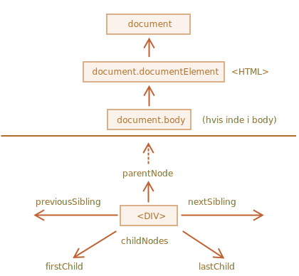
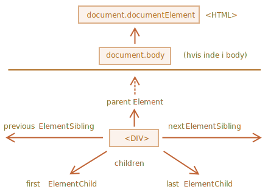

libs:
  - d3
  - domtree

---


# Gennemløbe DOM'en

DOM'en tillader os at gøre alt med dens elementer og deres indhold, men først skal vi "nå det" tilsvarende DOM-objekt.

Alle operationer på DOM'en starter med `document`-objektet. Det er "hoveddøren" til din DOM. Fra det kan vi tilgå enhver node.

Her er et billede af links, der tillader rejse mellem DOM-noder:



Lad os diskutere dem lidt i detaljer.

## I toppen: documentElement og body

De øverste trænoder er tilgængelige direkte som `document`-egenskaber:

`<html>` = `document.documentElement`
: Den øverste document node er `document.documentElement`. Det er DOM-noden for `<html>` tagget.

`<body>` = `document.body`
: En anden meget brugt DOM-node er `<body>`-elementet -- `document.body`.

`<head>` = `document.head`
: Tagget `<head>` er tilgængeligt som `document.head`.

````warn header="Der er en hage: `document.body` kan være `null`"
Et script kan ikke tilgå et element, der ikke eksisterer ved det øjeblik, hvor scriptet kører.

I særdeleshed, hvis et script er indeni `<head>`, så er `document.body` ikke tilgængeligt, fordi browseren har endnu ikke læst det.

Så, i eksemplet nedenfor viser den første `alert` `null`:

```html run
<html>

<head>
  <script>
*!*
    alert( "Fra HEAD: " + document.body ); // null, der er ikke noget <body> endnu
*/!*
  </script>
</head>

<body>

  <script>
    alert( "Fra BODY: " + document.body ); // HTMLBodyElement, findes nu
  </script>

</body>
</html>
```
````

```smart header="På DOM sprog betyder `null` at det \"ikke eksisterer\""
Hvis du møder `null` i DOM'en, betyder det "eksisterer ikke" eller "ingen sådan node".
```

## Children: childNodes, firstChild, lastChild

Der er to termer vi vil bruge fra nu af:

- **Child nodes (eller children/børn)** -- elementer der er direkte børn af et element. For eksempel er `<head>` og `<body>` børn af `<html>` elementet.
- **Descendants** (eller efterkommere) -- alle elementer der er indlejret i et givent element, inklusivt deres bør og børn af børn osv.

For eksempelt har `<body>` her `<div>` og `<ul>` som børn (og nogle tomme tekstnoder):

```html run
<html>
<body>
  <div>Start</div>

  <ul>
    <li>
      <b>Information</b>
    </li>
  </ul>
</body>
</html>
```

... og efterkommere af `<body>` er ikke kun børnene `<div>`, `<ul>` men også elementer der ligger dybere indlejret, såsom `<li>` (barn af `<ul>`) og `<b>` (et barn af `<li>`) -- hele den del af træet.

**Samlingen `childNodes` lister alle child nodes, inklusiv tekstnoder.**

Eksemplet nedenfor viser børn af `document.body`:

```html run
<html>
<body>
  <div>Start</div>

  <ul>
    <li>Information</li>
  </ul>

  <div>Slut</div>

  <script>
*!*
    for (let i = 0; i < document.body.childNodes.length; i++) {
      alert( document.body.childNodes[i] ); // Text, DIV, Text, UL, ..., SCRIPT
    }
*/!*
  </script>
  ...mere her...
</body>
</html>
```

Bemærk en interessant detalje her. Hvis vi kører eksemplet ovenfor, er det sidste element vist `<script>`. Faktisk har dokumentet mere indhold nedenfor, men på det tidspunkt hvor scriptet kører har browseren ikke læst det endnu, så scriptet ser det ikke.

**Egenskaberne `firstChild` og `lastChild` giver hurtig adgang til første og sidste barn.**

De er bare hurtige genveje. Hvis der findes børn, så er det altid sandt:
```js
elem.childNodes[0] === elem.firstChild
elem.childNodes[elem.childNodes.length - 1] === elem.lastChild
```

Der er også en særlig funktion `elem.hasChildNodes()` til at tjekke om der er nogle børn.

### DOM samlinger

Som vi kan se så ligner `childNodes` et array. Men det er faktisk ikke et array, men en *collection* (samling) -- et særligt array-lignende objekt.

Det har derfor to vigtige konsekvenser for os:

1. Vi kan bruge `for..of` til at iterere over den:
  ```js
  for (let node of document.body.childNodes) {
    alert(node); // viser alle noder fra samlingen
  }
  ```
  Det er fordi den er itererbar (leverer egenskaben `Symbol.iterator`, som det kræves).

2. Array metode virker ikke fordi det ikke er et array:
  ```js run
  alert(document.body.childNodes.filter); // undefined (der er ikke nogen filter-metode!)
  ```

Det første er skønt. Det andet er håndterbart, fordi vi kan bruge `Array.from` til at skabe en "rigtig" array fra samlingen, hvis vi vil have array-metoder:

  ```js run
  alert( Array.from(document.body.childNodes).filter ); // function
  ```

```warn header="DOM samlinger er kun til at læse fra"
DOM samlinger, eller i det hele taget -- *alle* egenskaber til navigation som vi taler om i dette kapitel er kun til at læse fra.

Vi kan ikke erstatte et barn med noget andet ved at tildele `childNodes[i] = ...`.

At ændre DOM kræver andre metoder. Vi vil se dem i næste kapitel.
```

```warn header="DOM samlinger er live"
Næsten alle DOM samlinger, med enkelte undtagelser, er *live*. Med andre ord, de afspejler den nuværende tilstand af din DOM.

Hvis vi holder en reference til `elem.childNodes`, og tilføjer/fjerner noder til DOM, så vises de automatisk i samlingen.
```

````warn header="Brug ikke `for..in` til at loope over samlinger"
Samlinger er itererbare ved brug af `for..of`. Nogle gange prøver folk at bruge `for..in` til det.

Lad være med det. Et `for..in`-loop itererer over alle enumerable egenskaber. Og samlinger har nogle "ekstra" sjældent brugte egenskaber, som vi normalt ikke vil have:

```html run
<body>
<script>
  // viser 0, 1, length, item, values and more.
  for (let prop in document.body.childNodes) alert(prop);
</script>
</body>
````

## Søskende og forældre (siblings og parents)

*Siblings* er noder som er børn af samme forælder.

For eksempel så er `<head>` og `<body>` søskende her:

```html
<html>
  <head>...</head><body>...</body>
</html>
```

- `<body>` bliver kaldt den "næste" eller "højre" søskende af `<head>`,
- `<head>` bliver kaldt den "forrige" eller "venstre" søskende af `<body>`.

Den næste søskende er kan hentes med egenskaben `nextSibling`, og den forrige - med `previousSibling`.

Forældren er tilgængelig som `parentNode`.

For eksempel:

```js run
// forælder til <body> er <html>
alert( document.body.parentNode === document.documentElement ); // true

// efter <head> kommer <body>
alert( document.head.nextSibling ); // HTMLBodyElement

// før <body> kommer <head>
alert( document.body.previousSibling ); // HTMLHeadElement
```

## Navigation af elementer alene

Egenskaberne til navigation som set ovenfor refererer til *alle* noder. Vi kan for eksempel med `childNodes` se både tekstnoder, elementnoder, og endda kommentar noder hvis de eksisterer.

Men i mange tilfælde har vi ikke lyst til at arbejde med tekst- eller kommentar noder. Vi vil gerne manipulere elementnoder, som repræsenterer HTML-tags og udgør strukturen af siden.

Så lad os se flere navigations links, som kun tager *element noder* i betragtning:



De minder om dem vi har set tidligere, de har bare fået ordet `Element` tilføjet:

- `children` -- kun de børn der er elementnoder.
- `firstElementChild`, `lastElementChild` -- første og sidste barn der er elementnode.
- `previousElementSibling`, `nextElementSibling` -- naboelementer.
- `parentElement` -- forældre-element.

````smart header="Why `parentElement`? Kan en forælder *undgå* at være et element?"
Egenskaben `parentElement` returnerer "element" forælderen, mens `parentNode` returnerer "alle typer af node" forælder. Disse egenskaber der normalt de samme: de henter begge forælderen.

Der er dog én undtagelse med `document.documentElement`:

```js run
alert( document.documentElement.parentNode ); // document
alert( document.documentElement.parentElement ); // null
```

Grunden til dette er at roden `document.documentElement` (`<html>`) har `document` som sin forælder. Men `document` er ikke en element node så `parentNode` returner den mens `parentElement` ikke gør.

Den lille detalje kan være brugbar, hvis vi vil "rejse" op gennem træet fra et vilkårligt element `elem` til `<html>`, men ikke til `document`:
```js
while(elem = elem.parentElement) { // gå op til <html>
  alert( elem );
}
```
````

Lad os modificere et af eksemplerne ovenfor: erstat `childNodes` med `children`. Nu viser det kun elementerne, og ignorerer tekstnoderne:

```html run
<html>
<body>
  <div>Start</div>

  <ul>
    <li>Information</li>
  </ul>

  <div>Slut</div>

  <script>
*!*
    for (let elem of document.body.children) {
      alert(elem); // DIV, UL, DIV, SCRIPT
    }
*/!*
  </script>
  ...
</body>
</html>
```

## Flere links: tabeller [#dom-navigation-tables]

Indtil nu har vi beskrevet de grundlæggende navigationsegenskaber.

Bestemte typer af DOM-elementer kan levere yderligere egenskaber, specifikke for deres type, for nemhedens skyld.

Tabeller er et godt eksempel, og de repræsenterer en særlig vigtig case:

**`<table>`** elementet undestøtter (ud over det vi har lært) disse egenskaber:
- `table.rows` -- en samling af `<tr>` elementer fra tabellen.
- `table.caption/tHead/tFoot` -- referencer til elementerne `<caption>`, `<thead>`, `<tfoot>`.
- `table.tBodies` -- samlingen af `<tbody>` elementer (kan være mange ifølge standarden, men der vil altid være mindst en -- selvom den ikke er i din egen kilde HTML, vil browseren sætte den i DOM).

**`<thead>`, `<tfoot>`, `<tbody>`** elementer leverer egenskaben `rows`:
- `tbody.rows` -- samlingen af `<tr>` elementer indeni.

**`<tr>`:**
- `tr.cells` -- samlingen af `<td>` og `<th>` celler indeni det givne `<tr>`.
- `tr.sectionRowIndex` -- positionen (indeks) af det givne `<tr>` indeni det omkringliggende `<thead>/<tbody>/<tfoot>`.
- `tr.rowIndex` -- nummeret på den givne `<tr>` i tabellen som helhed (inklusiv alle tabelrækker).

**`<td>` and `<th>`:**
- `td.cellIndex` -- nummeret på cellen indeni den omkransende `<tr>`.

Et eksempel på brug:

```html run height=100
<table id="table">
  <tr>
    <td>en</td><td>to</td>
  </tr>
  <tr>
    <td>tre</td><td>fire</td>
  </tr>
</table>

<script>
  // hent td med "to" (første række, anden kolonne)
  let td = table.*!*rows[0].cells[1]*/!*;
  td.style.backgroundColor = "red"; // fremhæv den
</script>
```

Specifikationen: [tabular data](https://html.spec.whatwg.org/multipage/tables.html).

Der er også yderligere muligheder for at navigere formularer. Dem kigger vi på senere når vi skal til at arbejde med formularer.

## Opsummering

Givet en hvilken som helst DOM-node, kan vi gå til dens umiddelbare naboer ved at bruge navigationsegenskaber.

Der er to hovedsæt af dem:

- For alle noder: `parentNode`, `childNodes`, `firstChild`, `lastChild`, `previousSibling`, `nextSibling`.
- For elementnoder alene: `parentElement`, `children`, `firstElementChild`, `lastElementChild`, `previousElementSibling`, `nextElementSibling`.

Nogle typer af DOM-elementer, f.eks. tabeller, leverer yderligere egenskaber og samlinger til at tilgå deres indhold.
