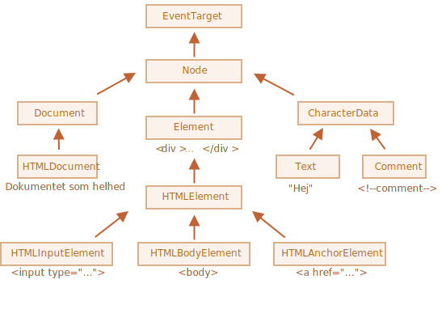

# Node egenskaber: type, tag og contents

Lad os gå lidt mere i dybden med DOM-noder.

I dette kapitel vil vi se mere på, hvad de er, og lære deres mest brugte egenskaber.

## DOM node klasser

Forskellige DOM-noder kan have forskellige egenskaber. For eksempel har et element svarende til et `<a>` tag, link-relaterede egenskaber, og den svarende til et `<input>` tag har input-relaterede egenskaber osv. Tekst-noder er ikke de samme som element-noder. Men der er også fælles egenskaber og metoder mellem dem alle, fordi alle klasser af DOM-noder danner en enkelt hierarki.

Hver DOM-node tilhører den tilsvarende indbyggede klasse.

Roden af hierarkiet er [EventTarget](https://dom.spec.whatwg.org/#eventtarget), som er nedarvet fra [Node](https://dom.spec.whatwg.org/#interface-node), og andre DOM-noder nedarver fra den.

Her er først en oversigt over klasserne, og derefter vil vi se på dem i detaljer:



Klasserne er:

- [EventTarget](https://dom.spec.whatwg.org/#eventtarget) -- er roden. En "abstract" klasse for alt andet.

    Objekter af denne klasse bliver aldrig oprettet. Den fungerer som en base så alle DOM-noder understøtter hændelser (såkaldte "events"), som vi vil studere senere.

- [Node](https://dom.spec.whatwg.org/#interface-node) -- er også en "abstract" klasse, der fungerer som en base for DOM-noder.

    Den tilbyder den grundlæggende træ-funktionalitet: `parentNode`, `nextSibling`, `childNodes` og så videre (de er getters). Objekter af `Node`-klassen bliver aldrig oprettet. Men der er andre klasser, der nedarver fra den (og derigennem nedarver `Node`-funktionaliteten).

- [Document](https://dom.spec.whatwg.org/#interface-document), af historiske grunde ofte nedarvet af `HTMLDocument` (selvom den nyeste specifikation ikke dikterer det) -- refererer til dokumentet som et hele.

    Det globale objekt `document` tilhører præcis denne klasse. Det fungerer som et indgangspunkt til DOM.

- [CharacterData](https://dom.spec.whatwg.org/#interface-characterdata) -- en "abstract" klasse, nedarves af:
    - [Text](https://dom.spec.whatwg.org/#interface-text) -- klassen der korresponderer med en tekst indeni elementer, f.eks. `Hej` i `<p>Hej</p>`.
    - [Comment](https://dom.spec.whatwg.org/#interface-comment) -- klassen for kommentarer. De vises ikke, men hver kommentar bliver et medlem af DOM.

- [Element](https://dom.spec.whatwg.org/#interface-element) -- er den grundlæggende klasse for DOM-elementer.

    Den tilbyder element-niveau navigation som `nextElementSibling`, `children` og søgemetoder som `getElementsByTagName`, `querySelector`.

    En browser understøtter ikke kun HTML. Den understøtter også ting som XML and SVG. Så `Element` klassen fungerer som base for mere specifikke klasser: `SVGElement`, `XMLElement` (vi bruger dem ikke i denne sammenhæng) og `HTMLElement`.

- Endelig er [HTMLElement](https://html.spec.whatwg.org/multipage/dom.html#htmlelement) den grundlæggende klasse for alle HTML-elementer. Vi vil arbejde med den det meste af tiden.

    Den bliver nedarvet af konkrete HTML-elementer, som har deres egne klasser, for eksempel:
    - [HTMLInputElement](https://html.spec.whatwg.org/multipage/forms.html#htmlinputelement) -- klassen for `<input>` elements,
    - [HTMLBodyElement](https://html.spec.whatwg.org/multipage/semantics.html#htmlbodyelement) -- klassen for `<body>` elements,
    - [HTMLAnchorElement](https://html.spec.whatwg.org/multipage/semantics.html#htmlanchorelement) -- klassen for `<a>` elements,
    - ...and so on.

Der er mange andre tags med deres egne klasser, der kan have specifikke egenskaber og metoder, mens nogle elementer, såsom `<span>`, `<section>`, `<article>` ikke har nogen specifikke egenskaber, så de er instanser af `HTMLElement`-klassen.

Således kommer det fulde sæt af egenskaber og metoder for en given node som resultatet af arvekæden.

For eksempel, lad os betragte DOM-objektet for et `<input>` element. Det tilhører [HTMLInputElement](https://html.spec.whatwg.org/multipage/forms.html#htmlinputelement) klassen.

Den får sine egenskaber og metoder som en superposition af (opstillet i arveorden):

- `HTMLInputElement` -- denne klasse leverer input-specifikke egenskaber,
- `HTMLElement` -- den leverer fælles HTML-elementmetoder (og getters/setters),
- `Element` -- den leverer generiske elementmetoder,
- `Node` -- den leverer fælles DOM-nodeegenskaber,
- `EventTarget` -- den giver støtte for hændelser (til dækning),
- ...og endelig nedarver den fra `Object`, så "almene objektmetoder" som `hasOwnProperty` også er tilgængelige.

For at se DOM-nodens klasse navn, kan vi huske på, at et objekt normalt har `constructor` egenskaben. Den refererer til klasse constructor, og `constructor.name` er dens navn. Så for `document.body` kan vi se:

```js run
alert( document.body.constructor.name ); // HTMLBodyElement
```

... eller vi kan bare bruge `toString` på den:

```js run
alert( document.body ); // [object HTMLBodyElement]
```

Vi kan også bruge `instanceof` for at tjekke nedarvning:

```js run
alert( document.body instanceof HTMLBodyElement ); // true
alert( document.body instanceof HTMLElement ); // true
alert( document.body instanceof Element ); // true
alert( document.body instanceof Node ); // true
alert( document.body instanceof EventTarget ); // true
```

Som vi kan se er DOM-noder regulære JavaScript-objekter. De bruger prototype-baserede klasser til arv.

Det kan også nemt vises ved at outputte et element med `console.dir(elem)` i en browser. Her kan du i konsollen se `HTMLElement.prototype`, `Element.prototype` og så videre.

```smart header="`console.dir(elem)` versus `console.log(elem)`"
De fleste browsere understøtter to udviklerrværktøjer: `console.log` og `console.dir`. De outputter deres argumenter til konsollen. For JavaScript-objekter er disse kommandoer normalt ens.

Men for DOM-elementer er de forskellige:

- `console.log(elem)` viser elementets DOM-træ.
- `console.dir(elem)` viser elementet som et DOM-objekt, godt til at udforske dets egenskaber.

Prøv det på `document.body`.
```

````smart header="IDL i specifikationen"
I specifikationen beskrives DOM-klasser ikke ved hjælp af JavaScript, men ved hjælp af et specielt [Interface description language](https://en.wikipedia.org/wiki/Interface_description_language) (IDL), som er nemmere at forstå.

I IDL er alle egenskaber foranstillet med deres typer. For eksempel, `DOMString`, `boolean` og så videre.

Her er et uddrag fra specifikationen med kommentarer, der forklarer IDL-syntaksen:

```js
// Define HTMLInputElement
*!*
// Kolon ":" betyder at HTMLInputElement nedarver fra HTMLElement
*/!*
interface HTMLInputElement: HTMLElement {
  // here go properties and methods of <input> elements

*!*
  // "DOMString" betyder at værdien af en egenskab er en streng
*/!*
  attribute DOMString accept;
  attribute DOMString alt;
  attribute DOMString autocomplete;
  attribute DOMString value;

*!*
  // boolesk værdi i egenskab (true/false)
  attribute boolean autofocus;
*/!*
  ...
*!*
  // nNu til metoderne: "void" betyder at metoden ikke returnerer nogen værdi
*/!*
  void select();
  ...
}
```
````

## Egenskaben "nodeType"

Egenskaben `nodeType` leverer en anden mere "gammeldags" måde at få datatypen af en DOM-node på.

Den har en numerisk værdi:
- `elem.nodeType == 1` for elementnoder,
- `elem.nodeType == 3` for tekstnoder,
- `elem.nodeType == 9` for dokumentobjektet,
- der er et par andre værdier i [specifikationen](https://dom.spec.whatwg.org/#node).

For eksempel:

```html run
<body>
  <script>
  let elem = document.body;

  // Lad os undersøge: hvilken datatype er noden elem?
  alert(elem.nodeType); // 1 => element

  // og dens første barn er...
  alert(elem.firstChild.nodeType); // 3 => text

  // for selve dokumentet er typen 9
  alert( document.nodeType ); // 9
  </script>
</body>
```

I moderne scripts kan vi bruge `instanceof` og andre class-baserede tests til at se nodetype, men nogle gange kan `nodeType` være enklere. Vi kan kun læse `nodeType`, ikke ændre det.

## Tag: nodeName og tagName

Med en givet DOM-node kan vi læse dets tag-navn fra `nodeName` eller `tagName` egenskaber:

For eksempel:

```js run
alert( document.body.nodeName ); // BODY
alert( document.body.tagName ); // BODY
```

Er der nogen forskel mellem `tagName` og `nodeName`?

Det er der, men forskellen er reflekteret i deres navne, og foskellen er subtil.

- Egenskaben `tagName` eksisterer kun for `Element` noder.
- Egenskaben `nodeName` er defineret for alle noder via nedarvning fra `Node`:
    - for elementer betyder det det samme som `tagName`.
    - for andre typer af noder (text, comment, etc.) har det en streng med nodens type.

Med andre ord, `tagName` er kun understøttet af elementnoder (da det stammer fra `Element`-klassen), mens `nodeName` kan sige noget om andre nodetyper.

For eksempel, lad os sammenligne `tagName` og `nodeName` for `document` og en kommentarnode:


```html run
<body><!-- comment -->

  <script>
    // for comment
    alert( document.body.firstChild.tagName ); // undefined (ikke et element)
    alert( document.body.firstChild.nodeName ); // #comment

    // for document
    alert( document.tagName ); // undefined (ikke et element)
    alert( document.nodeName ); // #document
  </script>
</body>
```

Hvis vi kun arbejder med elementer, kan vi både bruge `tagName` og `nodeName` - der er ingen forskel.

```smart header="Navnet på tag er altid i store bogstaver på nær i XML tilstand"
Browseren har to tilstande den kan processere dokumenter: HTML og XML. Normalt bruges HTML tilstanden for websider. XML tilstanden aktiveres når browseren modtager et XML dokument med headeren: `Content-Type: application/xml+xhtml`.

I HTML tilstand skrives `tagName/nodeName` altid med store bogstaver: det er `BODY` enten for `<body>` eller `<BoDy>`.

I XML tilstand bevares små bogstaver "som de er". I dag er XML tilstanden sjældent brugt.
```


## innerHTML: indholdet

Egenskaben [innerHTML](https://w3c.github.io/DOM-Parsing/#the-innerhtml-mixin) tillader at trække HTML ud af et andet element som en streng.

Vi kan også ændre det, så det er en af de mest kraftige måder at ændre siden på.

Eksemplet viser indholdet af `document.body` og erstatter det derefter helt:

```html run
<body>
  <p>Et afsnit</p>
  <div>En div</div>

  <script>
    alert( document.body.innerHTML ); // slet det nuværende indhold
    document.body.innerHTML = 'Den nye BODY!'; // erstat det
  </script>

</body>
```

Vi kan prøve at indsætte ugyldigt HTML, så vil browseren fikse vores fejl og indsætte det korrekt i DOM'en. For eksempel, hvis vi glemmer at lukke en tag, så vil browseren gøre det for os:

```html run
<body>

  <script>
    document.body.innerHTML = '<b>test'; // glemt at lukke tag
    alert( document.body.innerHTML ); // <b>test</b> (fikset)
  </script>

</body>
```

```smart header="Scripts eksekveres ikke"
Hvis `innerHTML` indsætter et `<script>` tag i dokumentet bliver det en del af HTML, men eksekveres ikke.
```

### Pas på: "innerHTML+=" overskriver fuldstændigt

Vi kan tilføje HTML til et element ved at bruge `elem.innerHTML+="mere html"`.

Sådan her:

```js
chatDiv.innerHTML += "<div>Hej !</div>";
chatDiv.innerHTML += "Hvordan går det?";
```

Men vi skal være meget forsigtige med at gøre dette. Det der foregår er nemlig ikke en tilføjelse, men en fuld overskrivning.

Teknisk set er disse to linjer det samme:

```js
elem.innerHTML += "...";
// er en kortere måde at skrive:
*!*
elem.innerHTML = elem.innerHTML + "..."
*/!*
```

Med andre ord gør `innerHTML+=` dette:

1. Det gamle indhold er fjernet.
2. Det nye `innerHTML` er skrevet i stedet (en sammenkædning af det gamle og det nye).

**Da indholdet er "nulstillet" og genoprettet fra bunden, vil alle billeder og andre ressourcer blive genindlæst**.

I eksemplet med `chatDiv` ovenfor genskaber linjen `chatDiv.innerHTML+="Hvordan går det?"` indholdet og henter `smile.gif` igen (forhåbentlig er det cached). Hvis `chatDiv` har en del anden tekst og billeder bliver genindlæsningen meget tydelig.

There are other side-effects as well. For instance, if the existing text was selected with the mouse, then most browsers will remove the selection upn rewriting `innerHTML`. And if there was an `<input>` with a text entered by the visitor, then the text will be removed. And so on.

Heldigvis er der andre måder at tilføje HTML end `innerHTML`, som vi snart vil se nærmere på.

## outerHTML: fuld HTML af et elementof the element

Egenskaben `outerHTML` indeholder elementets fulde HTML. Det er det samme som `innerHTML` men inklusiv elementet selv.

Her er et eksempel:

```html run
<div id="elem">Hej <b>verden</b></div>

<script>
  alert(elem.outerHTML); // <div id="elem">Hej <b>verden</b></div>
</script>
```

**Pas på: Modsat `innerHTML`, ændrer `outerHTML` ikke elementet. I stedet erstatter det det i DOM'en.**

Ja, det lyder underligt, og det er det også. Derfor lige denne seperate note. Lad os se på det.

Forestil dig dette eksempel:

```html run
<div>Hej, verden!</div>

<script>
  let div = document.querySelector('div');

*!*
  // erstat div.outerHTML med <p>...</p>
*/!*
  div.outerHTML = '<p>Et nyt element</p>'; // (*)

*!*
  // Wow! 'div' er stadig det samme!
*/!*
  alert(div.outerHTML); // <div>Hej, verden!</div> (**)
</script>
```

Det er underligt, ikke?

I linjen med `(*)` erstattede vi `div` med `<p>Et nyt element</p>`. I det ydre dokument (DOM'en) kan vi se det nye indhold i stedet for den gamle `<div>`. Men, som vi kan se i linjen med `(**)` har værdien af den gamle `div` ikke ændret sig!
Tildelingen af `outerHTML` ændrer ikke selve DOM-elementet (det objekt, som variablen 'div' i dette tilfælde refererer til), men fjerner det fra DOM'en og indsætter det nye HTML i dets sted.

Så, hvad der sker `div.outerHTML=...` er:
- `div` blev fjernet fra dokumentet.
- Et nyt stykke HTML `<p>Et nyt element</p>` blev indsat i dets sted.
- `div` har stadig den gamle værdi. Det nye HTML blev ikke gemt i nogen variabel.

Det er så nemt at lave en fejl her: Ændr `div.outerHTML` og arbejd bagefter videre med `div` som om det indeholder det nye indhold. Men det gør det ikke. Det vil være korrekt for `innerHTML`, men ikke for `outerHTML`.

Vi kan skrive til `elem.outerHTML`, men skal huske, at det ikke ændrer det element, vi skriver til ('elem'). Det indsætter det nye HTML i stedet. Vi kan få referencer til de nye elementer ved at forespørge på DOM'en.

## nodeValue/data: tekst noders indhold

Egenskaben `innerHTML` er kun gyldig for element noder.

Andre node typer, såsom tekst noder, har deres modstykke: `nodeValue` og `data` egenskaber. Disse to er praktisk taget de næsten de samme, der er kun små specifikationsforskelle. Så vi vil bruge `data`, fordi det er kortere.

Her er et eksempel på læsning af indholdet fra en tekstnode og en kommentarnode:

```html run height="50"
<body>
  Hej
  <!-- Kommentar -->
  <script>
    let text = document.body.firstChild;
*!*
    alert(text.data); // Hej
*/!*

    let comment = text.nextSibling;
*!*
    alert(comment.data); // Kommentar
*/!*
  </script>
</body>
```

Vi kan forestille os grunde til at læse eller ændre dem, men hvorfor kommentarer?

Nogle gange indlejrer udviklere information eller template instruktioner til HTML brug i dem, i stil med:

```html
<!-- if isAdmin -->
  <div>Velkommen, administrator!</div>
<!-- /if -->
```

... så kan JavaScript læse det fra `data` egenskaben og behandle de indlejrede instruktioner.

## textContent: ren tekst

Egenskaben `textContent` leverer adgang til selve *teksten* inde i elementet: kun tekst - minus alle `<tags>`.

For eksempel:

```html run
<div id="news">
  <h1>Overskrift!</h1>
  <p>Marsboere angriber folk!</p>
</div>

<script>
  // Overskrift!
  // Marsboere angriber folk!
  alert(news.textContent);
</script>
```

Som vi kan se returneres kun teksten. Det er som om alle `<tags>` var klippet ud, men teksten i dem har fået lov til at blive.

I praksis er læsning af teksten på denne måde ikke så tit brugt.

**Skrivning til `textContent` er meget mere nyttig, fordi det tillader os at skrive tekst på den "sikre måde".**

Lad os sige, vi har en vilkårlig streng, for eksempel indtastet af en bruger, og vi vil vise den på siden.

- Med `innerHTML` bliver det sat ind "som HTML", med alle HTML tags.
- Med `textContent` bliver det sat ind "som tekst", og alle symboler behandles bogstaveligt.

Compare the two:

```html run
<div id="elem1"></div>
<div id="elem2"></div>

<script>
  let name = prompt("Hvad er dit navn?", "<b>Peter-Plys!</b>");

  elem1.innerHTML = name;
  elem2.textContent = name;
</script>
```

1. The first `<div>` gets the name "as HTML": all tags become tags, so we see the bold name.
2. The second `<div>` gets the name "as text", so we literally see `<b>Peter-Plys!</b>`.

I de fleste tilfælde forventer vi tekst fra en bruger og vil behandle den som tekst. Vi vil ikke have uventet HTML ind på vores side. En tildeling via `textContent` sikrer præcis dette.

## Den skjulte egenskab "hidden"

Egenskaben `hidden` og den tilsvarende HTML-attribute specificerer om elementet er synligt eller ikke.

Vi kan bruge den i HTML eller tildele den ved hjælp af JavaScript, sådan:

```html run height="80"
<div>Begge divs nedenfor er skjulte</div>

<div hidden>Med attributten "hidden"</div>

<div id="elem">JavaScript tildelte egenskaben "hidden"</div>

<script>
  elem.hidden = true;
</script>
```

Teksnisk set virker `hidden` på samme måde som `style="display:none"`. men er kortere at skrive.

Her er et blinkende element:


```html run height=50
<div id="elem">Et blinkende element</div>

<script>
  setInterval(() => elem.hidden = !elem.hidden, 1000);
</script>
```

## Flere egenskaber

DOM elementer har flere egenskaber. Særligt findes egenskaber der afhænger af klassen. For eksempel:

- `value` -- værdien for tags som `<input>`, `<select>` og `<textarea>` (`HTMLInputElement`, `HTMLSelectElement`...).
- `href` -- hyperlink referencen "href" for `<a href="...">` (`HTMLAnchorElement`).
- `id` -- værdien af "id" attributten, for alle elementer (`HTMLElement`).
- ...og meget mere...

For eksempel:

```html run height="80"
<input type="text" id="elem" value="value">

<script>
  alert(elem.type); // "text"
  alert(elem.id); // "elem"
  alert(elem.value); // value
</script>
```

De fleste standard HTML attributter har en tilsvarende DOM egenskab og vi kan umiddelbart tilgå dem som sådan.

Hvis vi vil kende til hele listen af understøttede egenskaber kan vi finde dem i specifikationen. For eksempel er `HTMLInputElement` dokumenteret på <https://html.spec.whatwg.org/#htmlinputelement>.

Eller, hvis vi vil have dem hurtigt eller er interesseret i en bestemt browser specifikation -- kan vi altid outputte elementet ved hjælp af `console.dir(elem)` og læse egenskaberne. Eller udforske "DOM egenskaber" i Elements fanebladet i browserens udviklerværktøjer.

## Opsummering

Hver DOM node tilhører en bestemt klasse. Klasserne udgør en hierarki. Den fulde sæt af egenskaber og metoder kommer som resultatet af nedarvning.

Vigtige DOM node egenskaber er:

`nodeType`
: Vi kan bruge den til at se om en node er en tekst- eller elementnode. Den har en numerisk værdi: `1` for elementer,`3` for tekstnoder, og et par andre for andre nodetyper. Kun læsning.

`nodeName/tagName`
: For elementer. Viser tag navn (skrevet med store bogstaver med mindre browseren er i XML-mode). For ikke-elementnoder `nodeName` beskriver hvad det er. Kun læsning.

`innerHTML`
: Indholdet af HTML for elementet. Kan ændres.

`outerHTML`
: Det fulde HTML for elementet. Skrivning til `elem.outerHTML` berører ikke `elem` selv. I stedet bliver det erstattet med det nye HTML i den ydre kontekst.

`nodeValue/data`
: Indholdet af en ikke-element node (tekst, kommentar). Disse to er næsten de samme, og vi bruger normalt `data`. Kan ændres.

`textContent`
: Den tekst, der er inde i elementet: HTML minus alle `<tags>`. Skrivning til `textContent` sætter teksten ind i elementet, med alle specielle tegn og tags behandlet præcis som tekst. Kan dermed sikkert indsætte tekst fra brugere og beskytte mod uønsket indsættelse af HTML.

`hidden`
: Når sat til `true`, gør det det samme som CSS `display:none`.

DOM noder har også andre egenskaber afhængigt af deres klasse. For eksempel, `<input>` elementet (`HTMLInputElement`) understøtter `value`, `type`, mens `<a>` elementet (`HTMLAnchorElement`) understøtter `href` etc. De fleste standard HTML attributter har en tilsvarende DOM egenskab.

Men, HTML attributter og DOM egenskaber er ikke altid de samme, som vi vil se i næste kapitel.
