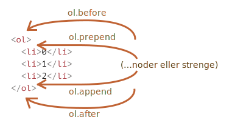
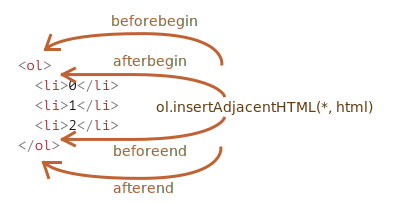

# Modificering af dokumentet

DOM modificering er nøglen til at skabe "levende" sider.

I denne del vil vi se på hvordan vi opretter nye elementer "on the fly" og modificerer eksisterende indhold på siden.

## Eksempel: vis en besked

Lad os demonstrere ved hjælp af et eksempel hvor vi tilføjer en besked på siden, der ser lidt bedre ud end `alert`.

Her er hvordan det vil se ud i HTML:

```html autorun height="80"
<style>
.alert {
  padding: 15px;
  border: 1px solid #d6e9c6;
  border-radius: 4px;
  color: #3c763d;
  background-color: #dff0d8;
}
</style>

*!*
<div class="alert">
  <strong>Hej med dig!</strong> Du har læst en vigtig besked.
</div>
*/!*
```

Dette var HTML eksemplet. Lad os nu oprette den samme `div` med JavaScript (vi antager at stilen alerede er defineret er i HTML/CSS).

## Oprettelse af et element

Der findes to metoder til at oprette DOM-noder:

`document.createElement(tag)`
: Opretter en ny *elementnode* med det givne tag:

    ```js
    let div = document.createElement('div');
    ```

`document.createTextNode(text)`
: Opretter en ny *textnode* med den givne tekst:

    ```js
    let textNode = document.createTextNode('Her er jeg');
    ```

I de fleste tilfælde er vi nødt til at oprette elementnoder, såsom `div` for beskeden.

### Oprettelse af beskeden

Oprettelse af beskeden gøres med 3 trin:

```js
// 1. Opret <div> element
let div = document.createElement('div');

// 2. Sæt dens class til "alert"
div.className = "alert";

// 3. Fyld indholdet i
div.innerHTML = "<strong>Hej med dig!</strong> Du har læst en vigtig besked.";
```

Nu er elementet oprettet. Men ind til videre er det bare en variabel kaldet `div`. Den er ikke på siden endnu, så vi kan ikke se den.

## Metoder til indsættelse af elementer

For at få vores `div` til at blive vist på siden skal den indsættes et sted i `document`. For eksempel, i `<body>` elementet, refereret til af `document.body`.

Der er en speciel metode `append` til dette: `document.body.append(div)`.

Her er hele koden:

```html run height="80"
<style>
.alert {
  padding: 15px;
  border: 1px solid #d6e9c6;
  border-radius: 4px;
  color: #3c763d;
  background-color: #dff0d8;
}
</style>

<script>
  let div = document.createElement('div');
  div.className = "alert";
  div.innerHTML = "<strong>Hej med dig!</strong> Du har læst en vigtig besked.";

*!*
  document.body.append(div);
*/!*
</script>
```

Her kalder vi `append` på `document.body`, men vi kan kalde `append` metoden på ethvert andet element, for at putte et andet element ind i det. For eksempel, vi kan tilføje noget til `<div>` ved at kalde `div.append(anotherElement)`.

Her er en række andre metoder til indsættelse. De specificerer hvor elementet skal indsættes.

- `node.append(...noder eller strenge)` -- tilføjer noder eller strenge *i slutningen* af `node`,
- `node.prepend(...noder eller strenge)` -- indsætter noder eller strenge *i begyndelsen* af `node`,
- `node.before(...noder eller strenge)` –- indsætter noder eller strenge *før* `node`,
- `node.after(...noder eller strenge)` –- indsætter noder eller strenge *efter* `node`,
- `node.replaceWith(...noder eller strenge)` –- erstatter `node` med de givne noder eller strenge.

Argumenterne til disse metoder er en vilkårlig liste af DOM-noder der skal indsættes. Det kan også være tekststrenge (der automatisk bliver omdannet til tekstnoder).

Lad os se dem i aktion.

Her er et eksempel hvor metoderne bruges til at tilføje elementer før og efter de eksisterende i en liste:

```html autorun
<ol id="ol">
  <li>0</li>
  <li>1</li>
  <li>2</li>
</ol>

<script>
  ol.before('before'); // indsæt strengen "before" før <ol>
  ol.after('after'); // indsæt strengen "after" efter <ol>

  let liFirst = document.createElement('li');
  liFirst.innerHTML = 'prepend';
  ol.prepend(liFirst); // indsæt elementet "liFirst" i begyndelsen af <ol>

  let liLast = document.createElement('li');
  liLast.innerHTML = 'append';
  ol.append(liLast); // indsæt elementet "liLast" i slutningen af <ol>
</script>
```

Her er et overblik over hvad metoderne gør:



Så den endelige liste vil se således ud:

```html
before
<ol id="ol">
  <li>prepend</li>
  <li>0</li>
  <li>1</li>
  <li>2</li>
  <li>append</li>
</ol>
after
```

Som sagt så kan disse metoder indsætte flere noder og strenge i ét kald.

Her indsættes for eksempel både en streng og et element:

```html run
<div id="div"></div>
<script>
  div.before('<p>Hej</p>', document.createElement('hr'));
</script>
```

Bemærk: Teksten bliver indsat "som tekst" ikke "som HTML", med korrekt opstilling af specialtegn såsom `<`, `>`.

Så den endelige HTML ser sådan ud:

```html run
*!*
&lt;p&gt;Hej&lt;/p&gt;
*/!*
<hr>
<div id="div"></div>
```

Med andre ord bliver strenge indsat på en "sikker måde", på samme måde som `elem.textContent` gør det.

Så disse metoder kan kun bruges til at indsætte DOM-noder eller tekststykker.

Men hvad hvis vi vil indsætte en HTML-streng "som HTML", med alle tags osv. fungerende, på samme måde som `elem.innerHTML` gør det?

## insertAdjacentHTML/-Text/-Element

Til dette kan vi bruge en anden, ganske fleksibel metode: `elem.insertAdjacentHTML(where, html)`.

Den første parameter er et kodeord, der specificerer hvor der skal indsættes i forhold til `elem`. Det skal være en af følgende:

- `"beforebegin"` -- indsæt `html` umiddelbart før `elem`,
- `"afterbegin"` -- indsæt `html` i `elem`, ved begyndelsen,
- `"beforeend"` -- indsæt `html` i `elem`, ved slutningen,
- `"afterend"` -- indsæt `html` umiddelbart efter `elem`.

Det andet parameter er den HTML-streng der skal indsættes "som HTML".

For eksempel:

```html run
<div id="div"></div>
<script>
  div.insertAdjacentHTML('beforebegin', '<p>Hej</p>');
  div.insertAdjacentHTML('afterend', '<p>Farvel</p>');
</script>
```

... vil føre til:

```html run
<p>Hej</p>
<div id="div"></div>
<p>Farvel</p>
```

Det er metoden til at tilføje vilkårlig HTML til siden.

Her er et billede af mulighederne for indsættelse:



Vi kan tydeligt se ligninger mellem denne og det forrige billede. Indstikningspunkterne er faktisk de samme, men denne metode indsætter HTML.

Metoden har to søskende:

- `elem.insertAdjacentText(where, text)` -- samme syntaks, men med en streng af `text` indsat "som tekst" i stedet for HTML,
- `elem.insertAdjacentElement(where, elem)` -- samme syntaks, men indsætter et element.

De eksisterer hovedsageligt for at gøre syntaksen "uniform". I praksis bruges kun `insertAdjacentHTML` de fleste gange. Til elementer og tekst har vi metoderne `append/prepend/before/after` -- de er kortere at skrive og kan indsætte noder/textstykker.

Så her er en alternativ variant af at vise en besked:

```html run
<style>
.alert {
  padding: 15px;
  border: 1px solid #d6e9c6;
  border-radius: 4px;
  color: #3c763d;
  background-color: #dff0d8;
}
</style>

<script>
  document.body.insertAdjacentHTML("afterbegin", `<div class="alert">
    <strong>Hej med dig!</strong> Du har læst en vigtig besked.
  </div>`);
</script>
```

## Fjernelse af noder

Til at fjerne en node findes metoden `node.remove()`.

Lad os få vores besked til at forsvinde efter et sekund:

```html run untrusted
<style>
.alert {
  padding: 15px;
  border: 1px solid #d6e9c6;
  border-radius: 4px;
  color: #3c763d;
  background-color: #dff0d8;
}
</style>

<script>
  let div = document.createElement('div');
  div.className = "alert";
  div.innerHTML = "<strong>Hej med dig!</strong> Du har læst en vigtig besked.";

  document.body.append(div);
*!*
  setTimeout(() => div.remove(), 1000);
*/!*
</script>
```

Bemærk: Hvis vi vil *flytte* et element til en ny placering, behøver du ikke at flytte det fra den gamle placering.

**Alle indsættelsesmetoder fjerner automatisk noden fra den gamle placering.**

Hvis vi for eksempel vil bytte plads på to elementer, så kan vi bare indsætte det første element efter det andet:

```html run height=50
<div id="first">Første</div>
<div id="second">Anden</div>
<script>
  // ingen behov for at kalde remove()
  second.after(first); // tag #second og indsæt #first efter (after) det.
</script>
```

## Kloning af noder: cloneNode

Hvordan indsætter man en tilsvarende besked?

Vi kunne lave en funktion og putte koden der. Men et bedre alternativ er at *klone* den eksisterende `div` og ændre teksten inde i den (hvis det er nødvendigt).

Nogle gange når vi har et stort element, kan det være både hurtigere og enklere.
- Kaldet til `elem.cloneNode(true)` opretter en "dyb" klon af elementet -- med alle attributter og underelementer. Hvis vi kalder `elem.cloneNode(false)`, oprettes klonen uden underelementer.

Et eksempel på kopiering af en besked:

```html run height="120"
<style>
.alert {
  padding: 15px;
  border: 1px solid #d6e9c6;
  border-radius: 4px;
  color: #3c763d;
  background-color: #dff0d8;
}
</style>

<div class="alert" id="div">
  <strong>Hej med dig!</strong> Du har læst en vigtig besked.
</div>

<script>
*!*
  let div2 = div.cloneNode(true); // Klon beskeden, inklusive dens indhold
  div2.querySelector('strong').innerHTML = 'Farvel med dig!'; // ændr klonen

  div.after(div2); // vis klonen efter den eksisterende div
*/!*
</script>
```

## DocumentFragment [#document-fragment]

`DocumentFragment` er en speciel DOM-node, der fungerer som et wrapper-element til at flytte rundt med lister af noder.

Vi kan tilføje andre noder til den, men når vi indsætter den et sted, så indsættes dens indhold i stedet.

For eksempel genererer `getListContent` nedenfor et fragment med `<li>` elementer, som senere indsættes i `<ul>`:

```html run
<ul id="ul"></ul>

<script>
function getListContent() {
  let fragment = new DocumentFragment();

  for(let i=1; i<=3; i++) {
    let li = document.createElement('li');
    li.append(i);
    fragment.append(li);
  }

  return fragment;
}

*!*
ul.append(getListContent()); // (*)
*/!*
</script>
```

Bemærk at vi i den sidste linje mærket med `(*)` tilføjer `DocumentFragment` med append(), men den "blandes ind" så resultatet af kodestrukturen bliver:

```html
<ul>
  <li>1</li>
  <li>2</li>
  <li>3</li>
</ul>
```

`DocumentFragment` bliver sjældent brugt direkte. Hvorfor vil man bruge en særlig slags node, når vi bare kan returnere en liste af noder i stedet? Et omskrevet eksempel vil se således ud:

```html run
<ul id="ul"></ul>

<script>
function getListContent() {
  let result = [];

  for(let i=1; i<=3; i++) {
    let li = document.createElement('li');
    li.append(i);
    result.push(li);
  }

  return result;
}

*!*
ul.append(...getListContent()); // append + "..." operator = venner!
*/!*
</script>
```

Vi nævner primært `DocumentFragment` fordi der er nogle koncepter lagt hen over det, såsom [template](info:template-element) elementet og shadow DOM, som vi ser på meget senere.

## Old-school insert/remove metoder

[old]

Der findes også gamle metoder for at indsætte og fjerne noder, som er der af historiske grunde.

Disse metoder kommer fra meget gamle tider. I dag er der ingen grund til at bruge dem, da moderne metoder, såsom `append`, `prepend`, `before`, `after`, `remove`, `replaceWith`, er mere fleksible.

Den eneste grund til at vi lister metoderne her er, fordi du kan finde dem i mange gamle scripts:

`parentElem.appendChild(node)`
: Tilføjer `node` som det sidste barn af `parentElem`.

    Det følgende eksempel tilføjer et nyt `<li>` til slutningen af `<ol>`:

    ```html run height=100
    <ol id="list">
      <li>0</li>
      <li>1</li>
      <li>2</li>
    </ol>

    <script>
      let newLi = document.createElement('li');
      newLi.innerHTML = 'Hej, verden!';

      list.appendChild(newLi);
    </script>
    ```

`parentElem.insertBefore(node, nextSibling)`
: Indsætter `node` før `nextSibling` inde i `parentElem`.

    Det følgende eksempel indsætter et nyt listeelement før det andet `<li>`:

    ```html run height=100
    <ol id="list">
      <li>0</li>
      <li>1</li>
      <li>2</li>
    </ol>
    <script>
      let newLi = document.createElement('li');
      newLi.innerHTML = 'Hej, verden!';

    *!*
      list.insertBefore(newLi, list.children[1]);
    */!*
    </script>
    ```
    For at indsætte `newLi` som det første element, kan vi gøre sådan her:

    ```js
    list.insertBefore(newLi, list.firstChild);
    ```

`parentElem.replaceChild(node, oldChild)`
: Erstatter `oldChild` med `node` blandt børn af `parentElem`.

`parentElem.removeChild(node)`
: Fjerner `node` fra `parentElem` (antaget at `node` er dets barn).

    Det følgende eksempel fjerner første `<li>` fra `<ol>`:

    ```html run height=100
    <ol id="list">
      <li>0</li>
      <li>1</li>
      <li>2</li>
    </ol>

    <script>
      let li = list.firstElementChild;
      list.removeChild(li);
    </script>
    ```

Alle disse metoder returnerer den indsatte/fjernede node. Med andre ord, `parentElem.appendChild(node)` returnerer `node`. Men ofte bruges det returnerede værdi ikke, vi køre bare metoden.

## Et ord om "document.write"

Der er en yderligere (meget gammel) metode til at tilføje noget til en webside: `document.write`.

Syntaksen er:

```html run
<p>Et sted på siden ...</p>
*!*
<script>
  document.write('<b>Hej fra JS</b>');
</script>
*/!*
<p>The end</p>
```

Kaldet til `document.write(html)` skriver den givne `html` ind på siden "lige nu og her". `html` kan genreres dynamisk, så den er fleksibel. Vi kan bruge JavaScript til at skabe en hel hjemmeside og skrive den ind.

Metoden kommer fra en tid, hvor der ikke var en DOM, ingen standarder ... virkelig gamle dage. Den lever stadig, fordi der kan være scripts, der bruger den.

I moderne scripts kan vi sjældent se den, på grund af følgende vigtige begrænsning:

**Kaldet til `document.write` virker kun, mens siden indlæses.**

Hvis vi kalder det senere, bliver det eksisterende dokumentindhold slettet.

For eksempel:

```html run
<p>Efter en sekund vil indholdet på denne side blive erstattet...</p>
*!*
<script>
  // document.write efter 1 sekund
  // efter siden er indlæst, så vil den slette det eksisterende indhold
  setTimeout(() => document.write('<b>...Af denne.</b>'), 1000);
</script>
*/!*
```

Så den er ret ubrugelig "efter" siden er indlæst, i modsætning til andre DOM metoder vi har gennemgået ovenfor.

Det er ulempen.

Men, der er en fordel. Teksnisk set, når `document.write` kaldes med browseren læser ("parser") den indkommende HTML,m og den skriver noget, så konsumerer browseren det som om det hele tiden har stået der - i HTML teksten.

Så det går lynende stærkt fordi der *ikke modificeres nogen DOM*. Der skrives direkte til sidens tekst, inden DOM'en er blevet bygget.

Så hvis vi har brug for at tilføje en masse tekst til HTML dynamisk, OG vi er i sidens indlæsningsfase, OG hastigheden er vigtig, kan det hjælpe. Men i praksis kommer disse krav sjældent sammen. Ofte ser vi denne metode i scripts ... bare fordi de er gamle.

## Opsummering

- Metoder til at oprette nye noder:
    - `document.createElement(tag)` -- opretter et element med det givne tag,
    - `document.createTextNode(value)` -- opretter en tekstnode (sjældent brugt),
    - `elem.cloneNode(deep)` -- kloner elementet, hvis `deep==true` så med alle efterkommere.

- Indsættelse og fjernelse af noder:
    - `node.append(...noder eller strenge)` -- indsætter i `node`, ved enden,
    - `node.prepend(...noder eller strenge)` -- indsætter i `node`, ved begyndelsen,
    - `node.before(...noder eller strenge)` –- indsætter lige før `node`,
    - `node.after(...noder eller strenge)` –- indsætter lige efter `node`,
    - `node.replaceWith(...noder eller strenge)` –- erstatter `node`.
    - `node.remove()` –- fjerner `node`.

    Tekststrenge indsættes "som tekst".

- Der er også "old school" metoder:
    - `parent.appendChild(node)`
    - `parent.insertBefore(node, nextSibling)`
    - `parent.removeChild(node)`
    - `parent.replaceChild(newElem, node)`

    Alle disse metoder returnerer `node`.

- Givet noget HTML i `html`, indsætter `elem.insertAdjacentHTML(where, html)` det afhængigt af værdien af `where`:
    - `"beforebegin"` -- indsætter `html` lige før `elem`,
    - `"afterbegin"` -- indsætter `html` inde i `elem`, i begyndelsen,
    - `"beforeend"` -- indsætter `html` inde i `elem`, i slutningen,
    - `"afterend"` -- indsætter `html` lige efter `elem`.

    Der er lignende metoder, `elem.insertAdjacentText` og `elem.insertAdjacentElement`, der indsætter strenge og elementer, men de bruges sjældent.

- For at tilføje HTML til siden før den er færdig med at indlæse:
    - `document.write(html)`

    Efter siden er indlæst vil et sådant kald slette dokumentet. Mest set i gamle scripts.
