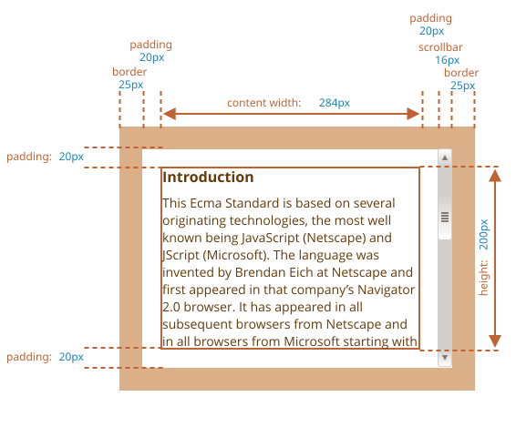
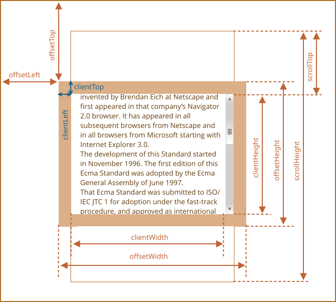
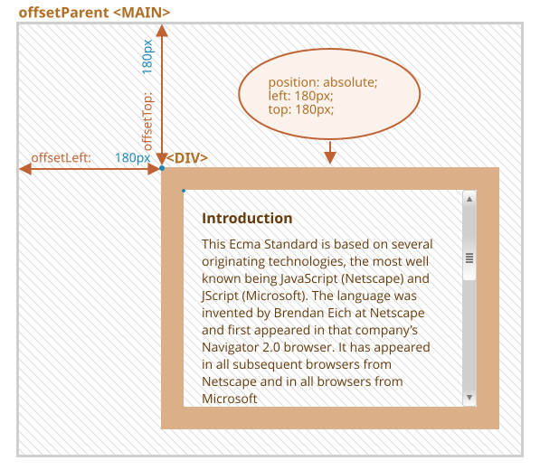
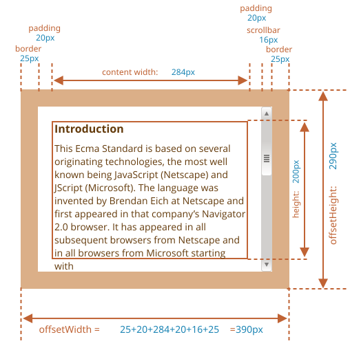
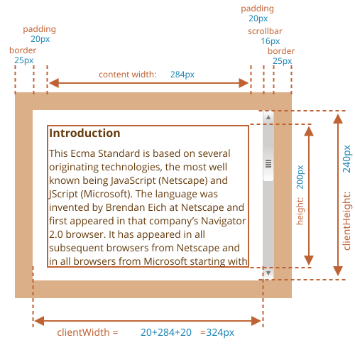
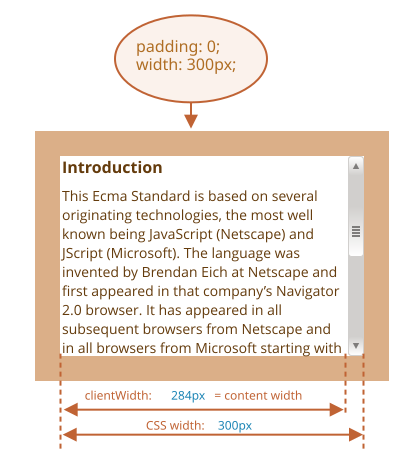
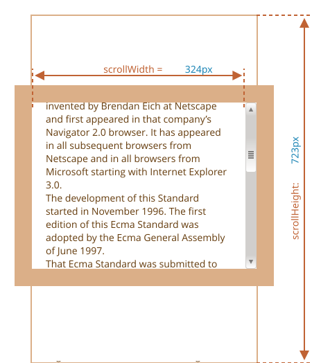
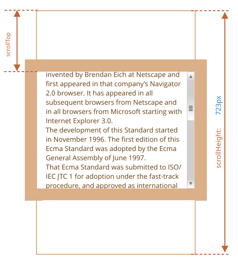

# Størrelsen på elementer og scrolling

Der er mange JavaScript-egenskaber, der giver os mulighed for at læse information om elementets bredde, højde og andre geometriske træk.

Vi har ofte brug for dem, når vi flytter eller placerer elementer i JavaScript.

## Eksempel-element

Lad os bruge elementet herunder som eksempel til at demonstrere egenskaberne:

```html no-beautify
<div id="example">
  ...Tekst...
</div>
<style>
  #example {
    width: 300px;
    height: 200px;
    border: 25px solid #E8C48F;
    padding: 20px;
    overflow: auto;
  }
</style>
```

Det har kant, padding og scroll-mulighed. Det har ingen margin, da de ikke er en del af elementet selv, og der er ingen specielle egenskaber for dem.

Elementet ser sådan ud:



Du kan [åbne dokumentet i sandbox](sandbox:metric).

```smart header="Mind the scrollbar"
Billedet ovenfor viser det mest komplekse tilfælde, hvor elementet har en scrollbjælke. Nogle browsere (ikke alle) reserverer plads til den ved at tage den fra indholdet (angivet som "content width" ovenfor).

Så uden en scrollbjælke ville indholdsbredden være `300px`, men hvis scrollbjælken er `16px` bred (bredden kan variere mellem enheder og browsere), er der kun `300 - 16 = 284px` tilbage, og vi bør tage det med i betragtning. Det er derfor, eksemplerne i dette kapitel antager, at der er en scrollbjælke. Uden den er nogle beregninger enklere.
```

```smart header="Området `padding-bottom` kan fyldes med tekst"
Normalt vil padding være tom som det ses på illustrationerne, men hvis der er meget tekst i elementet og det overløber, vil browseren vise den " overløbende" tekst på `padding-bottom`, det er normalt.
```

## Geometri

Her er et billede, der viser alle geometriske egenskaber:



Værdierne af disse egenskaber er teknisk set bare talværdier, men værdierne er i pixels, så det er pixelmålinger.

Lad os starte med at udforske egenskaberne startende fra elementets yderside.

## offsetParent, offsetLeft/Top

Disse egenskaber er sjældent nødvendige, men de er stadig de "yderste" geometriske egenskaber, så vi starter med dem.

`offsetParent` er den nærmeste forfader, som browseren bruger til at beregne koordinater under rendering.

Det er den nærmeste forfader, der er en af følgende:

1. CSS-positioneret (`position` er enten `absolute`, `relative`, `fixed` eller `sticky`),  eller
2. `<td>`, `<th>`, eller `<table>`,  eller
3. `<body>`.

Egenskaberne `offsetLeft` og `offsetTop` giver x/y koordinater i forhold til `offsetParent`'s øverste venstre hjørne.

I eksemplet nedenfor har det indre `<div>` `<main>` som `offsetParent` og `offsetLeft/offsetTop` viser forskydningen fra dets øverste venstre hjørne (`180`):

```html run height=10
<main style="position: relative" id="main">
  <article>
    <div id="example" style="position: absolute; left: 180px; top: 180px">...</div>
  </article>
</main>
<script>
  alert(example.offsetParent.id); // main
  alert(example.offsetLeft); // 180 (bemærk: et tal, ikke en streng "180px")
  alert(example.offsetTop); // 180
</script>
```



Der er lejligheder hvor `offsetParent` er `null`:

1. For ikke viste elementer (`display:none` eller ikke i dokumentet).
2. For `<body>` og `<html>`.
3. For elementer med `position:fixed`.

## offsetWidth/Height

Nu til selve elementet.

Disse to egenskaber er de simpleste. De giver elementets "ydre" bredde/højde. Eller med andre ord, dets fulde størrelse inklusive rammer.



For vores eksempel gælder det at:

- `offsetWidth = 390` -- den ydre bredde, kan beregnes som indre CSS-bredde (`300px`) plus padding (`2 * 20px`) og rammer (`2 * 25px`).
- `offsetHeight = 290` -- den ydre højde.

````smart header="Geometriske egenskaber er nul/null for elementer, der ikke vises"
Geometriske egenskaber beregnes kun for viste elementer.

Hvis et element (eller en af dets forfædre) har `display:none` eller ikke er i dokumentet, er alle geometriske egenskaber nul (eller `null` for `offsetParent`).

For eksempel er `offsetParent` `null`, og `offsetWidth` og `offsetHeight` er `0`, når vi har oprettet et element, men ikke har indsat det i dokumentet endnu, eller hvis det (eller en af dets forfædre) har `display:none`.

Vi kan bruge dette til at tjekke, om et element er skjult, sådan her:

```js
function isHidden(elem) {
  return !elem.offsetWidth && !elem.offsetHeight;
}
```

Bemærk at sådan en `isHidden` returnerer `true` for elementer, der er på skærmen, men har nul størrelser.
````

## clientTop/Left

Inde i elementet har vi rammerne.

For at måle dem, er der egenskaberne `clientTop` og `clientLeft`.

I vores eksempel:

- `clientLeft = 25` -- venstre rammes bredde
- `clientTop = 25` -- øverste rammes bredde


...Men for at være præcis -- disse egenskaber er ikke rammens bredde/højde, men snarere relative koordinater af den indre side fra den ydre side.

Hvad er forskellen?

Det bliver synligt, når dokumentet er højre-til-venstre (operativsystemet er på arabisk eller hebraisk). Scrollbjælken er så ikke til højre, men til venstre, og så inkluderer `clientLeft` også scrollbjælkens bredde.

I det tilfælde vil `clientLeft` være ikke `25`, men med scrollbjælkens bredde `25 + 16 = 41`.

Hér er eksemplet på hebraisk:


## clientWidth/Height

Disse egenskaber giver størrelsen af området inde i elementets rammer.

De inkluderer indholdsbredden sammen med padding, men uden scrollbjælken:



I forhold til billedet ovenfor, lad os først se på `clientHeight`.

Der er ingen vandret scrollbjælke, så det er præcis summen af det, der er inde i rammerne: CSS-højde (`200px`) plus top og bund padding (`2 * 20px`), i alt `240px`.

Nu `clientWidth` -- her er indholdsbredden ikke `300px`, men `284px`, fordi `16px` er optaget af scrollbjælken. Så summen er `284px` plus venstre og højre padding, i alt `324px`.

**Hvis der ikke er nogen padding, så er `clientWidth/Height` præcis indholdsområdet, inde i rammerne og scrollbjælken (hvis nogen).**



Så når der ikke er nogen padding, kan vi bruge `clientWidth/clientHeight` til at få størrelsen af indholdsområdet.

## scrollWidth/Height

Disse egenskaber er som `clientWidth/clientHeight`, men de inkluderer også de "ud-scrollede" dele (som jo egentligt er skjulte):



I forhold til billedet ovenfor:

- `scrollHeight = 723` -- er den fulde indre højde af indholdsområdet inklusive de ud-scrollede dele.
- `scrollWidth = 324` -- er den fulde indre bredde, her har vi ingen vandret scroll, så den er lig med `clientWidth`.

Vi kan bruge disse egenskaber til at udvide elementet til dets fulde bredde/højde.

Sådan her:

```js
// Udvid elementet til dets fulde højde
element.style.height = `${element.scrollHeight}px`;
```

```online
Klik på knappen for at udvide elementet:

<div id="element" style="width:300px;height:200px; padding: 0;overflow: auto; border:1px solid black;">tekst tekst tekst tekst tekst tekst tekst tekst tekst tekst tekst tekst tekst tekst tekst tekst tekst tekst tekst tekst tekst tekst tekst tekst tekst tekst tekst tekst tekst tekst tekst tekst tekst tekst tekst tekst tekst tekst tekst tekst tekst tekst tekst tekst tekst tekst tekst tekst tekst tekst tekst tekst tekst tekst tekst tekst tekst tekst tekst tekst tekst tekst tekst tekst tekst tekst tekst tekst tekst tekst tekst tekst tekst tekst tekst tekst tekst tekst tekst tekst tekst tekst tekst tekst tekst tekst tekst tekst tekst tekst tekst tekst tekst tekst tekst tekst tekst tekst tekst tekst tekst tekst tekst tekst tekst tekst tekst tekst tekst tekst tekst tekst tekst tekst tekst tekst tekst tekst tekst tekst tekst tekst tekst tekst tekst tekst tekst tekst tekst tekst tekst tekst tekst tekst tekst tekst tekst tekst tekst</div>

<button style="padding:0" onclick="element.style.height = `${element.scrollHeight}px`">element.style.height = `${element.scrollHeight}px`</button>
```

## scrollLeft/scrollTop

Egenskaberne `scrollLeft/scrollTop` er bredden/højden af den skjulte, ud-scrollede del af elementet.

På billedet nedenfor kan vi se `scrollHeight` og `scrollTop` for en blok med en lodret scroll.



Med andre ord er `scrollTop` "hvor meget der er scrollet op".

````smart header="`scrollLeft/scrollTop` kan ændres"
De fleste geometriske egenskaber her kan kun læses, men `scrollLeft/scrollTop` kan ændres, og browseren vil så rulle elementet.

```online
Hvis du klikker på elementet nedenfor, udføres koden `elem.scrollTop += 10`. Det får elementets indhold til at rulle `10px` ned.

<div onclick="this.scrollTop+=10" style="cursor:pointer;border:1px solid black;width:100px;height:80px;overflow:auto">Klik<br>Mig<br>1<br>2<br>3<br>4<br>5<br>6<br>7<br>8<br>9</div>
```

Ved at sætte `scrollTop` til `0` eller en stor værdi, som `1e9`, får vi elementet til at rulle til toppen/bunden.
````

## Tag ikke højde/bredde fra CSS

Vi har netop dækket geometriske egenskaber af DOM-elementer, der kan bruges til at få bredder, højder og beregne afstande.

Men som vi ved fra kapitlet <info:styles-and-classes>, kan vi læse CSS-højde og bredde ved hjælp af `getComputedStyle`.

Hvorfor ikke så bruge `getComputedStyle` til at få bredden af et element, sådan her?

```js run
let elem = document.body;

alert( getComputedStyle(elem).width ); // vis CSS-bredde for elem
```

Hvorfor skulle vi så bruge geometriske egenskaber i stedet? Der er to grunde:

1. Først afhænger CSS `width/height` af en anden egenskab: `box-sizing`, der definerer, "hvad" CSS-bredden og -højden omfatter. En ændring i `box-sizing` til CSS-formål kan ødelægge sådan et stykke JavaScript.
2. Dernæst kan CSS `width/height` være `auto`, for eksempel for et inline element:

    ```html run
    <span id="elem">Hello!</span>

    <script>
    *!*
      alert( getComputedStyle(elem).width ); // auto
    */!*
    </script>
    ```

    Set fra et CSS-perspektiv er `width:auto` helt normalt, men i JavaScript har vi brug for en præcis størrelse i `px`, som vi kan bruge i beregninger. Så her er CSS-bredden ubrugelig.

Og så er der endnu en grund: scrollbjælken. Nogle gange bliver kode, der fungerer fint uden en scrollbjælke, fejlbehæftet med en scrollbjælke, fordi en scrollbjælke optager plads fra indholdet i nogle browsere. Så den reelle bredde, der er til rådighed for indholdet, er *mindre* end CSS-bredden. Og `clientWidth/clientHeight` tager højde for det.

...Men med `getComputedStyle(elem).width` er situationen anderledes. Nogle browsere (f.eks. Chrome) returnerer den reelle indre bredde, minus scrollbjælken, og nogle af dem (f.eks. Firefox) -- CSS-bredden (ignorerer scrollbjælken). Sådan en tværbrowser-forskel er grunden til ikke at bruge `getComputedStyle`, men snarere stole på geometriske egenskaber.

```online
Hvis din browser reserverer plads til en scrollbjælke (de fleste browsere til Windows gør), så kan du teste det nedenfor.

[iframe src="cssWidthScroll" link border=1]

Elementet med tekst har CSS `width:300px`.

På et Desktop Windows-operativsystem reserverer Firefox, Chrome og Edge alle plads til scrollbjælken. Men Firefox viser `300px`, mens Chrome og Edge viser mindre. Det skyldes, at Firefox returnerer CSS-bredden, mens andre browsere returnerer den "reelle" bredde.
```

Bemærk, at den beskrevne forskel kun gælder for at læse `getComputedStyle(...).width` fra JavaScript; visuelt er alt korrekt.

## Opsummering

Elementer har følgende geometriske egenskaber:

- `offsetParent` -- er den nærmeste positionerede ancestor eller `td`, `th`, `table`, `body`.
- `offsetLeft/offsetTop` -- koordinater i forhold til den øverste venstre kant af `offsetParent`.
- `offsetWidth/offsetHeight` -- "ydre" bredde/højde af et element inklusive rammer.
- `clientLeft/clientTop` -- afstandene fra det øverste venstre ydre hjørne til det øverste venstre indre hjørne (indhold + padding). For venstre-til-højre operativsystemer er det altid bredden af venstre/øverste ramme. For højre-til-venstre operativsystemer er den lodrette scrollbjælke til venstre, så `clientLeft` inkluderer også dens bredde.
- `clientWidth/clientHeight` -- bredden/højden af indholdet inklusive padding, men uden scrollbjælken.
- `scrollWidth/scrollHeight` -- bredden/højden af indholdet, ligesom `clientWidth/clientHeight`, men inkluderer også den ud-scrollede, usynlige del af elementet.
- `scrollLeft/scrollTop` -- bredden/højden af den ud-scrollede øverste del af elementet, startende fra dets øverste venstre hjørne.

Alle egenskaber kan kun læses undtagen `scrollLeft/scrollTop`, som får browseren til at rulle elementet, hvis de ændres.
