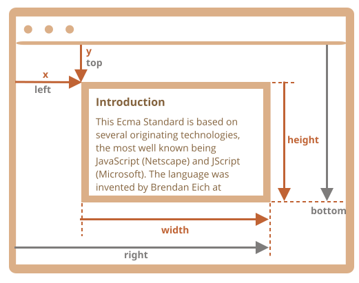
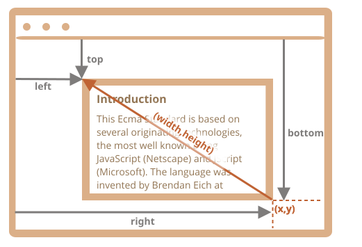

# Koordinator

For at flytte elementer rundt bør vi være bekendt med koordinaterne.

De fleste JavaScript-metoder bruger en af to koordinatsystemer:

1. **Relativt til vinduet** - minder om `position:fixed`, beregnet fra vinduets top/venstre kant.
    - vi vil betegne disse koordinater som `clientX/clientY`, årsagen til et sådant navn vil blive klar senere, når vi studerer event-egenskaber.
2. **Relativt til dokumentet** - minder om `position:absolute` i dokumentets rod, beregnet fra dokumentets top/venstre kant.
    - vi vil betegne dem `pageX/pageY`.

Når siden rulles til begyndelsen, således at top/venstre hjørne af vinduet er præcis dokumentets top/venstre hjørne, er disse koordinater ens. Men efter at dokumentet forskydes, ændres vinduesrelative koordinater for elementer, da elementer bevæger sig hen over vinduet, mens dokumentrelative koordinater forbliver de samme.

På dette billede tager vi et punkt i dokumentet og demonstrerer dets koordinater før scrollen (venstre) og efter den (højre):


Når dokumentet er scrollet:
- `pageY` - dokument-relative koordinater forbliver de samme, det beregnes fra dokumentets top (nu scrollet ud).
- `clientY` - vinduesrelative koordinater ændrede sig (pilen blev kortere), da det samme punkt kom tættere på vinduets top.

## Element koordinater: getBoundingClientRect

Metoden `elem.getBoundingClientRect()` returnerer vindueskoordinater for et minimalt rektangel, der omgiver `elem` som et objekt af den indbyggede [DOMRect](https://www.w3.org/TR/geometry-1/#domrect) klasse.

Hoved `DOMRect`-egenskaber:

- `x/y` -- X/Y-koordinater for rektangelens oprindelse relativt til vinduet,
- `width/height` -- bredde/højde af rektanglet (kan være negativ).

Derudover findes afledte egenskaber:

- `top/bottom` -- Y-koordinater for rektangelens top/bund kant,
- `left/right` -- X-koordinater for rektangelens venstre/højre kant.

```online
Klik på denne knap for at se dens vindueskoordinater:

<p><input id="brTest" type="button" style="max-width: 90vw;" value="Hent koordinater ved at bruge button.getBoundingClientRect() for denne knap" onclick='showRect(this)'/></p>

<script>
function showRect(elem) {
  let r = elem.getBoundingClientRect();
  alert(`x:${r.x}
y:${r.y}
width:${r.width}
height:${r.height}
top:${r.top}
bottom:${r.bottom}
left:${r.left}
right:${r.right}
`);
}
</script>

Hvis du ruller siden og gentager, vil du bemærke, at når knapens vinduesrelative position ændres, ændres dens vindueskoordinater (`y/top/bottom`, hvis du ruller lodret) også.
```

Her er billedet af `elem.getBoundingClientRect()` output:



Som du kan se, beskriver `x/y` og `width/height` rektanglet fuldt ud. Afledte egenskaber kan nemt beregnes ud fra dem:

- `left = x`
- `top = y`
- `right = x + width`
- `bottom = y + height`

Bemærk venligst:

- Koordinater kan være decimalfraktioner, såsom `10.5`. Det er normalt, internt bruger browseren fraktioner i beregninger. Vi behøver ikke runde dem af, når vi sætter dem til `style.left/top`.
- Koordinater kan være negative. For eksempel, hvis siden er scrollet således at `elem` nu er over vinduet, så er `elem.getBoundingClientRect().top` negativ.

```smart header="Hvorfor er afledte egenskaber nødvendige? Hvorfor findes `top/left` hvis `x/y` allerede eksisterer?"
Matematisk set er et rektangel entydigt defineret med dets startpunkt `(x,y)` og retningsvektoren `(width,height)`. De ekstra afledte egenskaber er altså for bekvemmelighedens skyld.

Teknisk set er det muligt for `width/height` at være negative, hvilket muliggør et "retningsbestemt" rektangel, f.eks. til at repræsentere musevalg med korrekt markerede start- og slutpunkter.

Negative værdier for `width/height` betyder, at rektanglet starter ved sit nederste højre hjørne og derefter "vokser" mod venstre og opad.

Her er et rektangel med negativ `width` og `height` (f.eks. `width=-200`, `height=-100`):



Som du kan se, er `left/top` ikke lig med `x/y` i dette tilfælde.

I praksis returnerer `elem.getBoundingClientRect()` dog altid positive værdier for width/height. Vi nævner negative width/height kun for at hjælpe dig med at forstå, hvorfor disse tilsyneladende duplikerede egenskaber ikke er faktiske duplikater.
```

```warn header="Internet Explorer: ingen understøttelse for `x/y`"
Internet Explorer understøtter af historiske årsager ikke `x/y` egenskaberne.

Vi kan derfor enten lave en polyfill (tilføje getters i `DomRect.prototype`) eller blot bruge `top/left`, da de altid er lig med `x/y` for positive `width/height`, især i resultatet af `elem.getBoundingClientRect()`.
```

```warn header="Koordinaterne right/bottom er forskellige fra CSS positionsegenskaberne"
Der er tydelige ligheder mellem vinduesrelative koordinater og CSS `position:fixed`.

Men i CSS positionering betyder `right`-egenskaben afstanden fra højre kant, og `bottom`-egenskaben betyder afstanden fra bundkanten.

Hvis vi bare ser på billedet ovenfor, kan vi se, at det ikke er sådan i JavaScript. Alle vindueskoordinater tælles fra øverste venstre hjørne, inklusive disse.
```

## elementFromPoint(x, y) [#elementFromPoint]

Kaldet `document.elementFromPoint(x, y)` returnerer det mest indlejrede element i vindueskoordinaterne `(x, y)`.

Syntaksen er:

```js
let elem = document.elementFromPoint(x, y);
```

For eksempel fremhæver og viser koden nedenfor tagget for det element, der nu er i midten af vinduet:

```js run
let centerX = document.documentElement.clientWidth / 2;
let centerY = document.documentElement.clientHeight / 2;

let elem = document.elementFromPoint(centerX, centerY);

elem.style.background = "red";
alert(elem.tagName);
```

Da det bruger vindueskoordinater, kan elementet være forskelligt afhængigt af den aktuelle scrolleposition.

````warn header="For koordinater uden for vinduet returnerer `elementFromPoint` `null`"
Metoden `document.elementFromPoint(x,y)` virker kun, hvis `(x,y)` er inden for det synlige område.

Hvis en af koordinaterne er negativ eller overstiger vinduets bredde/højde, returneres `null`.

Her er en typisk fejl, der kan opstå, hvis vi ikke kontrollerer for dette:

```js
let elem = document.elementFromPoint(x, y);
// hvis koordinaterne tilfældigvis er uden for vinduet, så er elem = null
*!*
elem.style.background = ''; // Fejl!
*/!*
```
````

## Brug til "fast" positionering

Langt de fleste gange har vi brug for koordinater for at placere noget.

For at vise noget nær et element kan vi bruge `getBoundingClientRect` til at få dets koordinater, og derefter CSS `position` sammen med `left/top` (eller `right/bottom`).

For eksempel viser funktionen `createMessageUnder(elem, html)` nedenfor beskeden under `elem`:

```js
let elem = document.getElementById("coords-show-mark");

function createMessageUnder(elem, html) {
  // Opret et besked element
  let message = document.createElement('div');
  // Nok bedre at bruge en css klasse for stilen her
  message.style.cssText = "position:fixed; color: red";

*!*
  // Tildel koordinater, husk "px"!
  let coords = elem.getBoundingClientRect();

  message.style.left = coords.left + "px";
  message.style.top = coords.bottom + "px";
*/!*

  message.innerHTML = html;

  return message;
}

// Anvendelse:
// tilføj den i 5 sekunder i dokumentet
let message = createMessageUnder(elem, 'Hello, world!');
document.body.append(message);
setTimeout(() => message.remove(), 5000);
```

```online
Prøv at trykke på knappen for at se den køre:

<button id="coords-show-mark">Knap med id="coords-show-mark", beskeden vil blive vist under den</button>
```

Koden kan ændres til at vise beskeden til venstre, højre, nedenunder, anvende CSS animationer til at "fade den ind" og så videre. Det er nemt, da vi har alle koordinater og størrelser af elementet.

Bemærk dog den vigtige detalje: når siden scroller væk, flyder beskeden væk fra knappen.

Årsagen er åbenlys: besked elementet er afhængigt af `position:fixed`, så det forbliver på det samme sted i vinduet, mens siden scroller væk.

For at ændre det, skal vi bruge dokumentbaserede koordinater og `position:absolute`.

## Dokument-relative koordinater [#getCoords]

Dokument-relative koordinater starter fra dokumentets øverste venstre hjørne, ikke vinduet.

I CSS svarer vindueskoordinater til `position:fixed`, mens dokumentkoordinater ligner `position:absolute` placeret øverst i dokumentet.

Vi kan bruge `position:absolute` og `top/left` til at placere noget et bestemt sted i dokumentet, så det forbliver der under en side scroll. Men vi har brug for de rigtige koordinater først.

Der er ingen standard metode til at få elementets dokumentkoordinater. Men det er ret nemt at skrive sig frem til dem.

De to koordinatsystemer er forbundet med formlen:
- `pageY` = `clientY` + højden af det ud-scrollede del af dokumentet.
- `pageX` = `clientX` + bredden af det ud-scrollede del af dokumentet.

Funktionen `getCoords(elem)` tager vindueskoordinaterne fra `elem.getBoundingClientRect()` og lægger det nuværende scroll til dem:

```js
// Funktion til at hente dokumentkoordinaterne for et element
function getCoords(elem) {
  let box = elem.getBoundingClientRect();

  return {
    top: box.top + window.pageYOffset,
    right: box.right + window.pageXOffset,
    bottom: box.bottom + window.pageYOffset,
    left: box.left + window.pageXOffset
  };
}
```

Hvis vi i eksemplet ovenfor brugte `position:absolute`, så ville beskeden forblive nær elementet under scroll.

Den ændrede `createMessageUnder` funktion:

```js
function createMessageUnder(elem, html) {
  let message = document.createElement('div');
  message.style.cssText = "*!*position:absolute*/!*; color: red";

  let coords = *!*getCoords(elem);*/!*

  message.style.left = coords.left + "px";
  message.style.top = coords.bottom + "px";

  message.innerHTML = html;

  return message;
}
```

## Opsamling

Ethvert punkt på siden har koordinater:

1. Relativt til vinduet -- `elem.getBoundingClientRect()`.
2. Relativt til dokumentet -- `elem.getBoundingClientRect()` plus det nuværende scroll af siden.

Vindueskoordinater er gode at bruge med `position:fixed`, og dokumentkoordinater virker godt med `position:absolute`.

Begge koordinatsystemer har deres fordele og ulemper; der er tidspunkter, hvor vi har brug for den ene eller den anden, ligesom med CSS `position` `absolute` og `fixed`.
