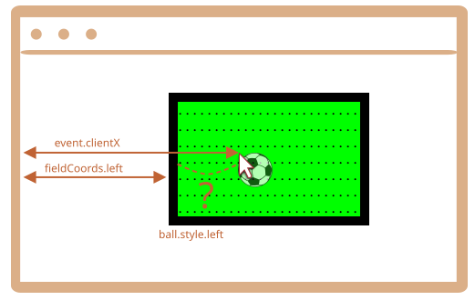

Først skal vi vælge en metode til at positionere bolden.

Vi kan ikke bruge `position:fixed` til det, fordi scrolling af siden ville flytte bolden fra plænen.

Så vi bør bruge `position:absolute` og, for at gøre positioneringen virkelig solid, give selve `field` en `position`.

På den måde vil bolden blive positioneret relativt til plænen:

```css
#field {
  width: 200px;
  height: 150px;
  position: relative;
}

#ball {
  position: absolute;
  left: 0; /* relativt til den nærmeste positionerede forælder (field) */
  top: 0;
  transition: 1s all; /* CSS animation for left/top får bolden til at bevæge sig */
}
```

Derefter skal vi tildele de korrekte `ball.style.left/top`. De indeholder nu koordinater relative til plænen.

Her er et billede:



Vi har `event.clientX/clientY` -- koordinater relativt til vinduet.

For at få et field-relativt `left` koordinat, kan vi trække fields venstre side og border tykkelse fra:

```js
let left = event.clientX - fieldCoords.left - field.clientLeft;
```

Normalt betyder `ball.style.left` den "venstre kant af et element" (bolden). Så hvis vi tildeler den `left`, så vil det være boldens venstre side og ikke center der vil være under musemarkøren.

Vi skal flytte den halve bredde af bolden til venstre og den halve højde op for at centrere den.

Så den endelige `left` vil være:

```js
let left = event.clientX - fieldCoords.left - field.clientLeft - ball.offsetWidth/2;
```

Den samme logik bruges til at beregne den lodrette koordinat.

Bemærk, at boldens bredde/højde skal være kendt på det tidspunkt, hvor vi tilgår `ball.offsetWidth`. Den skal angives i HTML eller CSS.
