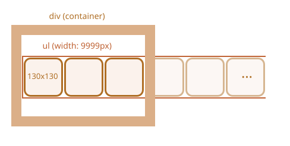
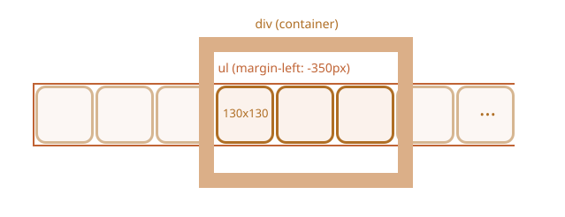

Billederne i båndet kan repræsenteres som en `ul/li` liste af billeder ``.

Normalt vil sådan et bånd være meget bredt, men vi putter en fast størrelse `
` omkring for at "beskære" det, så det kun er en del af båndet der er synligt:

For at vise listen vandret, kan vi anvende CSS-egenskaber for `<li>`, som f.eks. `display: inline-block`.

For `` bør vi også justere `display`, fordi standard er `inline`. Der er afsat ekstra plads under `inline`-elementer til "underliggere" (bogstaver der går under grundlinjen). Med `display:block` fjerner vi den plads.

Til at udføre scrolling, kan vi flytte `<ul>`. Der er mange måder at gøre det på. For eksempel kan vi ændre `margin-left` eller (endnu bedre ift ydeevne) bruge `transform: translateX()`:

Den ydre `
` har en fast bredde, så "ekstra" billeder bliver beskåret.

Hele karrusellen er en selvstændig "grafisk komponent" på siden, så vi bør pakke den ind i en enkelt `
` og style tingene inden for den.
