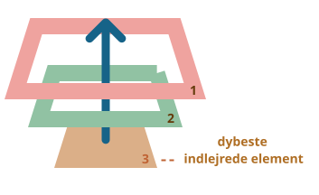
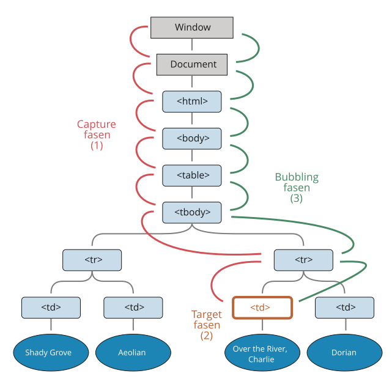

# Bubbling og capturing

Lad os starte med et eksempel.

Denne handler er tilknyttet `<div>`, men kører også, hvis du klikker på en hvilken som helst indlejret tag som `<em>` eller `<code>`:

```html autorun height=60
<div onclick="alert('The handler!')">
  <em>Hvis du klikker på <code>EM</code>, vil den handler der er på <code>DIV</code> blive kørt.</em>
</div>
```

Er det ikke lidt mærkeligt? Hvorfor kører handleren på `<div>` hvis det faktiske klik var på `<em>`?

## Bubbling

Princippet bag bubbling er simpelt.

**Når en event finder sted på et element, kører den først de handlers, der er tilknyttet elementet, derefter på dets forældre og så videre op til andre forældre.**

Lad os sige, at vi har 3 indlejrede elementer `FORM > DIV > P` med en handler på hvert af dem:

```html run autorun
<style>
  body * {
    margin: 10px;
    border: 1px solid blue;
  }
</style>

<form onclick="alert('form')">FORM
  <div onclick="alert('div')">DIV
    <p onclick="alert('p')">P</p>
  </div>
</form>
```

Et klik på det inderste `<p>` kører først `onclick`:
1. på selve `<p>` elementet.
2. Derefter på det omkringliggende `<div>` element.
3. Derefter på det ydre `<form>` element.
4. På den måde fortsætter kæden hele vejen op til `document` objektet.



Så hvis vi klikker på `<p>`, vil vi se 3 alerts: `p` -> `div` -> `form`.

Processen kaldes for "bubbling", fordi events "bobler op" fra det indre element op gennem forældre som bobler i vandet.

```warn header="*Næsten* alle events bobler."
Det vigtigste ord i denne sætning er "næsten".

For eksempel vil en `focus` event ikke boble. Der findes andre eksempler som vi skal se senere. Men det er mere undtagelsen en reglen - de fleste kan godt boble.
```

## event.target

En handler til et *omkransende element* kan altid få detaljer om det element, hvor det faktisk skete.

**Det dybeste element der startede kæden af events kaldes for *target* elementet, og kan fanges med `event.target`.**

Bemærk forskellen i forhold til `this` (=`event.currentTarget`):

- `event.target` -- er det "target" element der startede hele rækken af events - den ændrer sig ikke igennem bubbling processen.
- `this` -- er det "aktuelle" element. Det element som har en aktuelt kørende handler på det.

Hvis vi for eksempel har en enkelt handler `form.onclick`, så kan den "opfange" alle klik der sker inde i formen. Lige gyldigt hvor klikket skete, vil det boble op til `<form>` og køre handleren.

I `form.onclick` handleren:

- `this` (=`event.currentTarget`) er selve `<form>` elementet, fordi handleren kører på det.
- `event.target` er det faktiske element inde i formen, der blev klikket på.

Se f.eks. her:

[codetabs height=220 src="bubble-target"]

Det er muligt for `event.target` at være det samme som `this` -- det sker når klikket gives direkte på `<form>` elementet.

## Stop bubbling

En bubbling event går direkte fra det sted der klikkes på og op i en lige linje. Normalt vil det betyde, at det går opad gennem DOM'en til det rammer `<html>`, og derefter til `document` objekt ... nogle events fortsætter endda til `window` og kalder alle handlere på sin vej.

Men, hvilken som helst handler kan vælge at eventen er fuldt ud håndteret og stoppe muligheden for at andre handlere bliver kaldt.

Metoden til at gøre det er `event.stopPropagation()`.

For eksempel vil `body.onclick` ikke virke, hvis du klikker på `<button>`:

```html run autorun height=60
<body onclick="alert(`Der bobles ikke op hertil`)">
  <button onclick="event.stopPropagation()">Klik mig</button>
</body>
```

```smart header="event.stopImmediatePropagation()"
Hvis et element har flere event handlers på en enkelt event, så vil en handler, der kalder `event.stopPropagation()`, ikke forhindre andre handlers på samme element fra at køre.

Med andre ord, `event.stopPropagation()` stopper bevægelsen opad, men aller handlers på det aktuelle element vil stadig køre.

For at stoppe bubbling og forhindre handlers på det aktuelle element fra at køre, findes der en metode `event.stopImmediatePropagation()`. Efter denne kaldes ingen andre handlers.
```

```warn header="Lad være med at stoppe bubbling uden en grund!"
Bubbling er praktisk. Lad være med at stoppe det uden en reel grund.

Nogle gange skaber `event.stopPropagation()` skjulte fælder der senere bliver til problemer.

For eksempel:

1. Vi opretter en indlejret menu. Hver undermenu håndterer klik på sine elementer og kalder `stopPropagation` så den ydre menu ikke vil blive udløst.
2. Senere beslutter vi os for at fange klik på hele vinduet, for at spore brugernes adfærd (hvor folk klikker) - nogle analytiske systemer gør det. Normalt bruges koden `document.addEventListener('click'…)` til at fange alle klik.
3. Løsningen vil ikke virke i området, hvor klik er stoppet af `stopPropagation` da der er en "død zone".

Der er normalt intet reelt behov for at forhindre bubbling. En opgave der ser ud til at kræve det kan løses med andre midler. En af dem er at bruge tilpassede begivenheder, som vi vil dække senere. Vi kan også skrive vores data ind i `event` objektet i en handler og læse det i en anden handler. På den måde kan vi videregive information til handlers på forældre om behandlingen længere nede.
```


## Capturing

Der er en anden fase af event behandling kaldet "capturing" (tilfangetagelse på dansk). Den bruges sjældent i kode, men nogle gange kan den være nyttig.

Standard [DOM Events](https://www.w3.org/TR/DOM-Level-3-Events/) beskriver 3 faser af event propagation:

1. Capturing phase -- når eventet dykker ned til elementet.
2. Target phase -- eventet nåede målelementet.
3. Bubbling phase -- eventet bobler op fra elementet.

Her er et billede, taget fra specifikationen, af de tre faser for et klik event på en `<td>` inde i en tabel:



Det vil sige: for et klik på `<td>` går eventet først gennem forældrekæden ned til elementet (capturing phase), derefter når det målet og udløser der (target phase), og så går det op (bubbling phase), hvor det kalder handlers på sin vej.

Indtil videre har vi kun talt om bubbling, fordi capturing fasen sjældent bruges.

I virkeligheden var capturing fasen usynlig for os, fordi handlers tilføjet ved hjælp af `on<event>`-egenskab eller ved hjælp af HTML-attriibutter eller ved hjælp af to-argument `addEventListener(event, handler)` ikke ved noget om capturing, de kører kun 2nd og 3de fase.

For at fange et event i capturing fasen, skal vi sætte handlerens `capture` option til `true`:

```js
elem.addEventListener(..., {capture: true})

// eller bare "true" der er et alias til {capture: true}
elem.addEventListener(..., true)
```

Der er to mulige værdier for `capture` valget:

- Hvis det er `false` (standard), så er handleren sat på bubbling fasen.
- Hvis det er `true`, så er handleren sat på capturing fasen.


Bemærk at mens der formelt er 3 faser vil den 2nd fase ("target phase": eventet nåede målelementet) ikke blive håndteret seperat: handlers på både capturing og bubbling faserne trigger ved den fase.

Lad os se både capturing og bubbling i aktion:

```html run autorun height=140 edit
<style>
  body * {
    margin: 10px;
    border: 1px solid blue;
  }
</style>

<form>FORM
  <div>DIV
    <p>P</p>
  </div>
</form>

<script>
  for(let elem of document.querySelectorAll('*')) {
    elem.addEventListener("click", e => alert(`Capturing: ${elem.tagName}`), true);
    elem.addEventListener("click", e => alert(`Bubbling: ${elem.tagName}`));
  }
</script>
```

Koden sætter klik handlers på *hvert* element i dokumentet for at se hvilke der virker.

Hvis du klikker på `<p>`, så er sekvensen:

1. `HTML` -> `BODY` -> `FORM` -> `DIV -> P` (capturing fase, den første listener):
2. `P` -> `DIV` -> `FORM` -> `BODY` -> `HTML` (bubbling fase, den anden listener).

Bemærk at `P` dukker op to gange. Det er fordi vi sætter to listeners: capturing og bubbling. Målet for eventen trigger ved slutningen af den første og begyndelsen af den anden fase.

Der er en egenskab `event.eventPhase` der fortæller nummeret på den fase hvor eventet bliver fanget. Den bruges dog sjældent, da vi ofte ved det i handleren.

```smart header="For at fjerne en handler behøver `removeEventListener` den samme fase"
Hvis vi bruger `addEventListener(..., true)`, så skal den samme fase nævnes i `removeEventListener(..., true)` for at fjerne handleren korrekt.
```

````smart header="Listeners på samme element og i samme fase kører i dens orden de blev sat"
Hvis vi har flere event handlers på samme fase, tildelt til det samme element med `addEventListener`, kører de i den rækkefølge de er oprettet:

```js
elem.addEventListener("klik", e => alert(1)); // garanteret at blive afviklet først
elem.addEventListener("klik", e => alert(2));
```
````

```smart header="Afvikling af `event.stopPropagation()` i capturing fase forhindrer også bubbling"
Metoden `event.stopPropagation()` og dens søster `event.stopImmediatePropagation()` kan også blive kaldt i capturing fasen. Sker det vil det ikke kun forhindre yderligere fangst i cpaturing fasen. Det vil også stoppe propagation til bubbling fasen

Med andre ord så går eventet først ned ("capturing") og derefter op ("bubbling"). Hvis `event.stopPropagation()` kaldes i capturing fasewn, vil rejse stoppe der og ikke aktivere bubbling.
```


## Opsummering

Når en event sker vil det inderste indlejrede element blive markeret som "target element" (`event.target`).

- Derefter vil eventet bevæge sig ned fra dokumentets rod til `event.target`, kaldende handlers tildelt med `addEventListener(..., true)` på vejen (`true` er en genvej for `{capture: true}`).
- Derefter kaldes handlers på target elementet selv.
- Til sidst bobler eventet op fra `event.target` til roden og kalder handlers tildelt ved brug af `on<event>`, HTML attributter og `addEventListener` uden den 3. argument eller med det 3. argument `false/{capture:false}`.

Hver handler kan tilgå `event` objektets egenskaber:

- `event.target` -- det "dybeste" element, der forårsagede eventet.
- `event.currentTarget` (=`this`) -- det nuværende element, der håndterer eventet (det element, der har handleren på sig)
- `event.eventPhase` -- den nuværende fase (capturing=1, target=2, bubbling=3).

Enhver event handler kan stoppe eventet ved at kalde `event.stopPropagation()`, men det nabefales ikke, fordi vi ikke kan være sikre på, at der ikke er brug for det ovenfor, måske til helt andre ting.

Fasen capturing bruges sjældent - event håndteres normalt i bubbling fasen og der er en logisk forklaring på det.

Hvis der skete en ulykke i virkeligheden vil lokale myndigheder reagere først. De kender bedst området hvor det skete. Derefter vil højere niveauer af myndigheder blive inddraget hvis nødvendigt.

Det samme er gældende for event handlers. Den kode der sætter en handler på et specifikt element har mest viden om detaljer for elementet og hvad det gør. En handler på et specifikt element har mest viden om detaljer for elementet og hvad det gør. En handler på et specifikt `<td>` kan være velegnet til præcis dette `<td>`, det ved alt om det, så det skal have en chance først. Derefter skal dets umiddelbare forældre også vide om sammenhængen, men lidt mindre, og så videre indtil det allerøverste element, der håndterer generelle koncepter og kører den sidste.

Bubbling og capturing lægger fundamentet for "event delegation" -- et ekstremt kraftfuldt event handling mønster, vi studerer i den næste kapitel.
