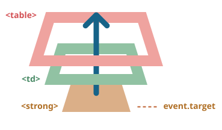

# Delegering af events

Capturing og bubbling tillader os at implementere en af de mest kraftfulde event håndteringsmønstre kaldet *event delegation*.

Ideen er, at hvis vi har mange elementer, der håndteres ens kan vi, i stedet for at tildele en handler til hvert enkelt element, sætte en enkelt handler på deres fælles forælder.

I handleren bruger vi så `event.target` til at se hvor eventet faktisk skete og håndtere det.

Lad os se på et eksempel -- [Ba-Gua diagrammet](http://en.wikipedia.org/wiki/Ba_gua) afspejler en gammel kinesisk filosofi.

Her er den:

[iframe height=350 src="bagua" edit link]

HTML koden er som følger:

```html
<table>
  <tr>
    <th colspan="3"><em>Bagua</em> Chart: Direction, Element, Color, Meaning</th>
  </tr>
  <tr>
    <td class="nw"><strong>Northwest</strong><br>Metal<br>Silver<br>Elders</td>
    <td class="n">...</td>
    <td class="ne">...</td>
  </tr>
  <tr>...2 linjer mere af samme slags...</tr>
  <tr>...2 linjer mere af samme slags...</tr>
</table>
```

Tabellen har 9 celler, men der kan være 99 eller 9999, det spiller ingen rolle.

**Vores opgave er at fremhæve en celle `<td>` ved klik.**

I stedet for at tildele en `onclick` handler til hver `<td>` (kan være mange) -- vil vi opsætte den "catch-all" handler på `<table>` elementet.

Det vil bruge `event.target` til at få det klikkede element og fremhæve det.

Koden er som følger:

```js
let selectedTd;

*!*
table.onclick = function(event) {
  let target = event.target; // hvor blev der klikket?

  if (target.tagName != 'TD') return; // ikke et TD? Så er vi ikke interesserede

  highlight(target); // fremhæv den
};
*/!*

function highlight(td) {
  if (selectedTd) { // fjern den eksisterende fremhævning, hvis der er en
    selectedTd.classList.remove('highlight');
  }
  selectedTd = td;
  selectedTd.classList.add('highlight'); // fremhæv den nye td
}
```

Sådan en kode er meget effektiv og fungerer uanset hvor mange celler der er i tabellen. Vi kan tilføje/fjerne `<td>` dynamisk når som helst og fremhævningen vil stadig fungere.

Men der er en ulempe.

Klikket kan opstå inde i `<td>`, i stedet for på selve `<td>` tag'et.

Hvis vi tager et kig i HTML'en, kan vi se indlejrede tags inde i `<td>`, som f.eks. `<strong>`:

```html
<td>
*!*
  <strong>Northwest</strong>
*/!*
  ...
</td>
```

Hvis der sker et klik på det indlejrede `<strong>` så bliver det den værdi, som `event.target` får.



I handleren `table.onclick` skal vi tage sådan en `event.target` og finde ud af, om klikket var inde i `<td>` eller ikke.

Her er den forbedrede kode:

```js
table.onclick = function(event) {
  let td = event.target.closest('td'); // (1)

  if (!td) return; // (2)

  if (!table.contains(td)) return; // (3)

  highlight(td); // (4)
};
```

Forklaringer:
1. Metoden `elem.closest(selector)` returnerer den nærmeste forælder, der matcher selectoren. I vores tilfælde leder vi efter `<td>` på vejen op fra event.target.
2. Hvis `event.target` ikke er inde i nogen `<td>`, så returnerer kaldet umiddelbart, da der ikke er noget at gøre.
3. I tilfælde af indlejrede tabeller kan `event.target` være en `<td>`, men ligge uden for den aktuelle tabel. Så her tjekker vi, om det faktisk er *vores tabels* `<td>` eller ej.
4. Og hvis det er tilfældet, så fremhæver vi den.


Resultatet er en hurtig og effektiv fremhævningskode, der ikke bekymrer sig om det samlede antal `<td>` i tabellen.

## Eksempel på event delegation: Handlinger i markup

Der er andre brugsscenarier for event delegation.

Lad os sige, at vi vil lave et menu med knapper "Save", "Load", "Search" og så videre. Og der er et objekt med metoder `save`, `load`, `search`... Hvordan matcher vi dem?

Den første idé kan være at tildele en separat handler til hver knap. Men der er en mere elegant løsning. Vi kan tilføje en handler for hele menuen og sætte `data-action` attributter for knapper, der har den metode, der skal kaldes:

```html
<button *!*data-action="save"*/!*>Klik for at gemme</button>
```

Handleren læser attributten og eksekverer metoden. Prøv eksemplet nedenfor:

```html autorun height=60 run untrusted
<div id="menu">
  <button data-action="save">Save</button>
  <button data-action="load">Load</button>
  <button data-action="search">Search</button>
</div>

<script>
  class Menu {
    constructor(elem) {
      this._elem = elem;
      elem.onclick = this.onClick.bind(this); // (*)
    }

    save() {
      alert('gemmer');
    }

    load() {
      alert('henter');
    }

    search() {
      alert('søger');
    }

    onClick(event) {
*!*
      let action = event.target.dataset.action;
      if (action) {
        this[action]();
      }
*/!*
    };
  }

  new Menu(menu);
</script>
```

Bemærk at `this.onClick` er bundet til `this` i `(*)`. Det er vigtigt, for ellers ville `this` inde i den referere til DOM-elementet (`elem`), ikke til `Menu`-objektet, og `this[action]` ville ikke være det, vi har brug for.

Så, hvilke fordele giver delegation os her?

```compare
+ Vi behøver ikke at skrive kode der tildeler en handler til hver knap. Bare opret en metode og put den i markeringen.
+ HTML-strukturen er fleksibel, vi kan tilføje/fjerne knapper når som helst.
```

Vi kunne også bruge klasser `.action-save`, `.action-load`, men en attribut `data-action` er bedre semantisk. Og vi kan på den måde også bruge den i CSS-regler.

## "behavior" mønsteret

Vi kan også bruge event delegation til at tilføje "adfærd" (behaviors) til elementer *deklarativt*, med specielle attributter og klasser.

Mønsteret har to dele:
1. Vi tilføjer en brugerdefineret attribut til et element, der beskriver dets adfærd.
2. En handler på dokumentniveau sporer events, og hvis et event sker på et element med en sådan attribut -- udfører det handlingen.

### Behavior: Tæller

For eksempel tilføjer attributten `data-counter` en adfærd: "øg værdi ved klik" til knapper:

```html run autorun height=60
Tæller: <input type="button" value="1" data-counter>
En tæller mere: <input type="button" value="2" data-counter>

<script>
  document.addEventListener('click', function(event) {

    if (event.target.dataset.counter != undefined) { // hvis attributten eksisterer...
      event.target.value++;
    }

  });
</script>
```

Hvis vi klikker på en knap -- øges dens værdi. Det er ikke knapperne, men den generelle tilgang er vigtig her.

Der er ingen grænse for antallet af attributter med `data-counter` vi kan oprette. Vi kan også tilføje nye attributter til HTML når som helst. Ved hjælp af event delegation har vi "udvidet" HTML, og tilføjet en attribut, der beskriver en ny adfærd.

```warn header="For handlere på dokumentniveau -- brug altid `addEventListener`"
Når vi tildeler en event handler til `document`-objektet, bør vi altid bruge `addEventListener`, ikke `document.on<event>`, fordi det senere vil forårsage konflikter: nye handlers overskriver nemlig gamle.

I projekter er det normalt, at der er mange handlers på `document` sat af forskellige dele af koden.
```

### Behavior: Toggle

Her er endnu et eksempel på adfærd. Et klik på et element med attributten `data-toggle-id` vil vise/skjule elementet med det givne `id`:

```html autorun run height=60
<button *!*data-toggle-id="subscribe-mail"*/!*>
  Vis tilmeldingsformularen
</button>

<form id="subscribe-mail" hidden>
  Din mail: <input type="email">
</form>

<script>
*!*
  document.addEventListener('click', function(event) {
    let id = event.target.dataset.toggleId;
    if (!id) return;

    let elem = document.getElementById(id);

    elem.hidden = !elem.hidden;
  });
*/!*
</script>
```

Lad os en gang til se på hvad vi har gjort. Nu, for at tilføje en toggle-funktion til et element -- er der ingen grund til at kende JavaScript, brug blot attributten `data-toggle-id`.

Det kan vise sig at blive virkelig praktisk -- vi har ikke behov for at skrive JavaScript for hvert element - kun at bruge attributten. Handleren på dokumentniveau får det til at virke for alle elementer på siden.

Vi kan også kombinere flere behaviors på et enkelt element.

Mønsteret "behavior" kan være et alternativ til mange mini-fragmenter af JavaScript.

## Opsummering

Delegation af events er ret sejt! Det er et af de mest hjælpsomme mønstre for DOM-events.

Det bruges ofte til at tilføje den samme håndtering for mange lignende elementer, men ikke kun til det.

Algoritmen:

1. Put en enkelt handler på containeren.
2. I handleren -- tjek det oprindelige element `event.target`.
3. Hvis eventet skete inden for et element, der interesserer os, så håndter eventet.

Fordelene ved delegation er:

```compare
+ Forenkler initialisering og sparer hukommelse: ingen behov for at tilføje mange handlers.
+ Mindre kode: når vi tilføjer eller fjerner elementer, er der ingen behov for at tilføje/fjerne handlers.
+ DOM-modifikationer: vi kan tilføje/fjerne mange elementer med `innerHTML` eller lignende.
```

Delegation har selvfølgelig også sine begrænsninger:

```compare
- For det første. Eventet skal kunne bobble. Nogle events bobler ikke. Desuden bør lav-niveau handlers ikke bruge `event.stopPropagation()`.
- For det andet. Delegation kan tilføje CPU load, fordi handleren på container-niveau reagerer på events i enhver del af containeren, uanset om de interesserer os eller ej. Men ofte er belastningen ubetydelig, så vi behøver ofte ikke at tage den i betragtning.
```
